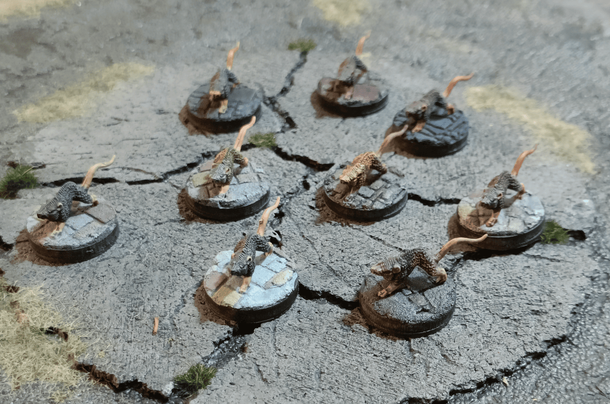
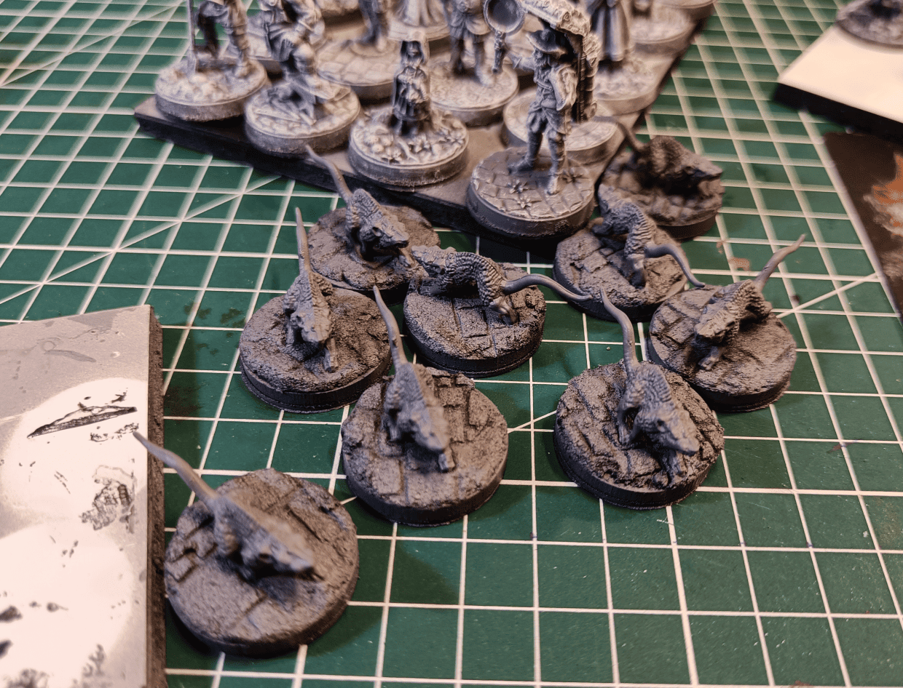
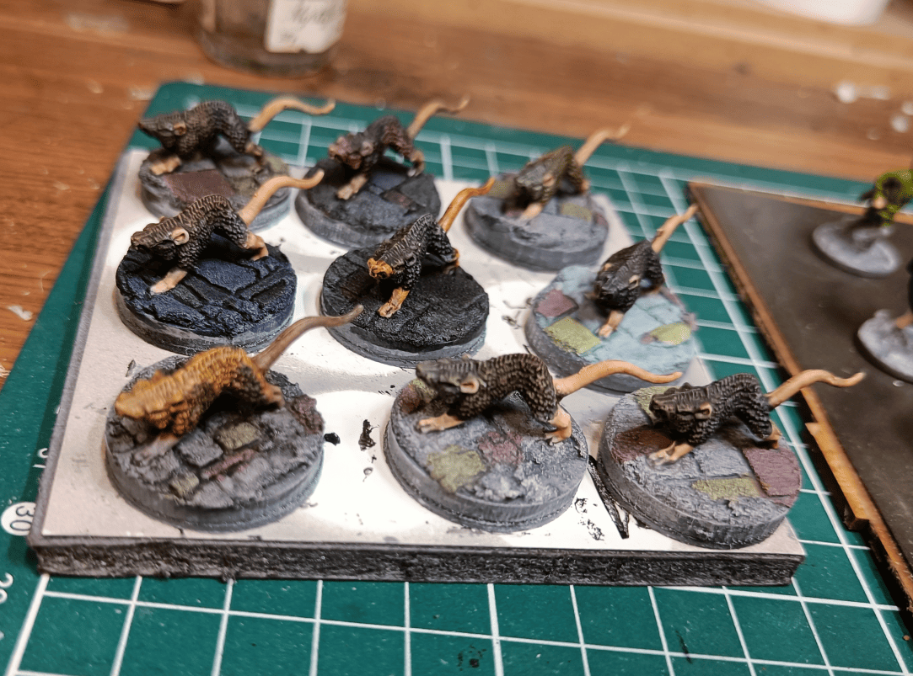
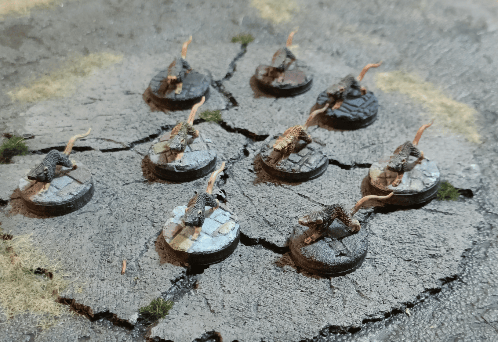

Just finished painting these Warhammer Quest rats I've had sitting around since I was a teenager! Pretty happy I finally crossed them off my to-do list after all these years.

What I really like about these minis is that they hit a sweet spot. They're big enough to look imposing without being dire rats (you know, those gigantic ones with spikes and crazy fangs). And they're individual models, not a swarm. 

They're perfect for representing those level 1 low-threat enemies that still feel like a coherent challenge when you're just starting out.

The initial Warhammer Quest miniature come with feet molded directly onto hard plastic bases so they can stand on their own. I removed those plastic parts and mounted them on traditional sized bases instead. 

For the base texture, I applied a slightly wet filler mixture and used a roller to create a tile pattern. The effect isn't perfect since the roller didn't catch everywhere, but I used those gaps to my advantage to make it look like tiles half covered with mud.

For the painting, it's speedpaint. On each of the rats, I tried to mix two different speedpaints while it was still wet and blend them a little to try to give a bit more subtlety to the fur. In the end, since the sculpture is so small and my colors are so similar, it's barely noticeable.

