I wasn't sure I'd be able to craft tonight, so I squeezed in a few 5-minute breaks during the day, between two tasks while waiting on my computer. I used them to keep digging through my box of plastic stuff, documenting ideas for what I already have.

## Plastic finds, continued

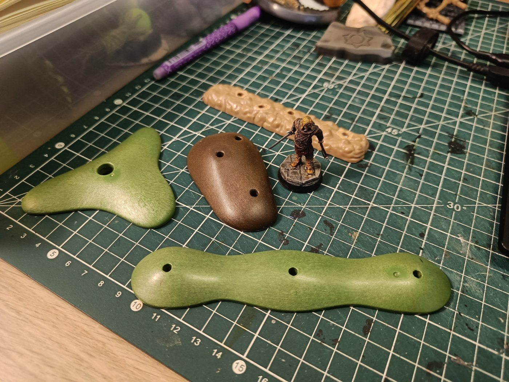

These are Playmobil bases, the kind that have hedges or trees plugged into them. The ochre one at the back, I'm not sure it's Playmobil. What I like: Playmobil plastic is really solid, and the shapes are irregular, so I don't have to think about the shape when using them as scatter terrain.

My first worry was that my modular project works in multiples of 5cm, and these bases probably won't fit that grid. But thinking about it, for scatter terrain, varied sizes are fine, even desirable, because they feel more organic. Only the elevation blocks need to stay square and on fixed multiples. So these are a good base for scatter: solid, and I can build on top of them.

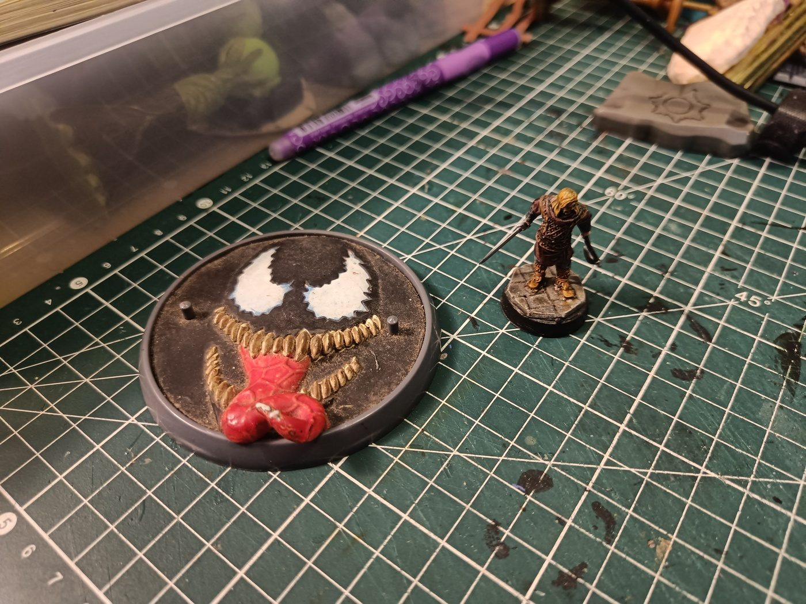

Next, a textured plastic piece: Venom's head. Big demonic eyes, a huge mouth with a textured tongue, genuinely scary. I could use it vertically on a wall to mark a cultist lair, or on the ground as some kind of living pentacle.

The problem is that it's way too recognizable as Venom, even repainted. I could keep only the mouth and replace the eyes, or just leave it as is and take the risk. I like the idea of only the mouth coming out from under some stones, or the whole piece vertically on a wall. Undecided for now. I might look for scary eyes from another monster to replace Venom's.

## Resin casting

In the evening, before leaving for a few days, my priority was to cast some resin to check if my stock still works, so I know whether I need to buy more.

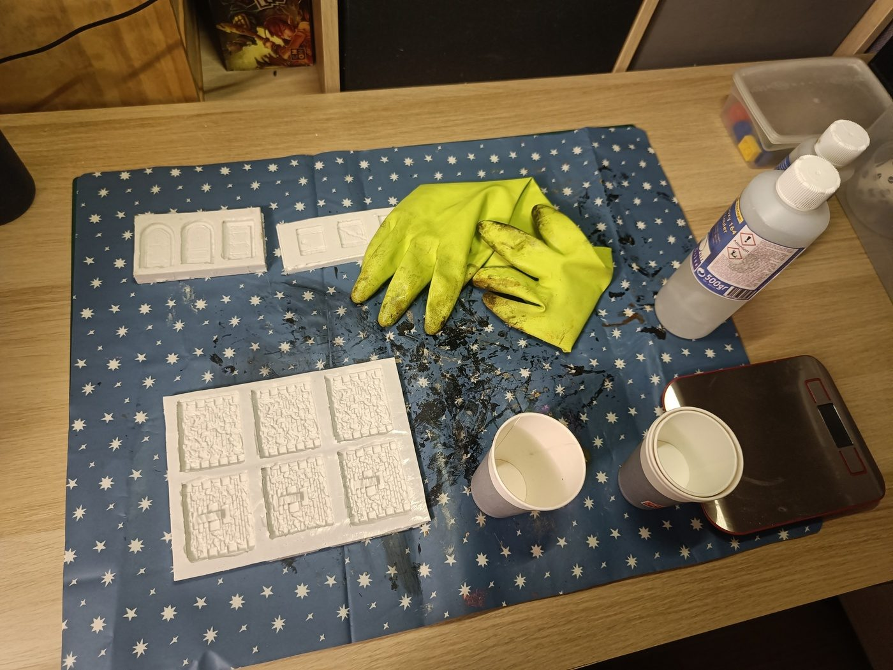

I used the Dungeons & Lasers wall molds I made a few days ago. It's a two-part epoxy resin: 100g of resin plus 50g of hardener. I had no idea how much surface 150g would cover, so this was also a test to see how many molds it fills. I had other molds ready to absorb any extra.

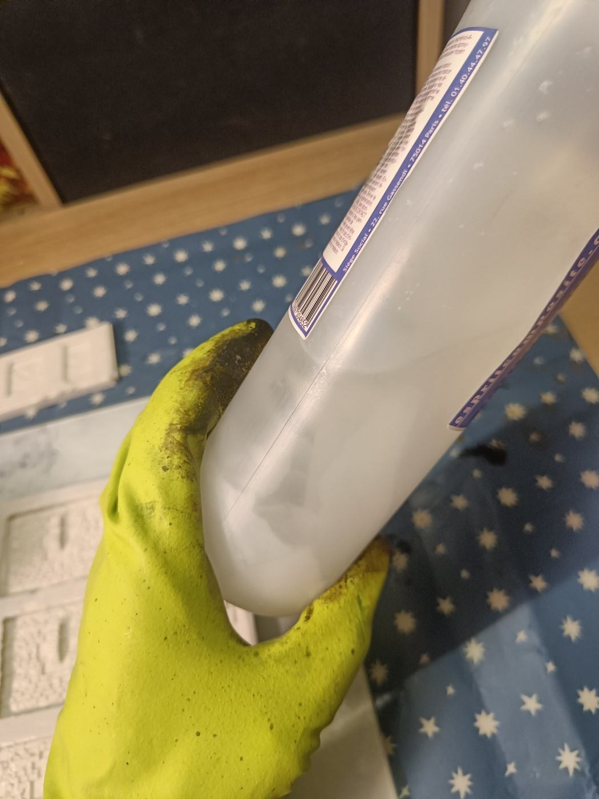

The resin is getting old. There are chunks floating inside, like a glacier shedding icebergs. Probably not in optimal condition, but I tried anyway.

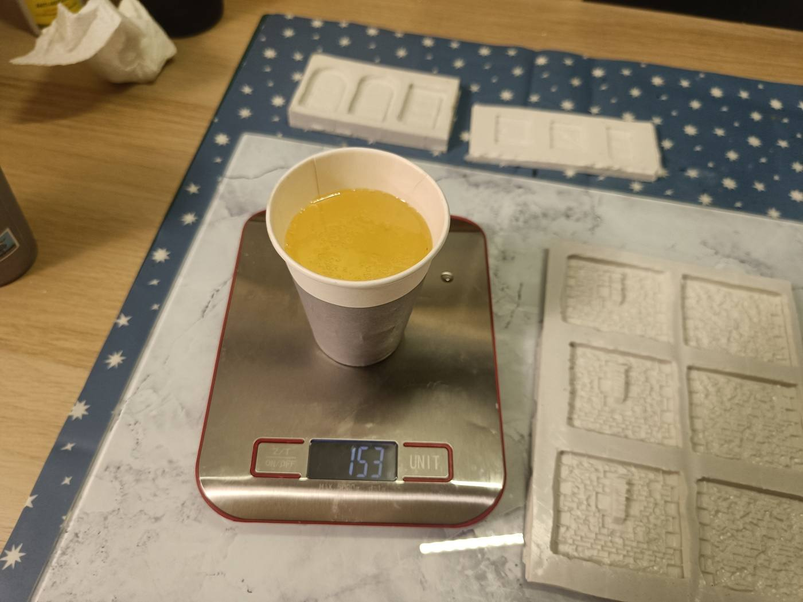

While mixing, I realized there are single-component resins out there, one pot, no mixing. Something to look into, because it's really hard to judge the right quantity with a two-part system. And indeed, I prepared too much for the molds I had planned. No big deal, I had spare molds.

After about a minute, the mix started to heat up, which is my cue to pour. The molds were set on a glass plate. Instead of pouring from high up (hard to aim), I started right at the surface and then slowly lifted up. It fills pretty quickly.

I forgot to tint the first mold, so I finished it clear and tinted the next ones with a drop of paint. It's much easier to see the fill level when the resin is tinted than when it's transparent. The workshop is being reorganized, everything is in crates, and I couldn't find my paints. I ended up using Army Painter Strong Tone Dark. It barely colored anything at first, so I had to add a lot. The result was a transparent black/grey, good enough.

The walls with an arrow slit were tricky: the resin must not go above the little wall formed by the hole. I failed on the first one, got it right on the second. Then the plain wall. Because the resin is old, a few lumps fell in, so I had to watch for those. Since the pieces will be glued flat, I don't need to fill the mold to the top: only the bottom with the relief matters.

I used the remaining resin on the door molds (x3), then the small wooden doors, then other molds I pulled out as I went. My dosing got more and more approximate towards the end: too much resin on the last ones (that'll be on the back, I'll sand it). The window molds are really tiny and hard to dose, so I got overflows, and resin spilled on the last mold as I reached the end of the cup. The session ended in a bit of a disaster cleanliness-wise, but the molds are mostly well filled.

The first molds, the walls, look good, but there are bubbles. Tapping didn't bring them up. I hesitated to use heat, but I was afraid of melting something else, so I left them as is. I'll clean up the overflow, let everything cure overnight, and check later.

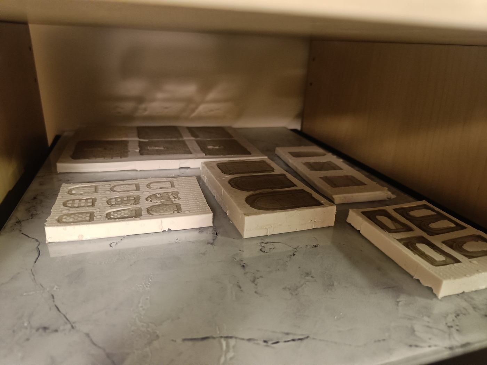

Here's everything I cast, set flat in a corner out of reach of the cats. Not a great photo, taken after the fact, but I didn't want to move anything while the resin was still fresh.

Overall, a satisfying evening. Next steps: find an easier resin to cast (single-component) for the next pieces, and buy more silicone to make the rest of the molds: face B of the plain walls (only face A is done), the long walls, and the doors.

## Preparing the boxes

The main shapes for my elevations are 15x15 and 15x8, and conveniently they're almost the same height. The goal is to build one complete elevation of each type to see how it looks. I was tempted to start right away with the Dungeons & Lasers pieces I already cast, but I'd rather wait until all the molds are done.

I'm also wondering whether the elevations should sit on a base, or be flush with the ground. I'm leaning towards flush, so they can be placed directly on the table. I still need to figure out the material and look of the top surface.

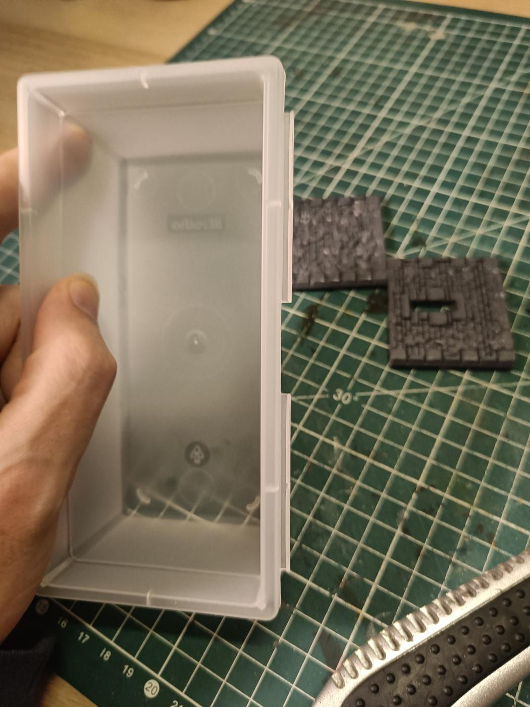

On the 15x8 boxes, there are little edges that I thought were for a lid, but they're actually for attaching boxes to each other. Useless for me, so they have to go.

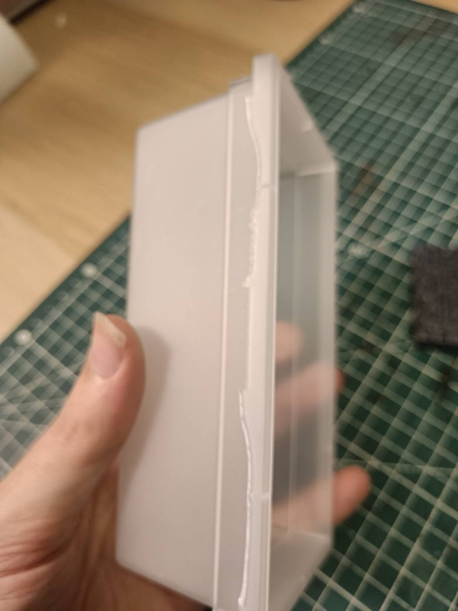

A well-placed cutter does the job. The cut isn't perfect, but it's good enough. I'll have to do this on all the boxes so they sit flush.

Plans are nice, but nothing beats actually doing it. I'd rather build something concrete to see what's actually doable.

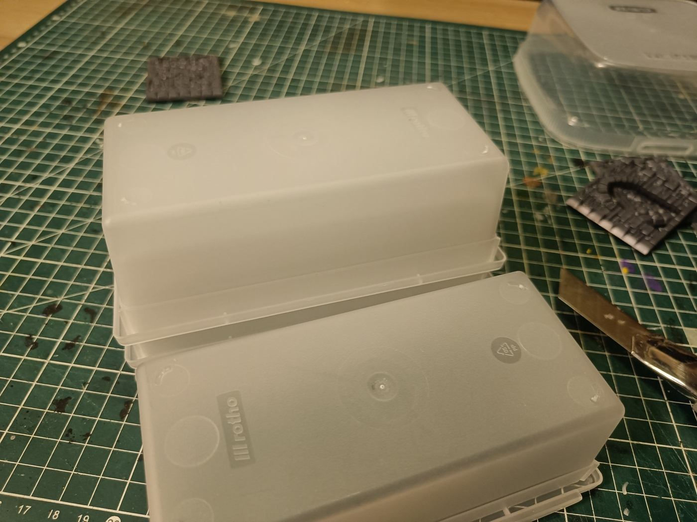

I also removed the little plastic feet sticking out under the boxes, so the top is as flat as possible. I'll probably glue bricks or some other material there.

## The rim dilemma

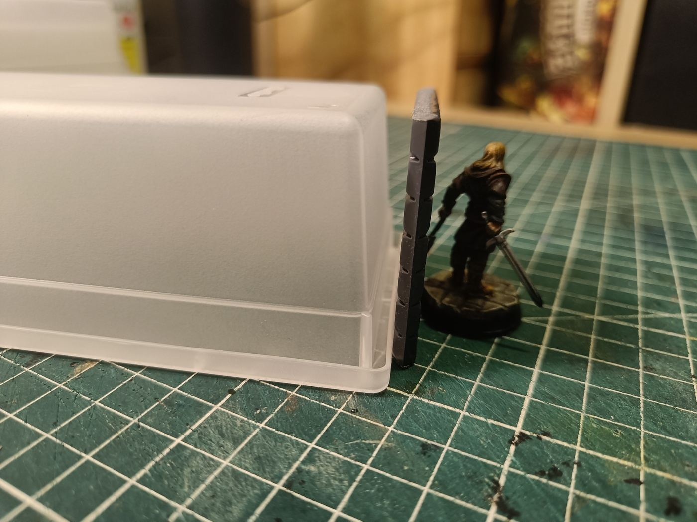

Here's the technical dilemma. The foot of the box, once flipped, forms a sort of sidewalk rim all around it. Inside that rim, it's exactly 15cm one way and 7.5cm the other: the perfect dimensions I'm after. But the rim has some height, so gluing a wall on top of it brings me to 5.5cm instead of the 5cm I wanted.

Three options:

1. Remove the rim: perfect dimensions (15x7.5), but the box is structurally weaker, and solidity was the whole point of using plastic.
1. Keep the rim and glue the wall on top: solid, but 5.5cm tall instead of 5.
1. Glue the walls outside the rim: correct height, but the dimensions change (15 becomes 16).

I ruled out notching the wall to fit around the rim: too many cuts, it would weaken the structure. 5.5cm instead of 5 is acceptable, heights will never be perfectly aligned between pieces anyway. I need to stay consistent with the 15x15 boxes, which are already a bit taller than planned. If they grow a bit too, the two formats will still match. Something to test.

That opens a new question: how do I visually connect the rim and the wall? I'd probably need to engrave the plastic to make it look like a wall, which isn't easy. By the way, the boxes are PP (polypropylene), it says so on the box.

And another one: since the box is upside down, how do I close the open bottom? I could glue it on a base, which adds height but stays uniform if I use the same base everywhere. Or I could cut a piece to exactly fill the bottom, but that requires a precision I don't think I can reach. I'm leaning towards the base. Ideally I'd hide it by carving it to look like bricks, but I don't know how to handle the junction with the rim in that case.

## Carving polypropylene

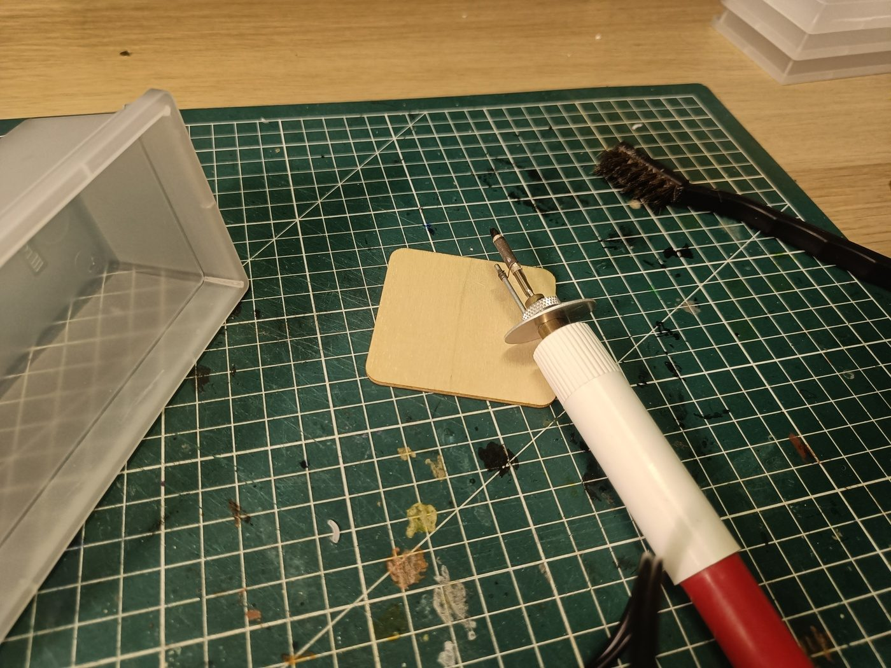

I wanted to see if a heat tool could easily mark PP, so I tried my pyrography pen.

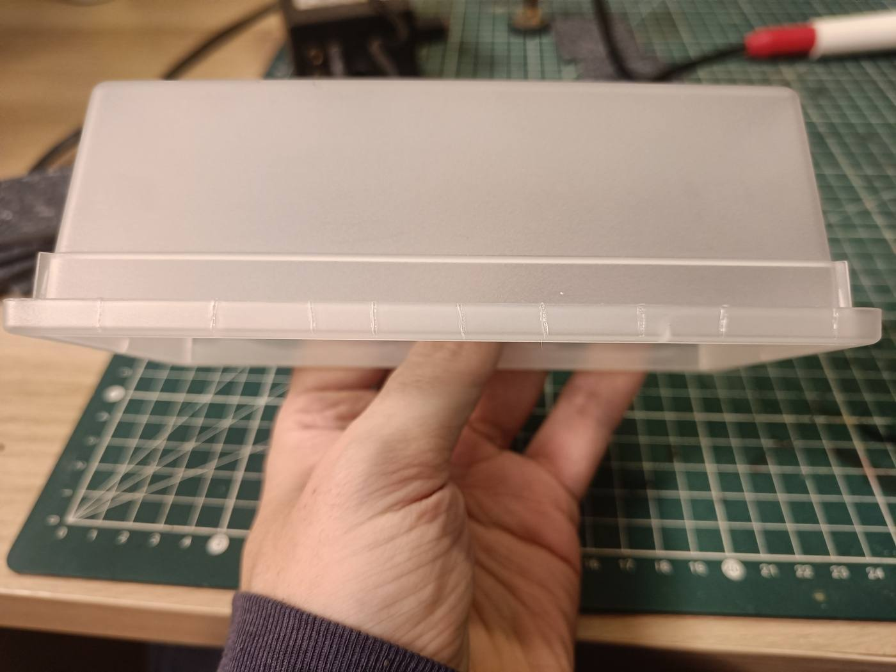

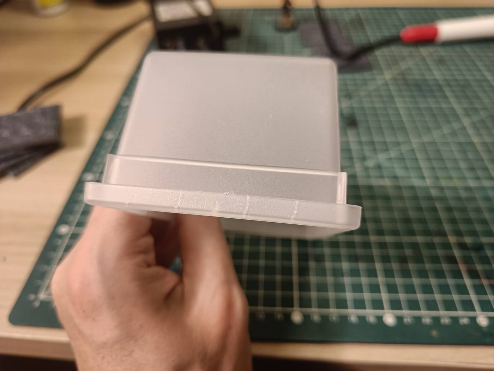

I got some light marking, but mixed results for convincing brick separations. The texture still looks very plastic. It also smells bad when heated. I'm not convinced by the final effect.

I then tried a file and a saw, but the notches weren't convincing either. Conclusion: PP is not an easy material to carve.

So the plan became: glue the box on a thick cardboard base (double layer), and find something to put on top to give it a sidewalk texture. I also looked into how other terrain makers texture the sides of their bases, and read up on plasticard. It's a rigid styrene plastic sheet, easy to cut, engrave and glue, used in scale modelling for scratch-building. Evergreen and Plastruct make it, and Green Stuff World even has textured brick/stone versions ready to use. Everyday plastic packaging is too thin, fragile and curved for precise work, so it's better to buy real sheets.

This got me questioning the whole approach. Starting from recycled PP boxes for solidity and correct dimensions seemed clever, but struggling to texture them properly makes me wonder if cutting polystyrene sheets to size wouldn't have been simpler, even with less perfectly straight cuts. It probably wouldn't be worse than what I have now.

## No rim at all

Another idea: apply filler on the rim, then use a texture roller or glue textured elements on top.

But going back to my inspiration pictures, I noticed something: the elevations there have brick walls going all the way down to the ground, with no rim or sidewalk at the bottom. The cardboard sidewalk base is more of a house thing. So why keep the rim at all? If I cut it off and glue the wall directly on the side, all the way down, it solves the height problem from earlier and matches the references.

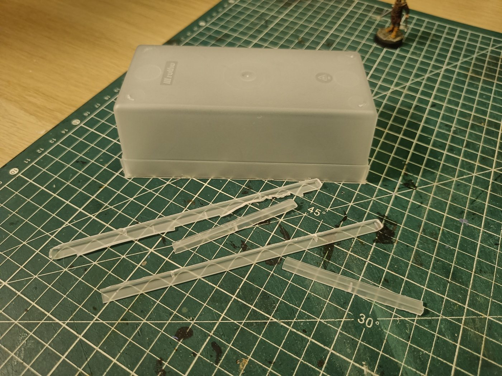

I removed the whole rim. First thing I noticed: there's less gluing surface, and the box is noticeably less rigid without it. Gluing it on a cardboard board underneath should compensate, but it's not quite the same.

On the plus side, walls glued directly on the sides are very flush with the ground, and it looks good. I still need to figure out how to keep the walls straight while gluing. Oh, and I spilled resin on the sleeve of a sweater I really like.

Flipped with the hollow side down, the box would leave a visible cardboard border all around, which is annoying, although cardboard might be easier to engrave. So I'm considering the other way around: box upright, full bottom on the table, walls glued against it. That makes keeping them straight much easier. Once flipped, I'd just need to fill in the top (the original opening of the box) with something solid. That seems easier than the alternative, so I'm leaning towards this.

## Doubts

To be honest, I'm having doubts about the whole elevation approach. Maybe starting from recycled boxes wasn't a good idea, compared to doing everything in polystyrene from the start. What held me back was cutting straight, I thought I'd need a Proxxon. And there's a new problem: if I glue cast Dungeons & Lasers bricks on the box sides, their depth might not match bricks I'd make myself in polystyrene, so the two systems won't line up flush. It might have been simpler to do everything in polystyrene, walls and bricks, the classic way, instead of complicating things with recycled boxes and casting.

It's been a rough evening motivation-wise. Work has been a rush lately (long days, working late on weekends), the workshop is under construction so I don't have my tools at hand to test things, and there's the resin on my sweater. So I'm stopping here for tonight. I'll pick this up again when I'm more motivated and the workshop is usable. In the meantime, I'll wait to see how the resin casts turned out: if the Dungeons & Lasers molds work well and are easy to reproduce in bulk, then it might be worth going all-in on this approach.
