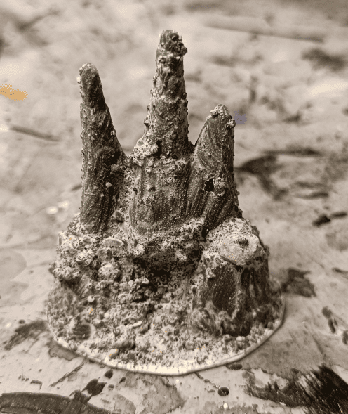
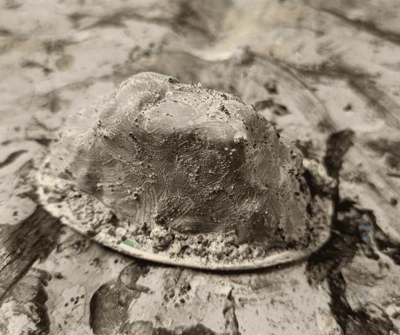
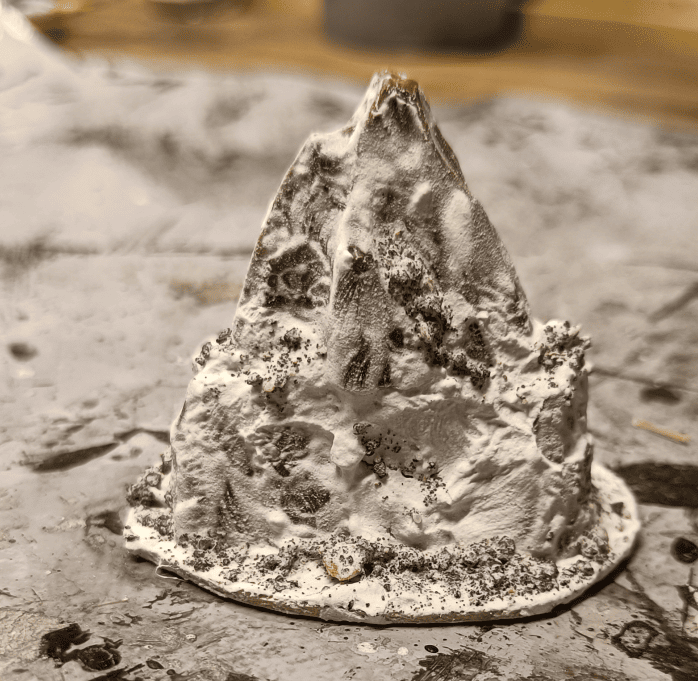

Quick doc on some scatter terrain I made. Basically just rocks for forest encounters.

I grabbed plastic rocks from various toy sets (Mega Bloks and others). What I like about them is they already have a natural rock shape, even though the texture is pretty smooth. They're also really solid which is great.

I glued them onto cardboard bases, then covered everything with a mix of glue, filler, and small pebbles/stones. This gives the smooth plastic surface more texture and roughness so they look more realistic.

Pretty simple project but they'll work great for adding some quick terrain to outdoor scenes.