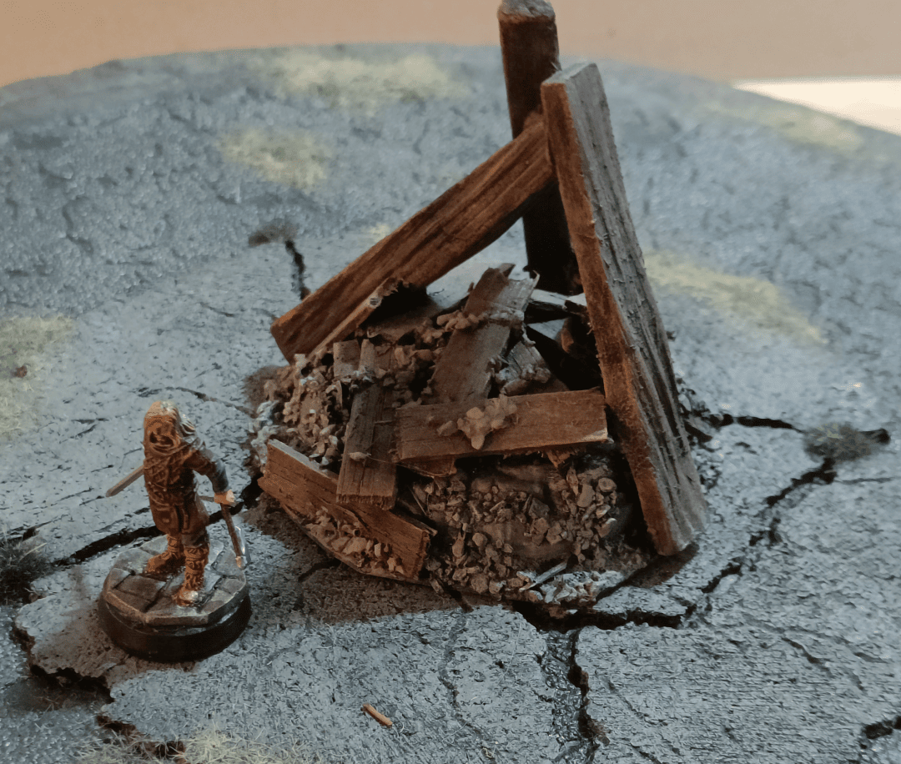
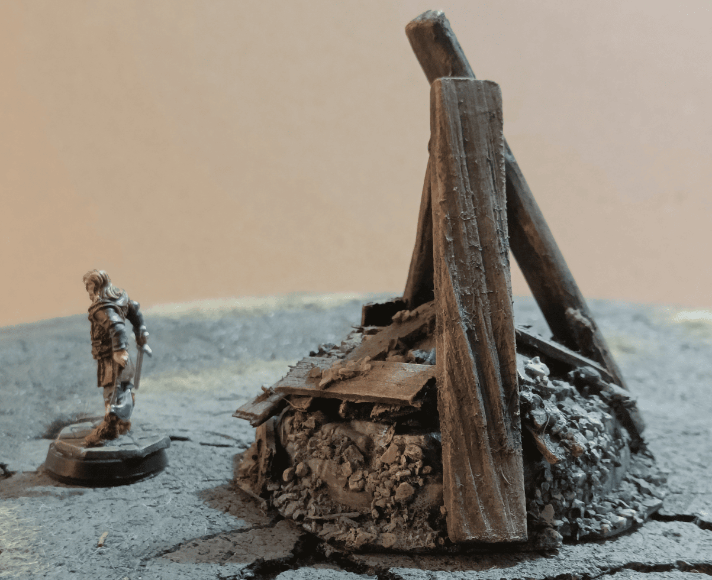

I tried to make a bonfire or pyre (the kind you'd use to burn a witch in a scenario), but I messed it up a bit. It ended up looking more like a pile of debris or scatter terrain, like what you'd see where a ceiling collapsed or in a ruined house.

The base is plastic to give it some volume. I added wooden planks made from popsicle sticks and cement, plus some stone pieces made with gravel.

I still use it from time to time, but honestly it takes up quite a bit of storage space. It's pretty tall but doesn't really add much to the battlefield. It's just scatter terrain that takes up space and isn't particularly beautiful or evocative. I think it's the kind of thing I should redo and get rid of.