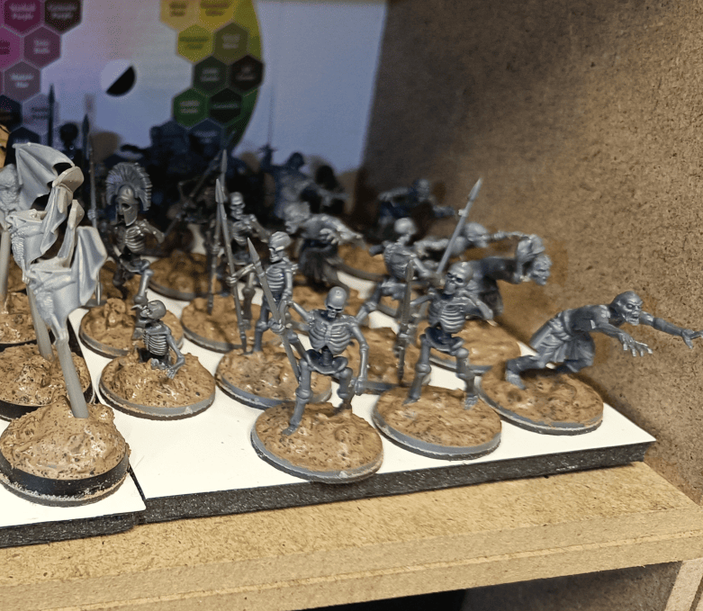
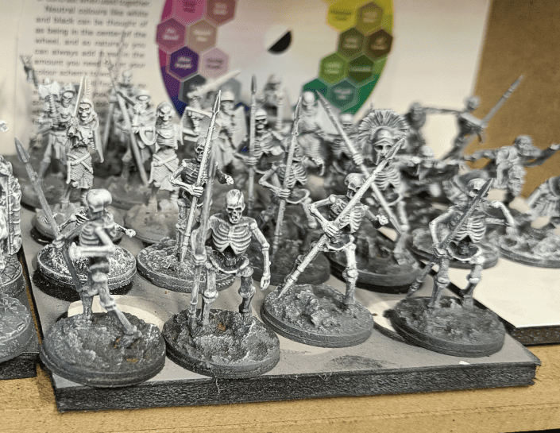
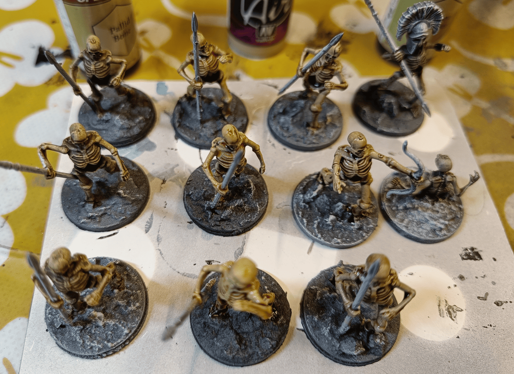
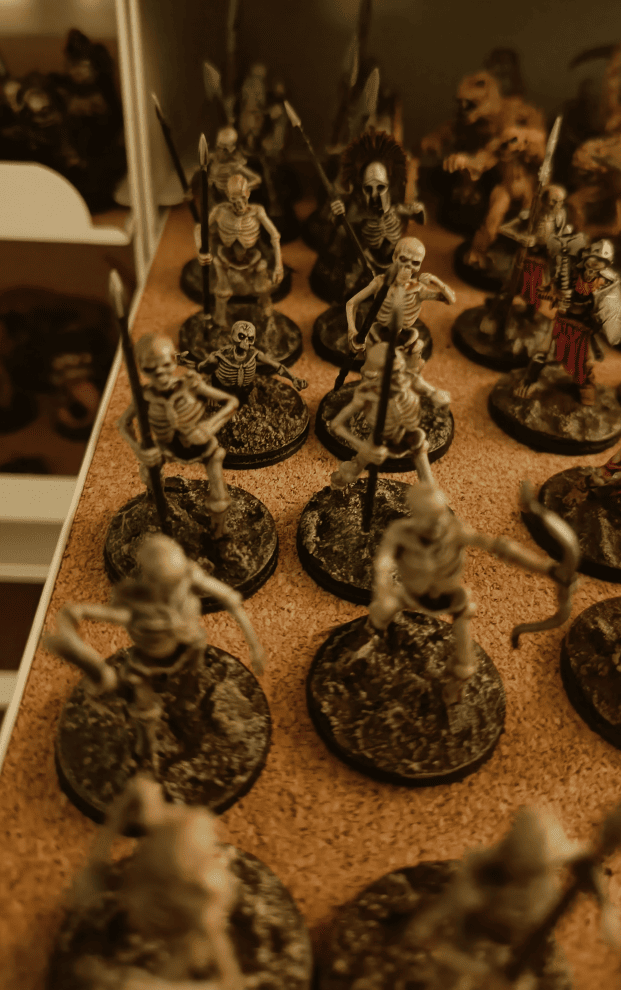

Wanted a break from terrain work so I decided to paint some miniatures. I realized my skeleton collection is a bit of a mess - I've got the original Games Workshop ones, some from the D&D board game, and random ones I've picked up at flea markets. They all have different paint schemes and scales which bugs me.

Since skeletons are such a classic monster for games, I figured I should have a uniform group. So I bought some new ones (can't remember the brand or where from), simple multi-piece models, just basic skeletons. Got them on their bases, added my usual basing mixture, and now I'm ready to paint them all up to match.

I do my base coating in several stages. First, I base coat everything in black so that any unpainted spots don't show too much. Then I apply a bit of gray on the front, top, and back. After that, I do a white zenithal over it.

Back at my workshop, I do a white dry brush using Army Painter's Fanatic Paints - it has really good coverage. It might be overkill, maybe the gray layer isn't needed, or maybe the zenithal prime isn't either, but that's my current technique and it works well. I might remove a step later to save time, but for now I'm happy with it.

It gives a lot of color variation on the miniatures, which makes the speedpaints work really well over it.

And there you have it! This is what it looks like once I add the speedpaint on top.

I have two colors that I really like (Pallid Bone and Bony Matter) for making skeleton colors. Some of these I did directly on my undercoat, and others I did on a first layer of Bone White as a base color. That way it gives me a bit of variation in the final look.

And there they are: finished and stored on the shelf.