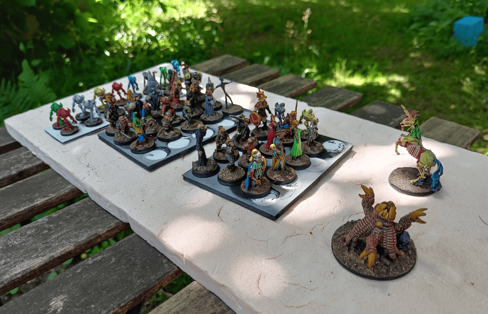
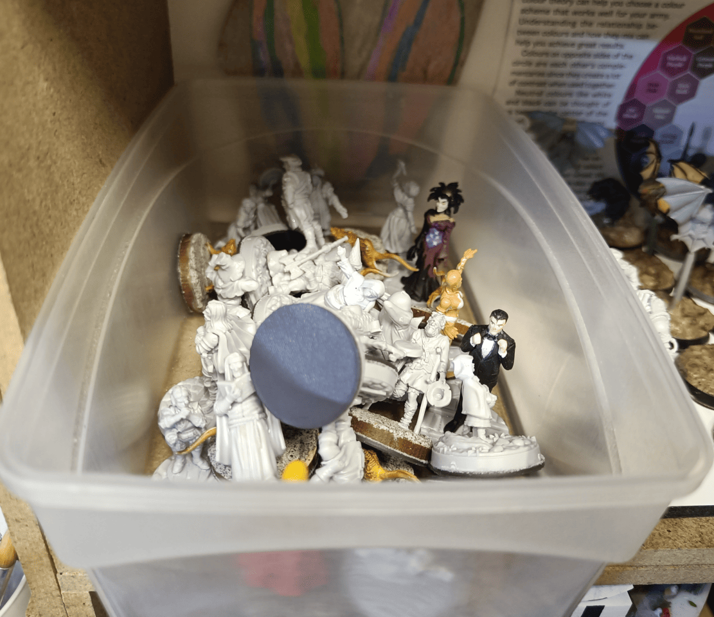
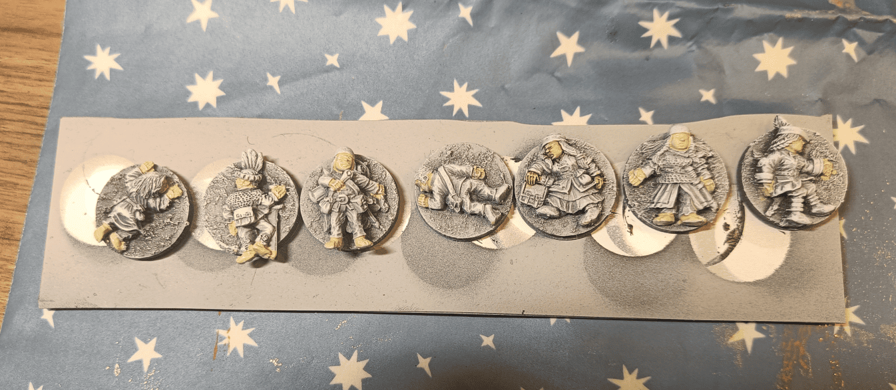
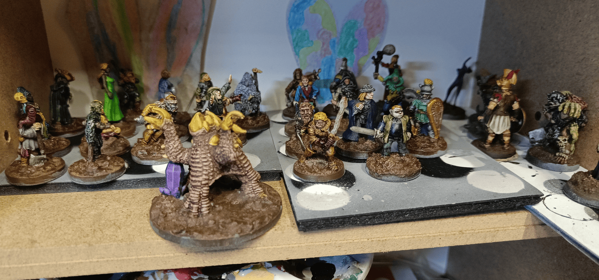
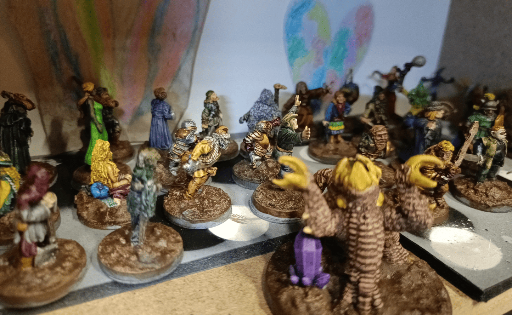

Here's an overview of miniatures I batch painted in an evening or two thanks to speedpaints. I had just received my speedpaint pack and wanted to try out all the colors to see what they looked like, which ones I liked, and which ones I didn't. [Similar to my creature batch](../creatureBatch/), I gathered a bunch of miniatures from various sources to test them out.

<!-- 1 -->

<!-- 2 -->

This mix includes miniatures from Dungeons & Lasers' Civilian set, Heroclix figures, HeroQuest miniatures, old metal miniatures I recovered from long ago, Zombicide figures, official Dungeons & Dragons miniatures, World of Warcraft figures, Reaper miniatures, and more. I threw everything together and painted a bit of everything.

<!-- 3 -->

These were from a Halfling Kickstarter I backed. They're dead Halflings. These are the tokens I always use to indicate when there's a corpse on the battlefield. I should really buy some that represent human corpses because right now I only have Halfling corpses. I'd had these for a long time and was always too lazy to paint them. This was the perfect opportunity.

<!-- 4 -->

Nearly finished, before varnishing. This really let me try out lots of different speedpaints. My process was to pick a color, like red, look at all my miniatures and decide who needed a bit of red, and apply it. Then I'd take another color, like dark black, and do the same. This approach gave a really nice uniformity to the whole batch.

<!-- 5 -->

A closer look at the finished results. I was really pleasantly surprised by the speedpaints. They allowed me to get decent tabletop-ready miniatures with minimal effort, and the variety of sources and styles actually works together cohesively.

