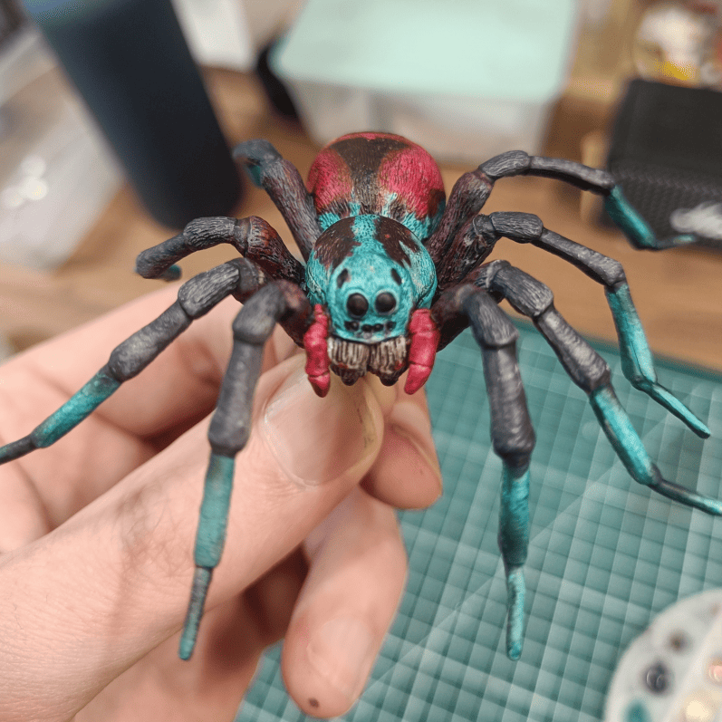
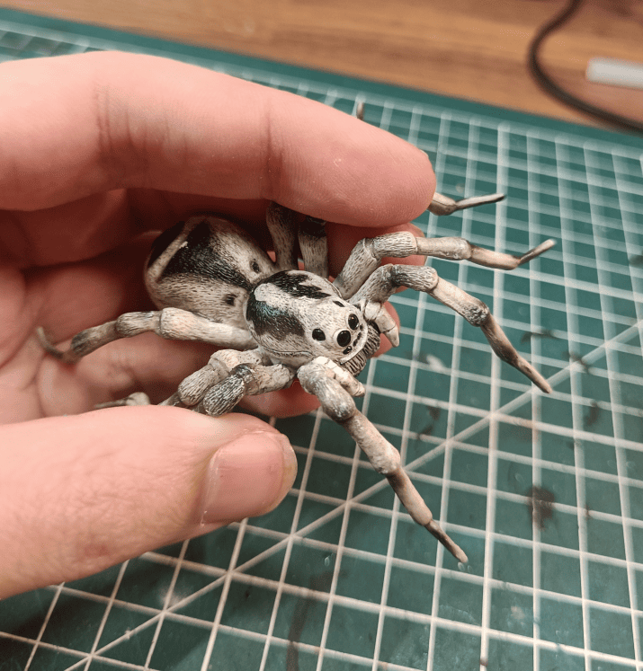
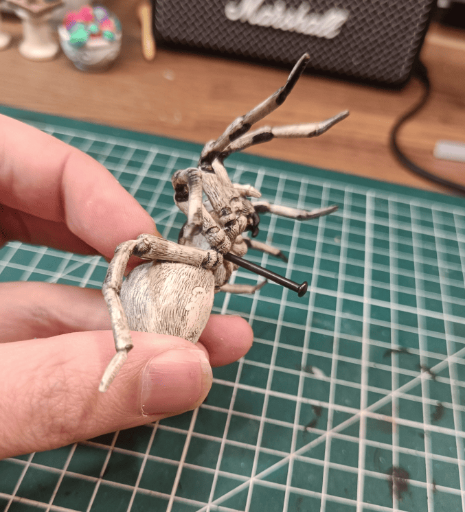
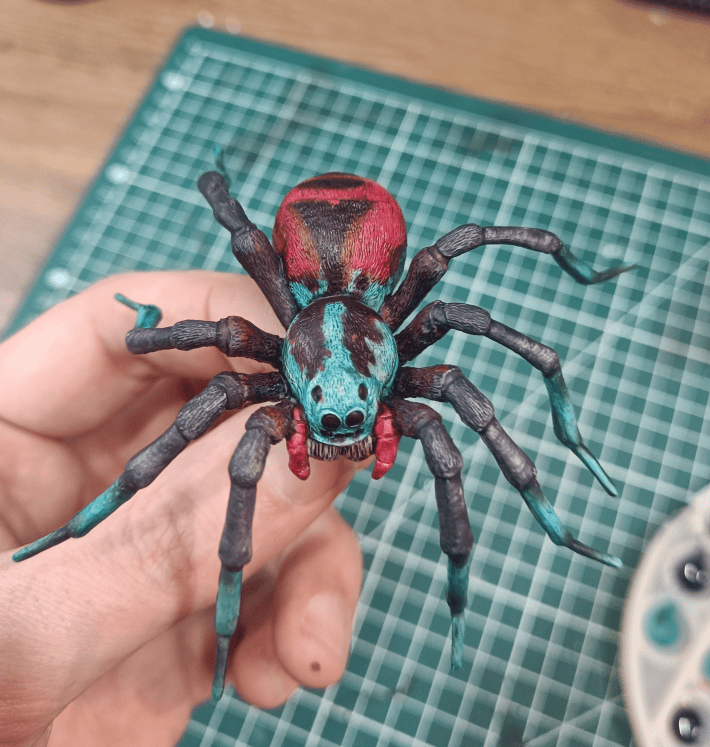

<!-- Image 1 -->

You might recognize this spider color scheme. It's the one from the spider boss beneath the abandoned village in Baldur's Gate 3. I like this fight because it involves a lot of vertical gameplay, stealth mechanics, and avoiding aggro on the smaller spiders and Ettercaps. I wanted anyone who played the game to immediately recognize the color scheme.

<!-- Image 2 -->

This was the original version, a plastic prank toy meant to scare people. It's fairly large and the plastic is quite flexible, with legs that bend easily. Honestly, it was already pretty scary as is and I could have used it in a game session without any modifications, but I felt it didn't look fantastical enough.

<!-- Image 3 -->

To paint it easily, I made a small hole underneath and inserted a nail, which I held throughout the entire painting process. I also scraped off all the markings that were on it: CE markings, serial numbers, things like that.

<!-- Image 4 -->

The more I paint, the more I realize that I used to try to replicate reality as closely as possible. But in reality, spiders have dozens or even hundreds of different shades of gray and brown, and I can't paint that properly. More importantly, it's not very interesting. 

Now, I keep things simple: two main colors, three at most. Here there's blue, red, black, and that's it. I try to use the main colors where the eye naturally goes. That's why I didn't paint all the legs blue, only the tips, and primarily the body. But I left the abdomen red. I try to be tactical with color choices: elements that aren't important get more neutral colors, while elements where I want to draw attention get much stronger colors. [Similar to how I repainted the Dark Young's tongue in a bright color](../darkYoungOfShubNiggurath/). Years ago, I would never have painted a spider this color. Even if I hadn't played Baldur's Gate, I would have painted it in very brown tones.

The bold color scheme makes it instantly recognizable and much more interesting than a realistic spider would be.
