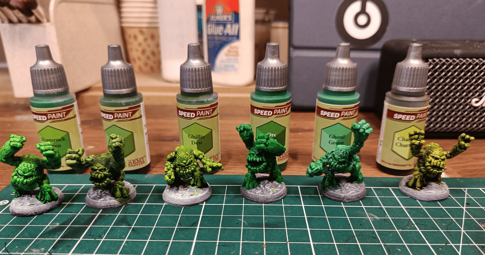
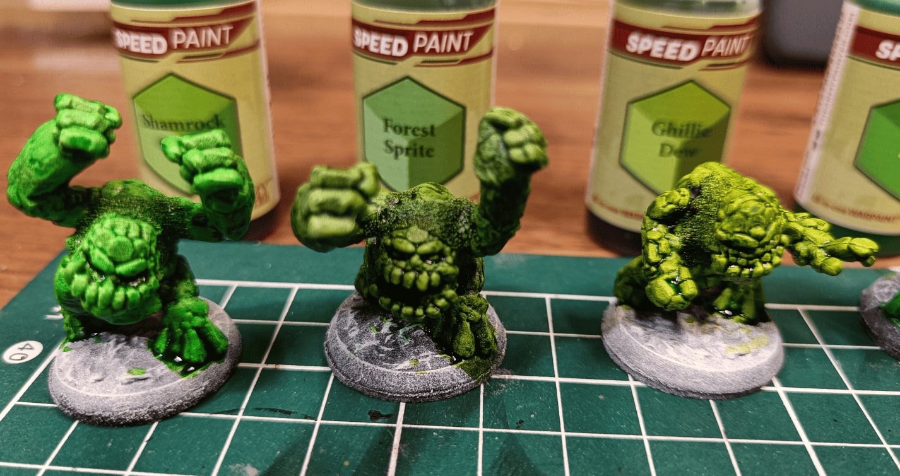
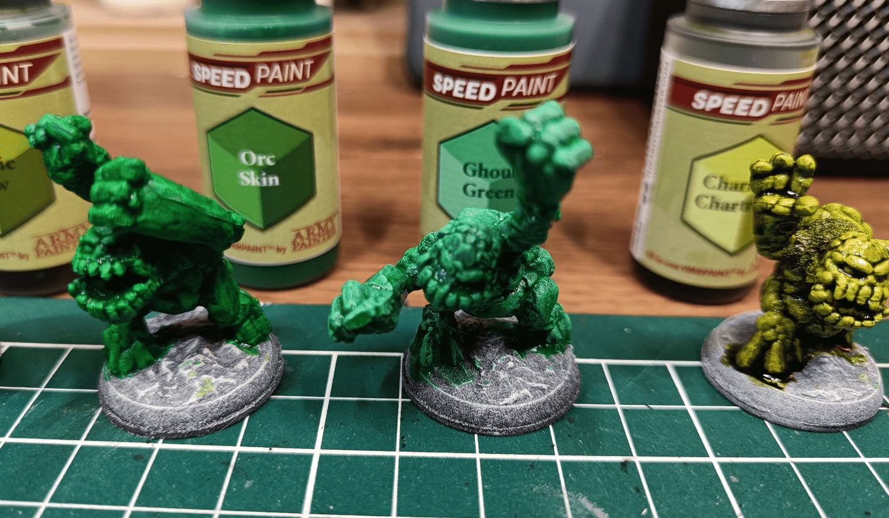

<!-- Image 1 -->

I have these miniature, probably Reaper models though I'm not sure. I really liked the sculpts with their somewhat cartoonish style. 

The parts to assemble didn't fit together perfectly, so I added some baking soda and super glue to create the connections between parts. Since that gave them a rocky texture anyway, it wasn't a problem.

I thought those would be a good way to test my green Speedpaints, [similar to my other speedpaint tests](../speedpaintTestBulkPainting/). I have tons of greens and was struggling to know which was which. 

For example, Ghoul Green sounds like it should be something morbid but it's actually quite bright. [Orc Skin](../speedpaintTest/) sounds dark but looks like an emerald. The names don't match what they actually look like. I figured this could be a good way to create a unit of stone elementals with cohesion, all green but with different shades.

<!-- Image 2 -->

Here's a focus on Shamrock Green, Forest Sprite, and Ghillie Dew. Shamrock Green is one I kept because it's very vibrant, great for really punchy green. Forest Sprite remains one of my standard choices for camouflage. Ghillie Dew I stopped using.

<!-- Image 3 -->

Here we have Orc Skin, Ghoul Green, and Charming Chartreuse. I find that Charming Chartreuse and Ghillie Dew look too similar, so I only kept one and use it rarely. Orc Skin could potentially swap with Shamrock Green as a darker shade. Ghoul Green has a precious stone look and doesn't look ghoul at all.

In the end, these miniature weren't fun to paint...

The sculpts were excellent but I wasn't inspired at all when painting them. It was too much green. 

I tried applying a darker wash later to give them more of a stone appearance but messed up the paint job and it looks ugly. If I had to do it over, I would have done most of the golem in stone gray and just made the teeth, eyes, nails, and certain extremities in more powerful colors. At least this allowed me to see which greens I liked.
