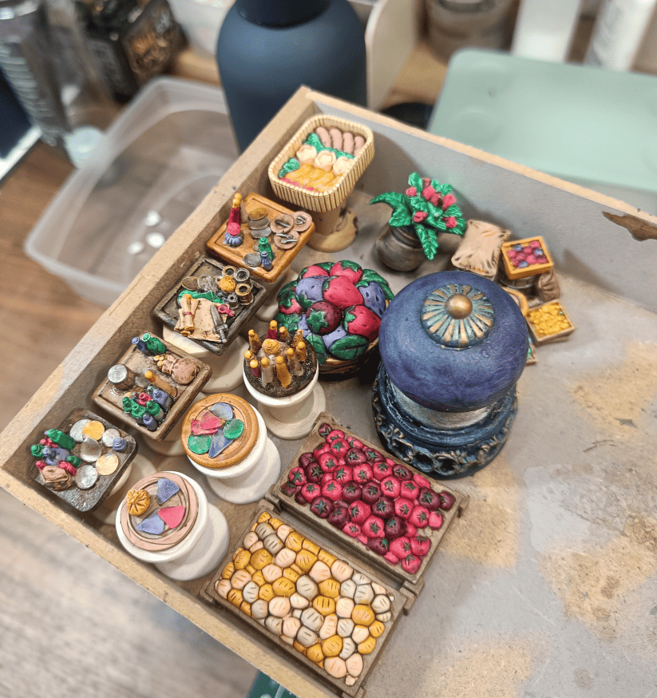
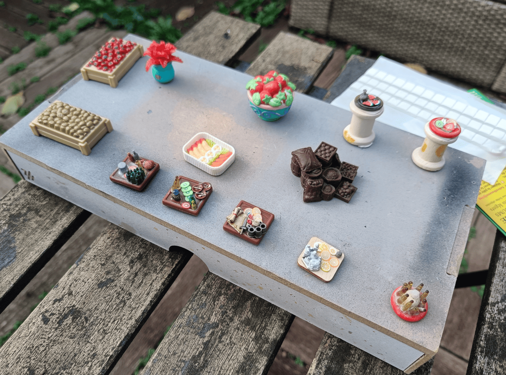
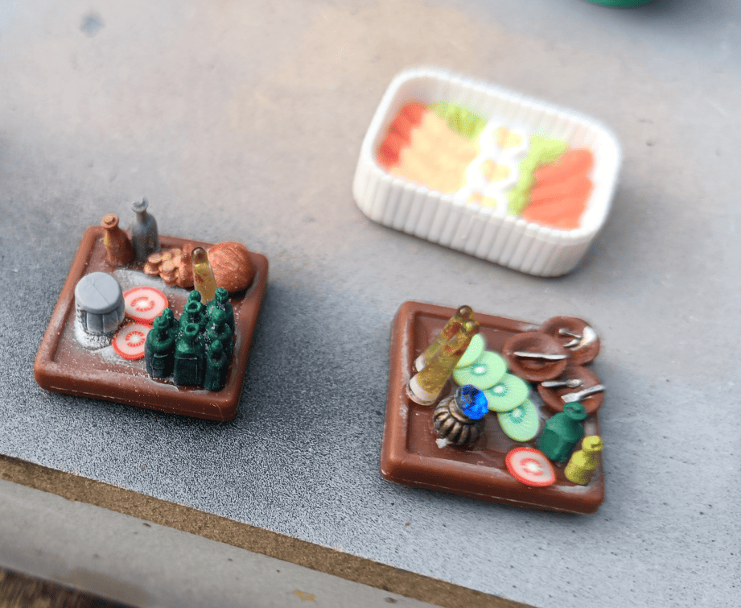
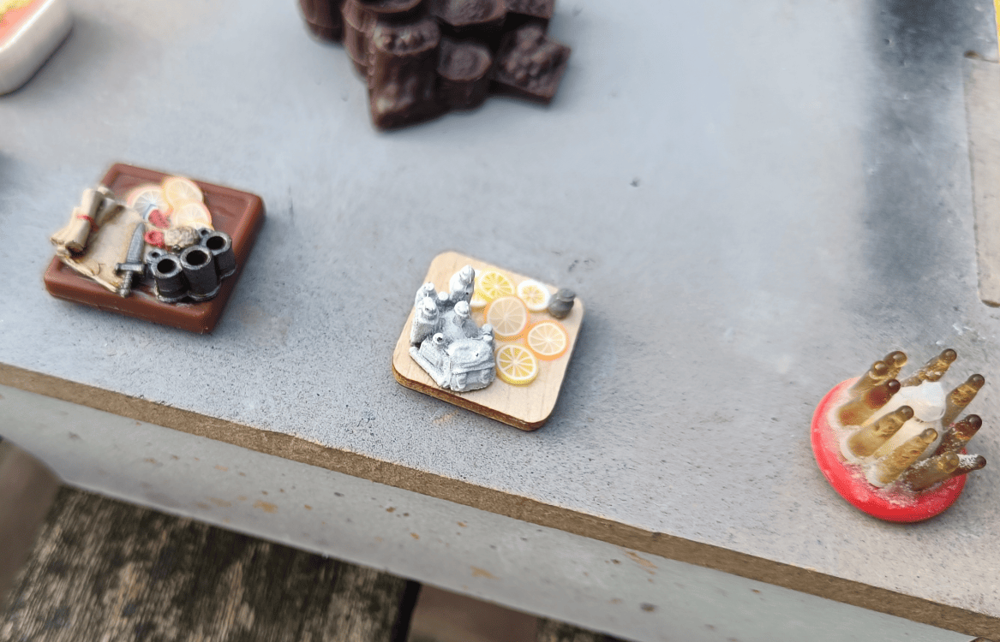
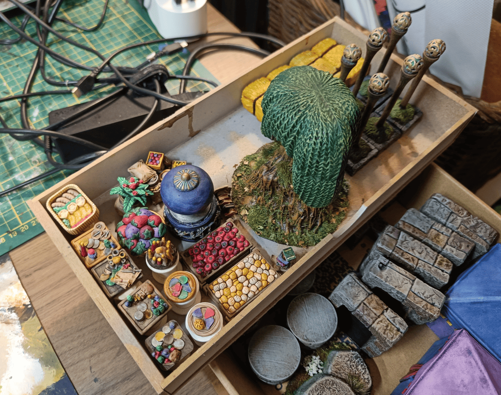

<!-- Image 1 -->

Table dressing are scenery elements you place on top of other scenery, like small trays you put on tables.

In another post I made [market stalls](../fairgroundMarketStalls/), and I didn't want to glue what each stall was selling directly onto them since it could change between scenarios. Instead I made small removable elements. I gathered lots of small pieces from various sources and made trays that can be placed anywhere.

<!-- Image 2 -->

Before painting. The trays at the bottom are made with small plastic circles (tokens from board games) or squares (bases from Dungeons & Dragons board game miniatures). I cut those miniatures off to rebase them on rounds like all my others, but kept the square bases for trays.

<!-- Image 3 -->

The white thing in back is from a game, probably Sylvanian Families. I "borrowed" it from my daughter. Some pieces are already painted (the bottles, the purse) because I'd painted those in a painting frenzy when I received my [Mantic Terrain Crate](../manticCrateFurnitures/) kickstarter pledge, then realized they were too small to use individually on the table. So I kept them aside to glue together onto trays.

The kiwi and tomato pieces came from some craft store. I thought they might show what people are eating, but I ended up painting them as gold coins later. Good way to get small round objects easily.

<!-- Image 4 -->

My idea was to fill trays with things that make sense individually in a medieval fantasy setting, even if they don't make sense together. That's fine. It shows the table is full of clutter with stuff players can search through. On the far right, those small ochre things are the ends of glass medicine ampules. I kept them thinking they'd make good candles.

<!-- Image 5 -->

Finished painting. They're in my tray ready for varnishing outdoors along with other pieces. I painted them with bright colors and I'm happy with how they turned out. Small things, nothing much, but little details that improve a game board easily.

Besides the trays, there are other small elements that don't sit on tables. The stall filled with tomatoes and the one with what looks like bread or potatoes came from some toy I can't remember. Simple scenery to make since it's already sculpted. The big purple piece will be a luxury statue or fountain. It's actually a drawer handle placed vertically, and the rest comes from various sources.
