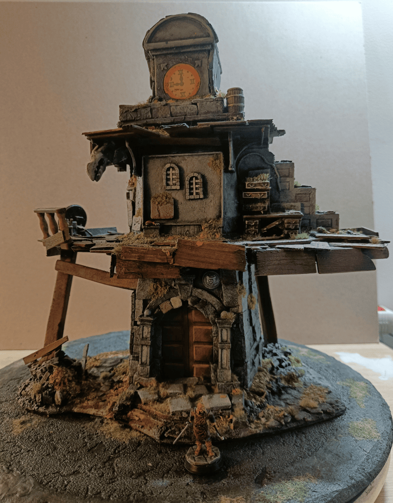
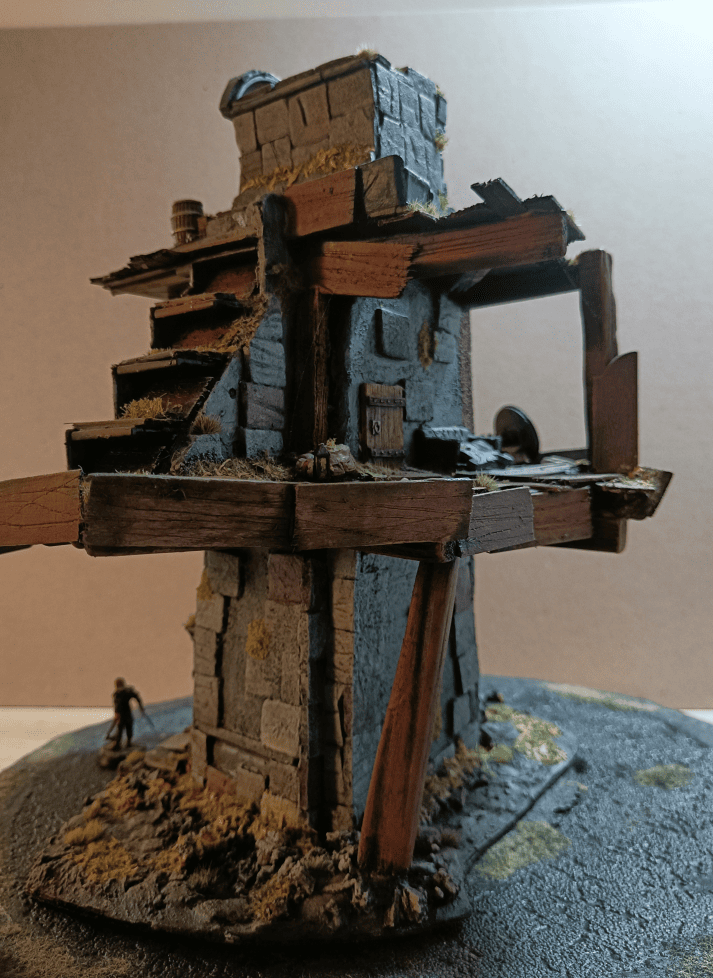
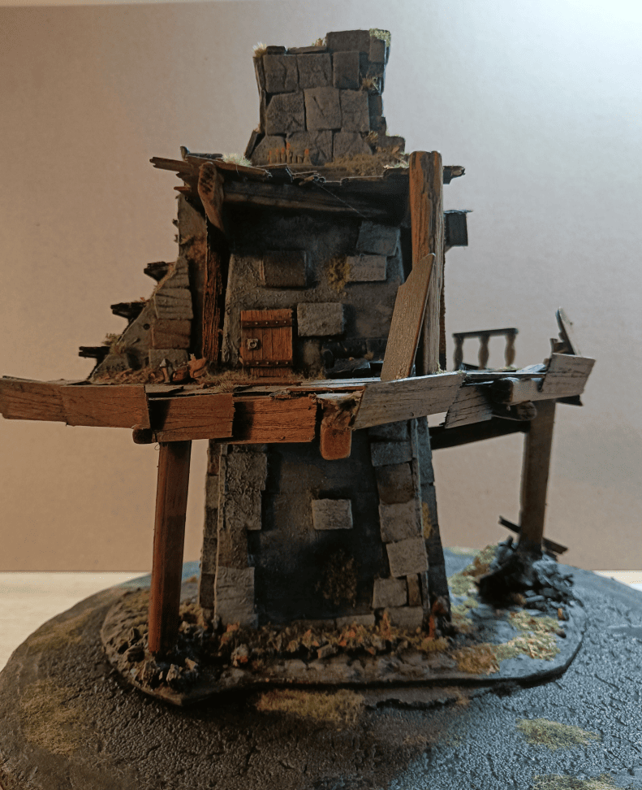
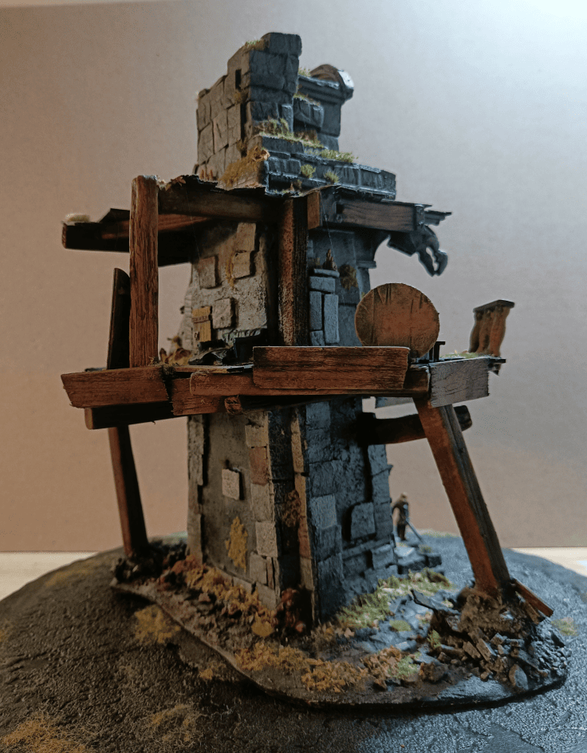
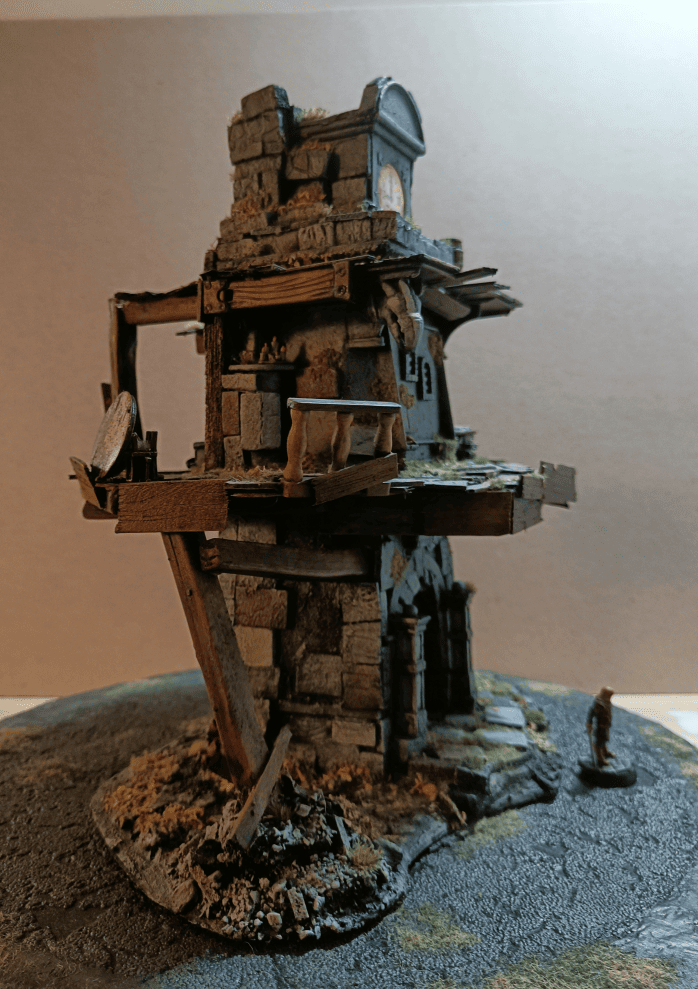
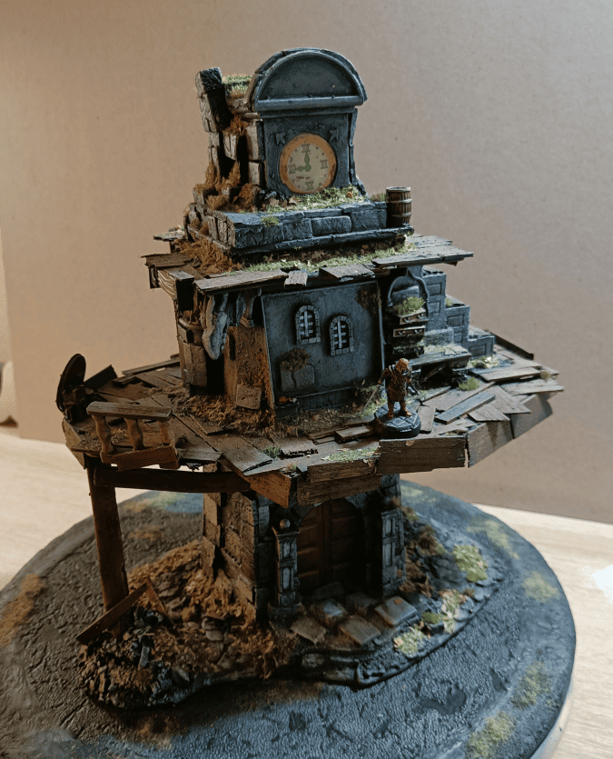
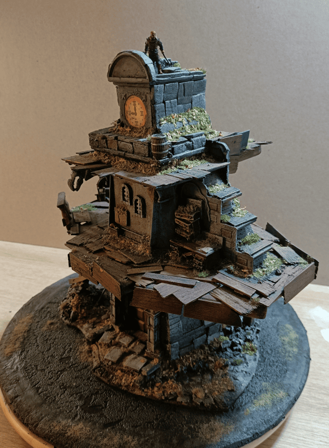

I already documented the entire build process for this bell tower a long time ago. This is really just a small post while I'm going through all the photos I took to make sure I'm properly sharing the beauty shots I made of this piece. It was one of the biggest builds I've done.

This one is quite interesting to me because it represents the bell tower of Tarnopol, a place described in "Mariemburg, Sold Down the River", a guide to Marienburg for Warhammer Fantasy Role Playing Game first edition that I loved. It's this bell tower where orphans live, and it left an impression on me, so I wanted to recreate it.

This build was nice because there were quite a few techniques I was discovering while doing it. Wood, foam bricks, very easy stone painting and very easy wood painting too, with flocking all around which holds really well. It's super solid. 

It's a build I appreciate a lot, even though it's simple and I don't really know when I'll need it. I like it a lot because it evokes something for me.

