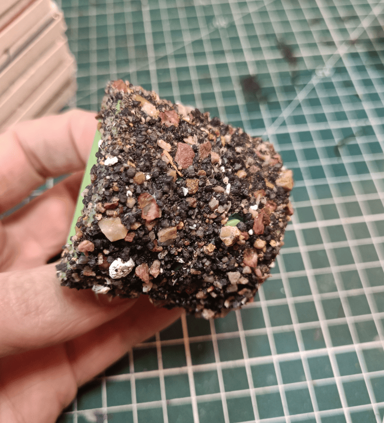

This is a quick post to show something I made recently. 

I usually use an aluminium foil ball to create stone texture on foam, but after a while it hurts my hands from pressing. So I made my own tool. 

I took a piece of plastic with a handle and put lots of glue on it, then pressed it into a container full of gravel. I added more glue on top, pressed it into the gravel container again, applied fixative over it, and now I have a tool with a handle with real stones glued to it. 

When I press it on foam, it impacts it inside, which lets me work much faster because the surface I'm pressing with is much larger. It's very solid and makes real stone impacts rather than aluminium texture. 

If I had to do it again though, I'd choose something even more comfortable to hold in my hand, but the point is that when you do things many times, you might as well **craft your own tools** to make better craft.
