<!-- Image 1 -->
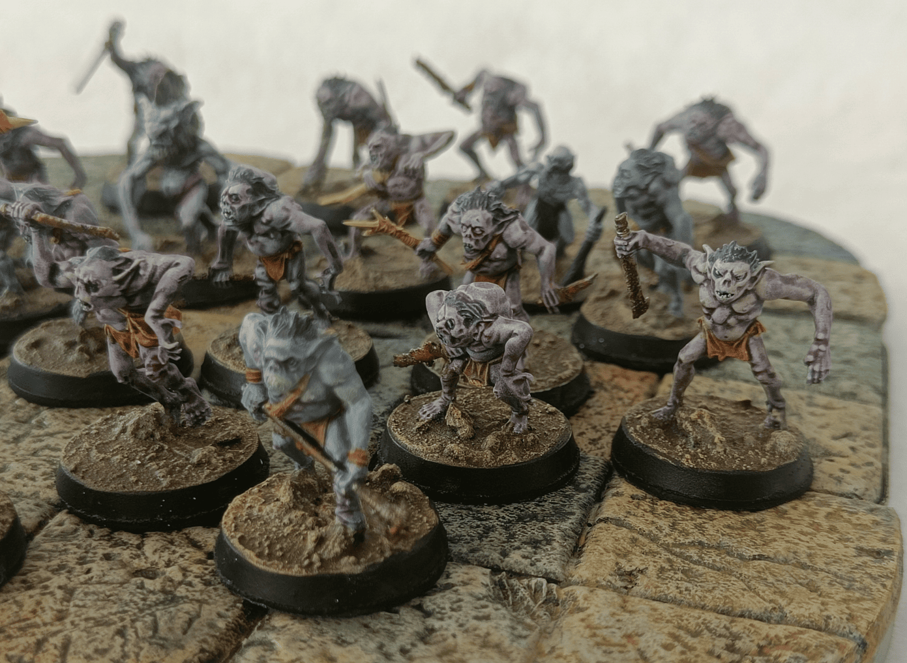

I found these miniatures really interesting. I believe they are Games Workshop miniatures, the goblins from Moria, with slightly deformed heads that work well for dark goblins. They're quite affordable because you get a lot of them in the box, they're all plastic, and each sculpt is different. Since I had a scenario where players might encounter Troglodytes, I decided to paint them as such. They're deformed creatures that live underground and don't see much daylight. They could also work as Mongrelmen or many low-level monsters that level 1 players can fight without too many moral questions.

<!-- Image 2 -->
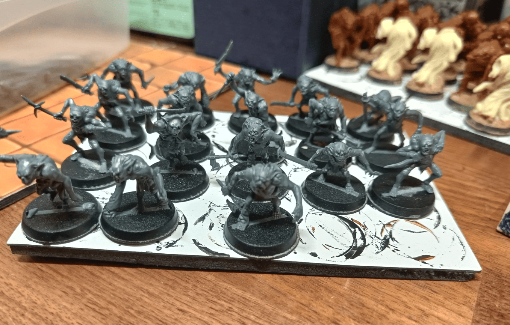

This is my assembly line at the very beginning. The sculpts look similar but there are really no two identical ones in the box.

<!-- Image 3 -->
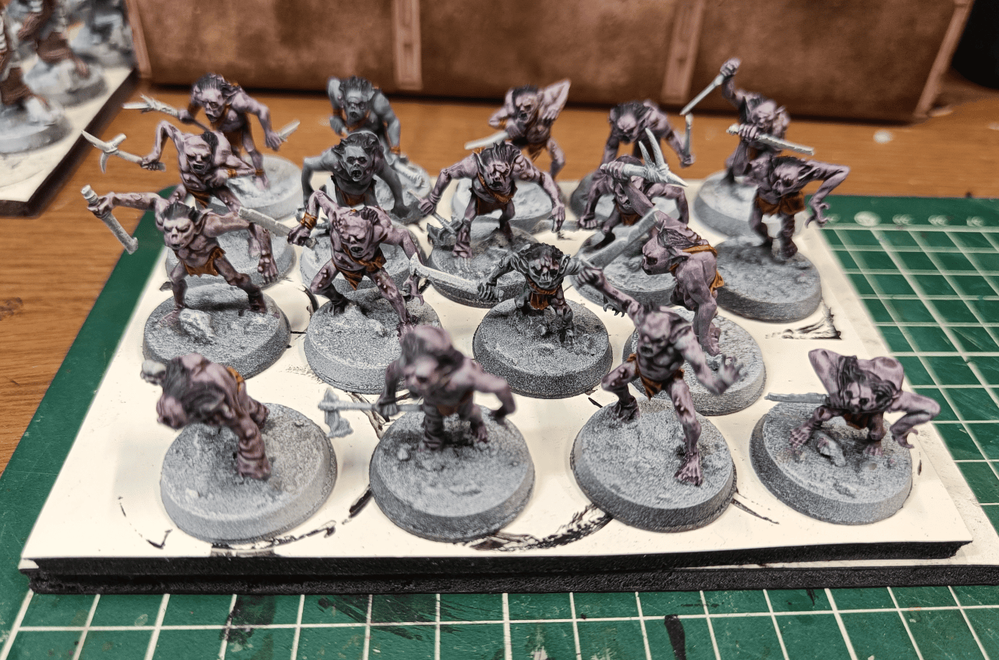

I started applying the base colors, though I don't really remember the exact process. It looks like I used Games Workshop washes, but I think they're all speedpaints. I tested some blue and pink, sometimes mixing both, wanting them to stay in those tones.

<!-- Image 4 -->
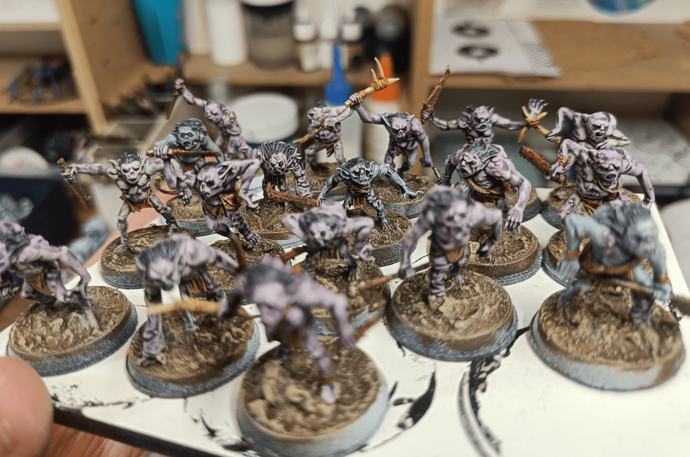

I did their hair in speedpaint, their leather loincloth, and their weapons in either bone or rusty tones. I should have taken notes as I was doing it, because now if I had to reproduce the same effect, I wouldn't know how.

<!-- Image 5 -->
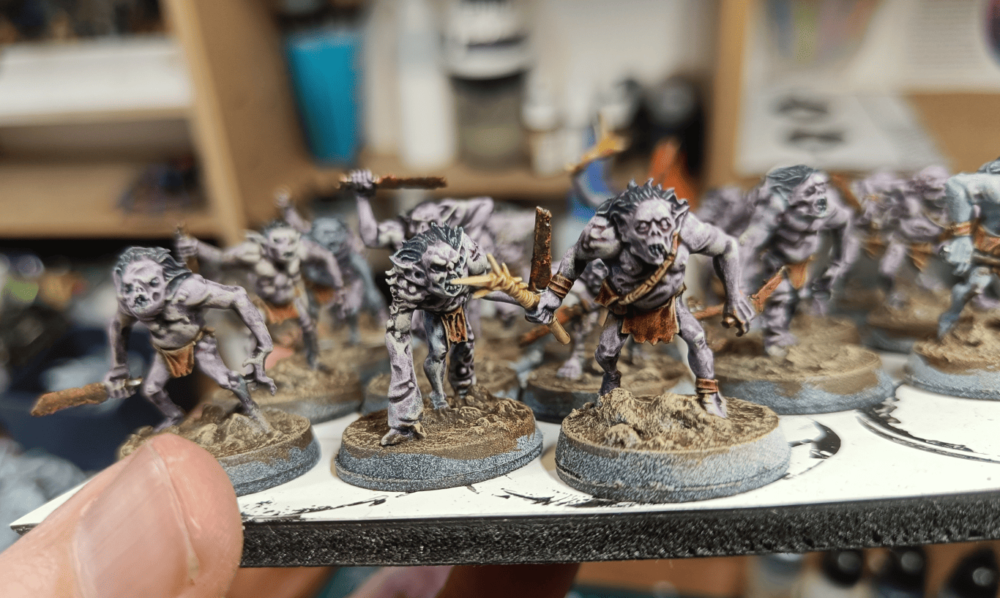

Here you can see them a bit closer. What I do remember is going back over all their pustules afterward with a purple wash to give them a slightly more violet look.

<!-- Image 6 -->
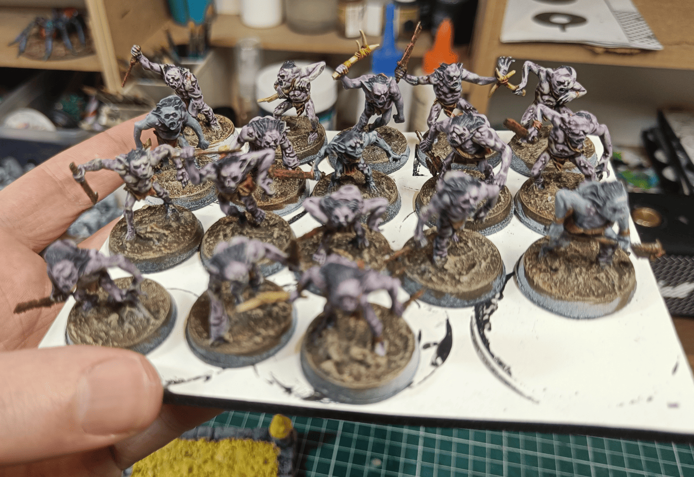

Here is a nice family photo of all of them together.

<!-- Image 7 -->
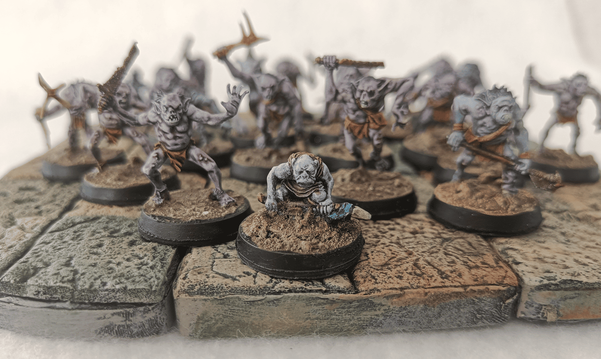

This is the complete photo. I had a few miniatures that I had already painted with this color scheme that I added to the unit, including this little thing. I don't remember exactly where it comes from, but I thought it could represent their chief well.

<!-- Image 8 -->
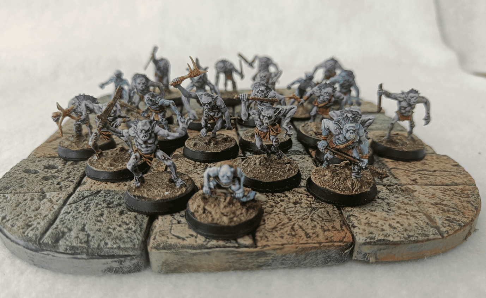

Here you see them in a group. My players actually fought them in a canyon in the middle of a desert, with holes on both walls from which these creatures emerged. I had them smell really bad, and when they died they created an almost poison aura around them.

<!-- Image 9 -->
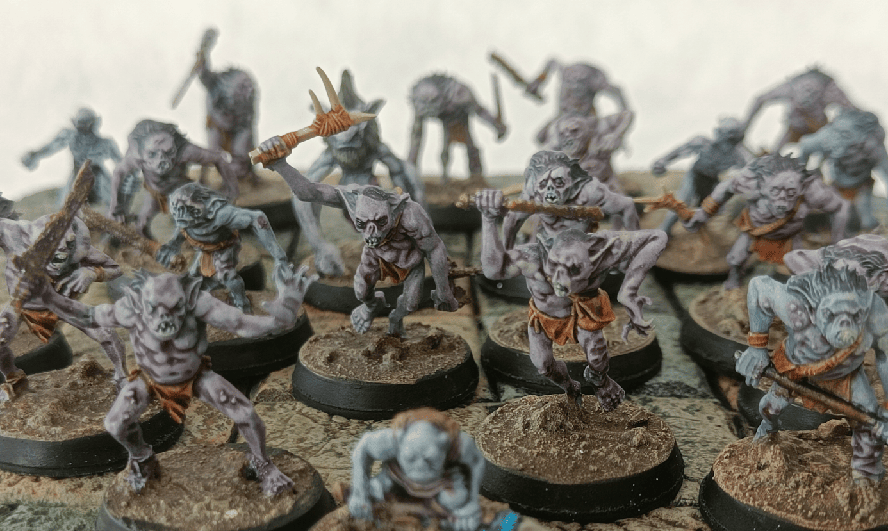

Here you see them even closer. They're really pleasant to paint and good Games Workshop miniatures for the price, with a lot of character.

<!-- Image 10 -->
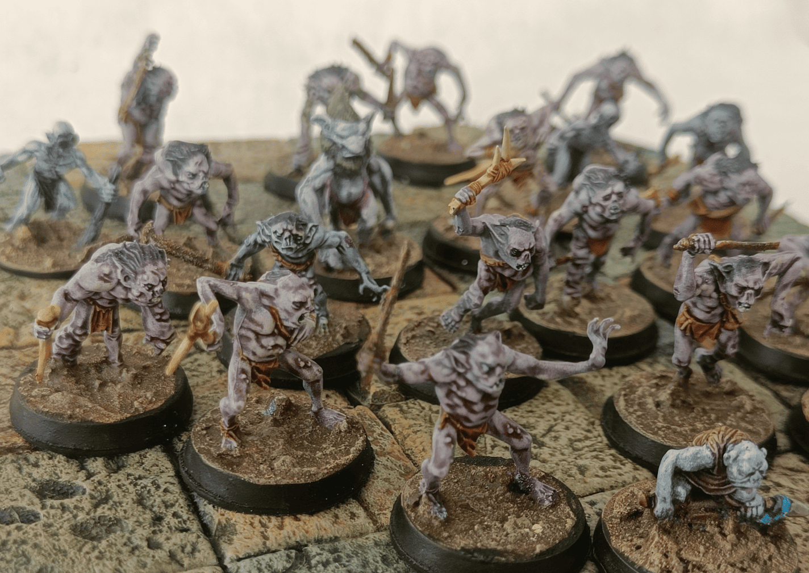

Here is another group photo. You can notice two intruders that don't come from this set. In the top left is a miniature from Heroclix, part of the monsters that live underground with the mole man. In the middle is a forest goblin from some board game I can't remember, but painted with the same color scheme they blend well into the mass of deformed creatures.

<!-- Image 11 -->
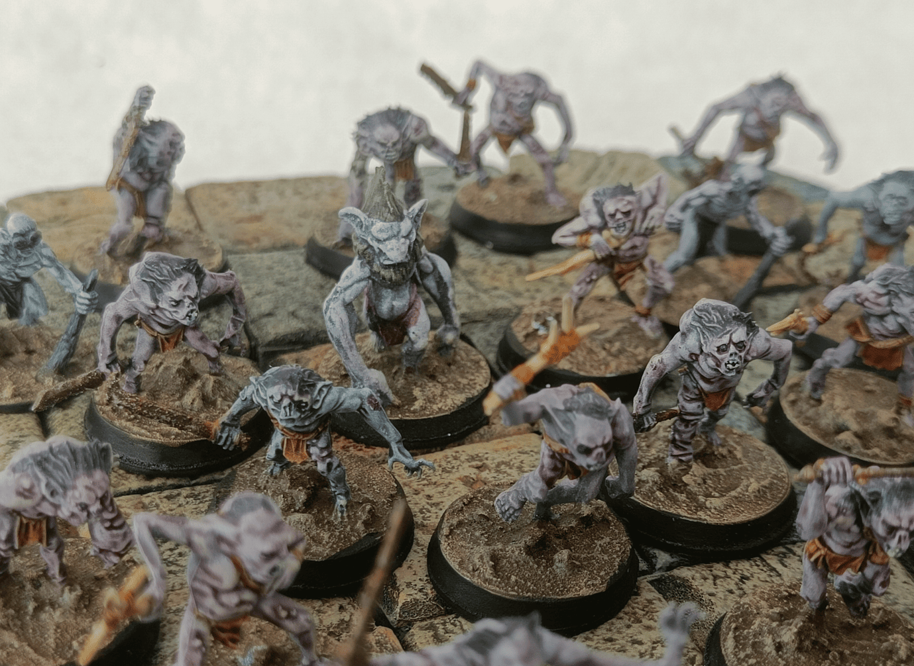

Here you can see this big goblin a bit better.

In the end, I really like these miniatures for their original sculpts. They're very easy to paint, I'm quite happy with how they turned out with speedpaints, and they work well on the battlefield.

