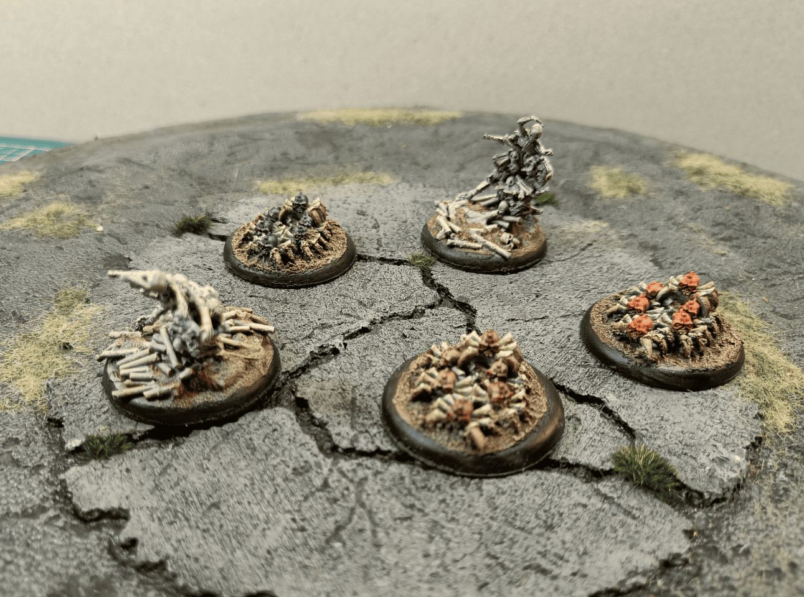
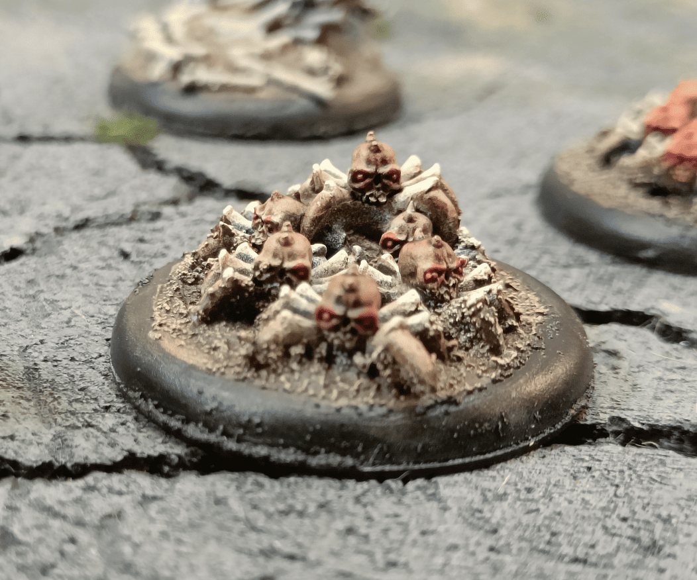
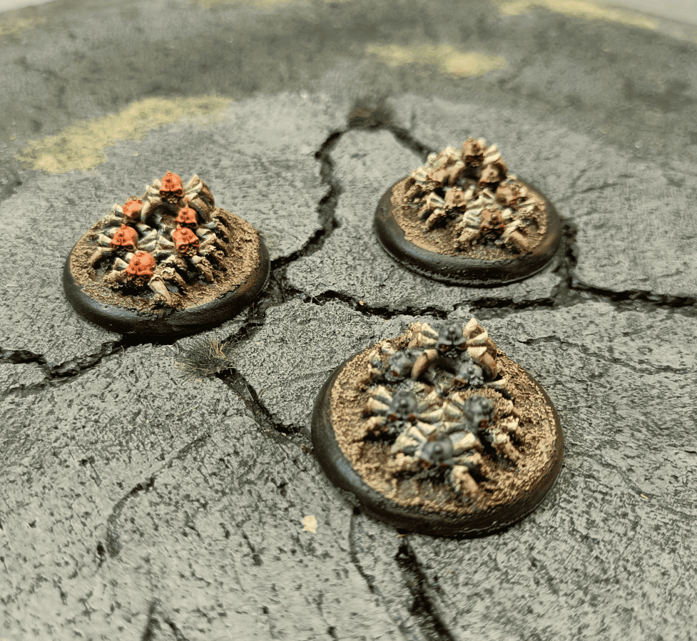
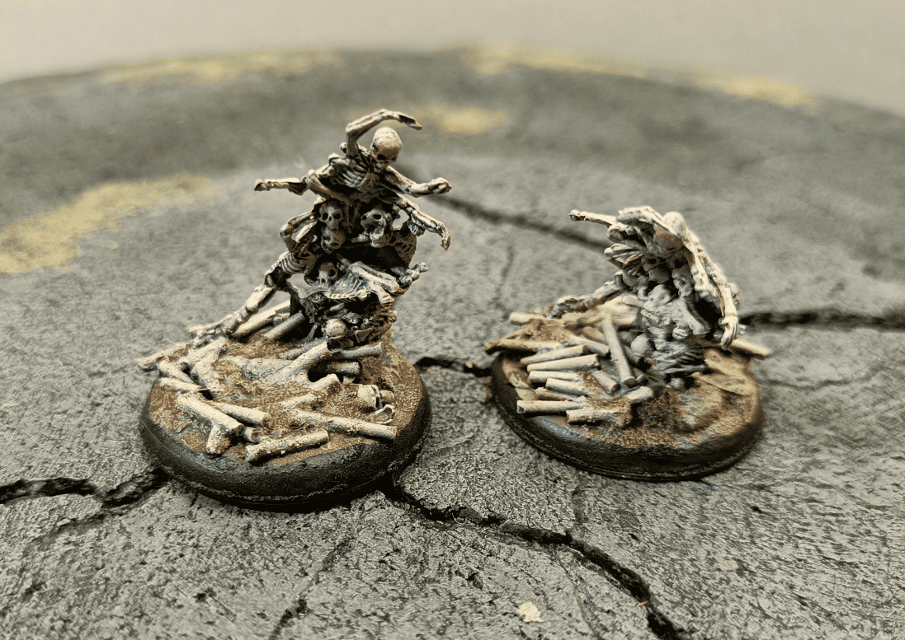
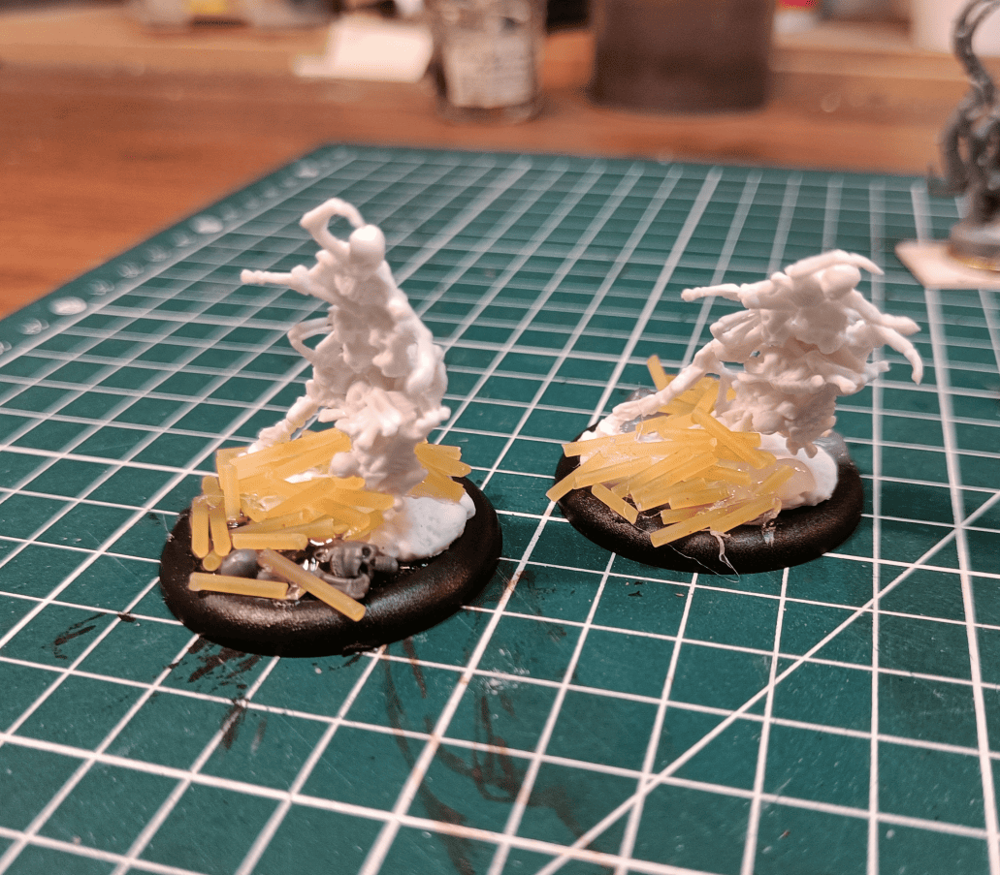
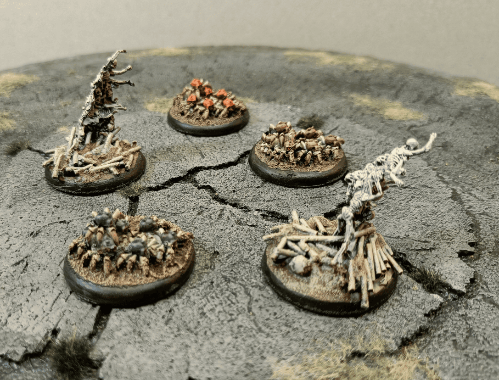

<!-- Image 1 -->

This is a post to show some of my undead swarm miniature. I have two types: the bone swarm, which is basically a wave of bones, and the animated skulls that are half skull, half spider.

<!-- Image 2 -->

Here's a close-up of these skulls. I'm not sure where they come from, maybe from Helldorado, or maybe from another brand.

<!-- Image 3 -->

Here you can see the three different ones. I tried to give them slightly different colors so they can be recognized a bit on the battlefield.

<!-- Image 4 -->

These are swarms from Reaper Bones. It's not really resin, not really plastic, I'm not entirely sure what it is. It bends quite easily. I added a bit more to the bases to make it look like there are more bones.

<!-- Image 5 -->

You can see the technique here: I took [small pieces of spaghetti](../bonePiles/) and glued them to the ground. I think I made the spaghetti pieces a bit too big. I should have spent a bit more time and made them smaller, and potentially added a few more skulls and rib cages. I added some, but I think the effect would have been greatly improved if I had added more.

<!-- Image 6 -->

And finally, here's an overview of everything.
