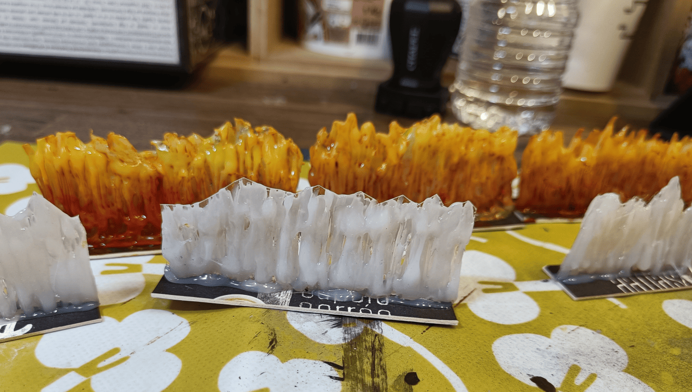
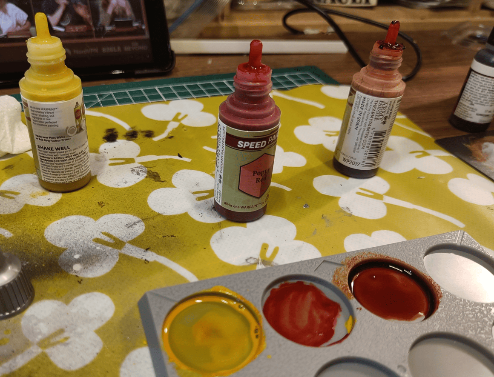

Quick post to document how I made some firewall effects for a scenario I was working on.

I took a sheet of transparent plastic - didn't buy it, just recovered packaging from a blister pack that came with something from a store.

Then I used a hot glue gun to put little flames/lines of glue next to each other on one side. Let it dry, then did the same thing on the other side. Once dry, I cut roughly between the two layers.

Finally, I glued that vertically on a piece of cardboard and done!

For the painting, I did something really rough. I did it with speed paints because they're quite liquid and seep well into the holes.

I started doing one block at a time. First, I covered absolutely everything from top to bottom in yellow. Then while the paint was still wet, I covered the bottom two-thirds in orange, mixing it vaguely so you can still see some yellow showing through.

After that, I took red and only did the bottom third with it. Same approach - not really mixing, just painting poorly over it. The idea is that you can see the successive layers of orange, yellow and red.

I think at the very end, I even added a little bit of black on the extremities at the top.