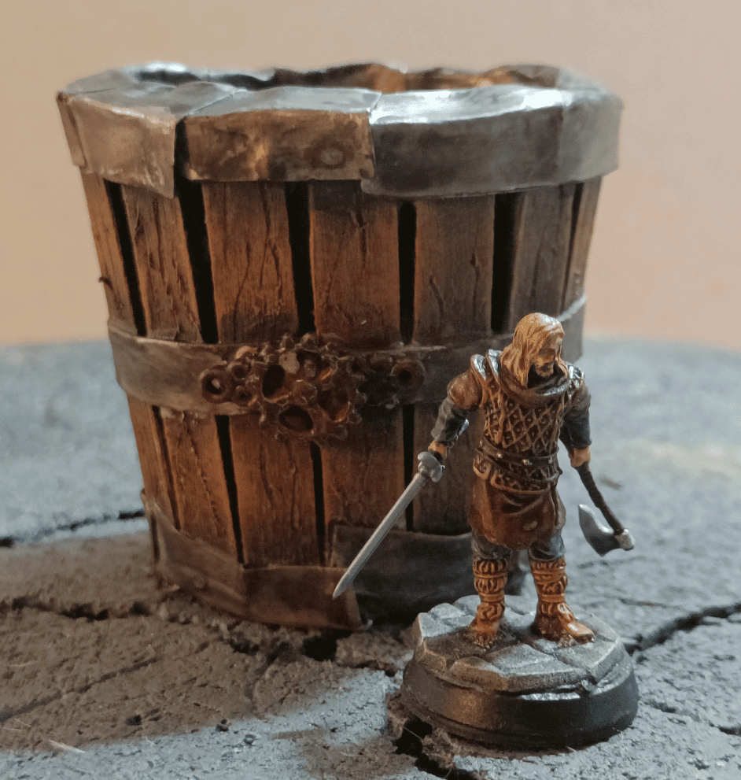
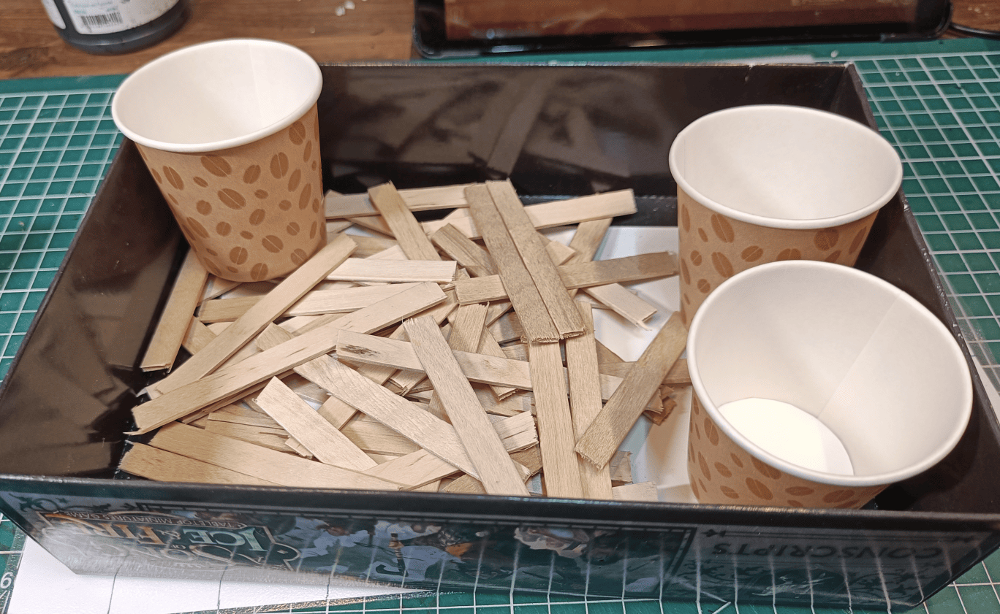
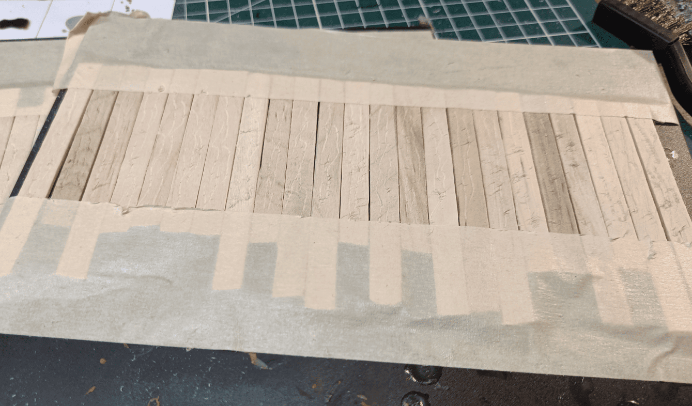
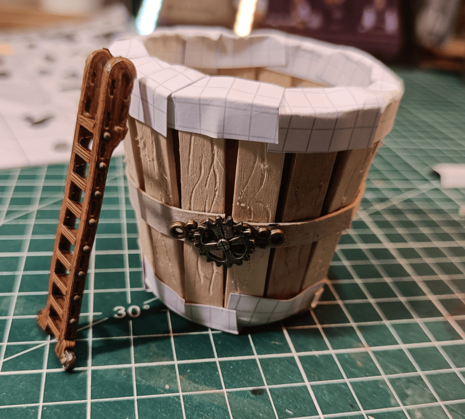
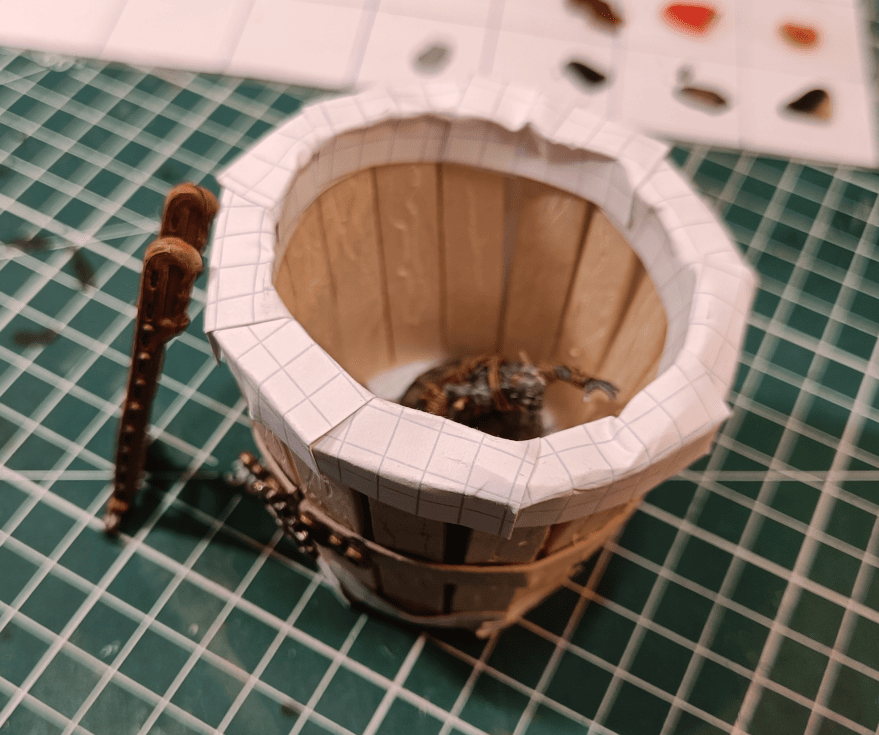
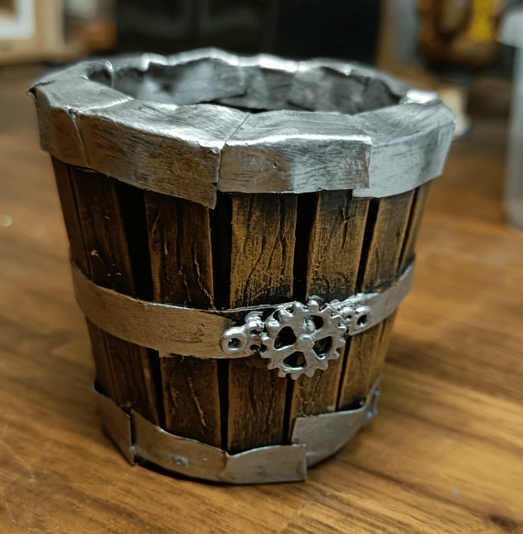
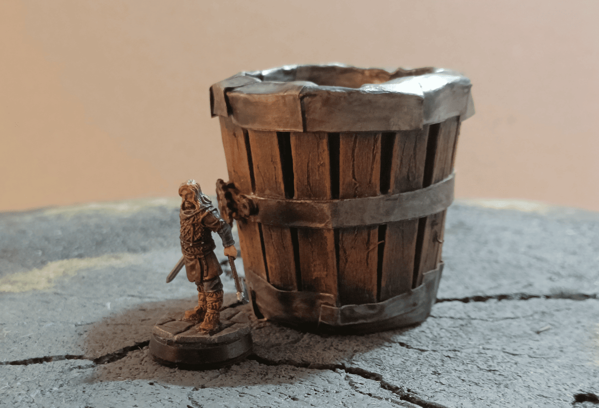
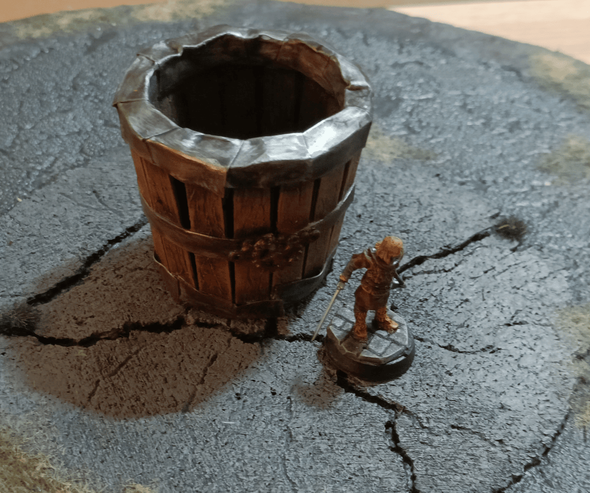
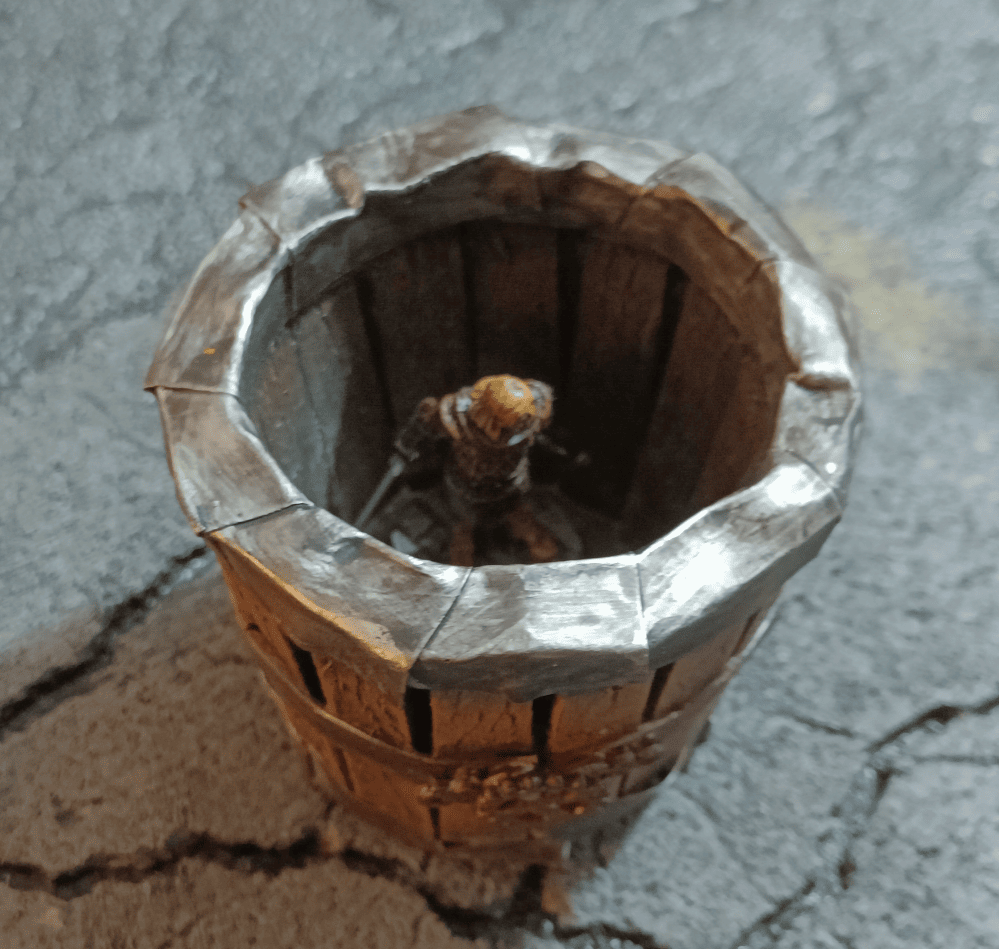

I made this element for my asylum scenario and reused it later in a distillery scenario. The idea was to create a very large barrel or tank with liquid inside.

At its core, it's really just a cardboard cup that I sanded and surrounded with popsicle sticks. Of course we're going to embellish all that a bit, but there you have it - that's what it's made of at its very foundation.

I taped the popsicle sticks to a support so I could have them all next to each other. That made it super easy to scratch the surface with a Swiss Army knife to create the wood grain marks.

Way easier than doing them one by one. Plus I only needed the marks on one side, so having them all fixed in place meant I could work on them in blocks all at once.

I checked the height and it's roughly the same as a decorative ladder I got from an Mantic crate.

I added small pieces of cardboard on top to symbolize metal plates. Just crumpled up some cardboard and glued the elements so they overlap each other. This makes it really easy to hide the joints where you'd see the cup underneath.

I also added a hoop around it - just a strip of cardboard with a few small steampunk-style decorations to give it a metallic look.

The size is perfect! There's enough room to fit a figurine inside. We've already reused it in a couple of scenarios where a monster gets stuck inside.

Here's a painted version before I added the Nuln Oil on the metallic parts.

We finish with a few beauty shots of the completed element with a miniature next to it to show the scale a little bit.