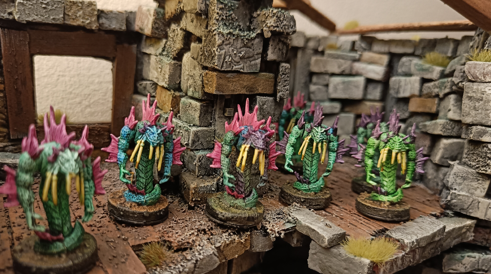
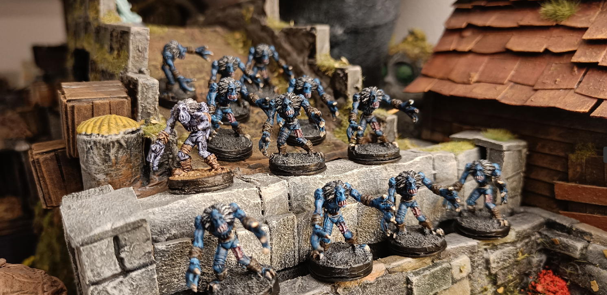
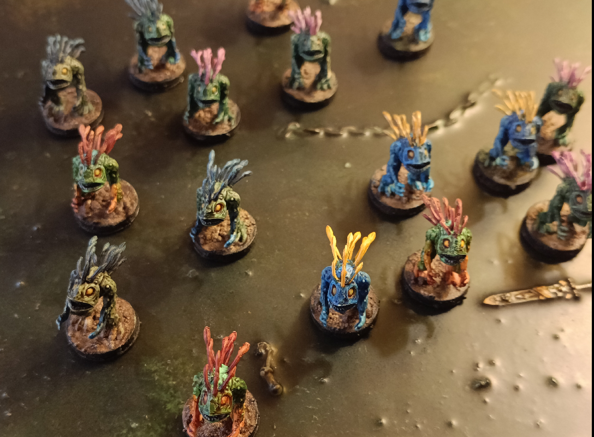
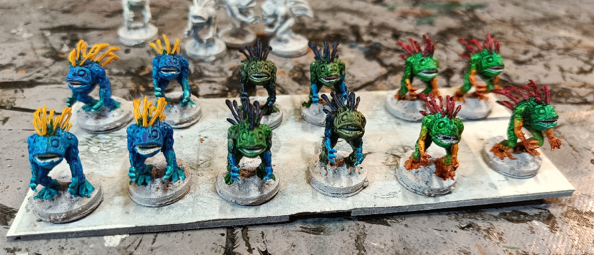
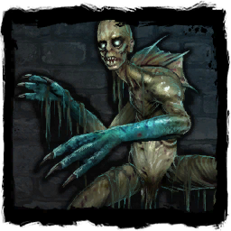

I used some of my new acquired Speed Paints to paint a bunch of World of Warcraft miniature I had. The miniature are coming from the board game, that I bought second hand, and never played. I only kept the miniature.

The ghouls I had already started painting in a more traditional fashion before getting the Speed Paints, though.

Grrmrlllbbbb!

For the murlocs, I did the traditional Murlocs colors, and some I painted in more muted colors, like the Drowners from the Witcher serie.

With the Tritons and Murlocs, I have enough miniature to populate a Sea/Swamp type encounter if needed. They are smaller scale than my usual miniature, so they could easily represent low level creatures.

