<!-- Image 1 -->
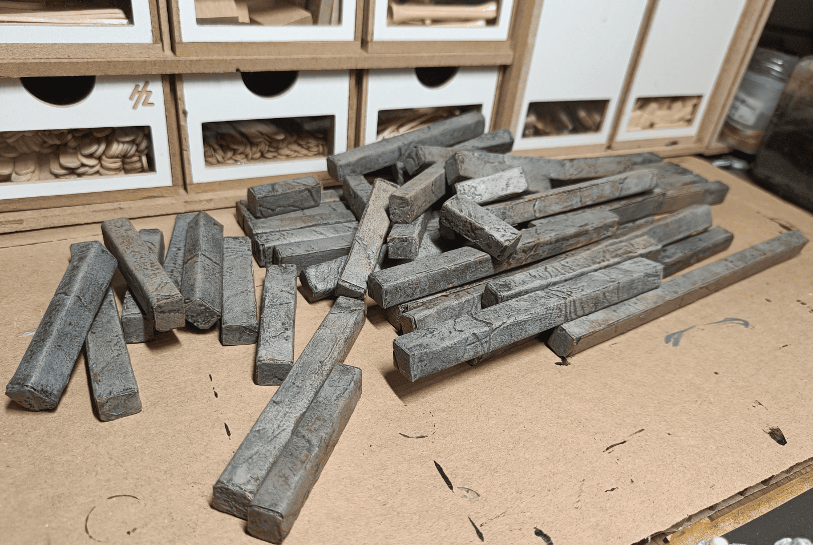

When I play RPG sessions, I have tiles (sometimes large ones, sometimes small ones) but not much to simulate walls. I don't like making walls that are very high because you can't see much, but I still like to indicate where the separation between two rooms is. I've made [modular walls before](../zombicideModularWalls/), but this wasn't really a critical need. I just had some leftover stuff in a box and thought I'd try to make something out of it.

<!-- Image 2 -->
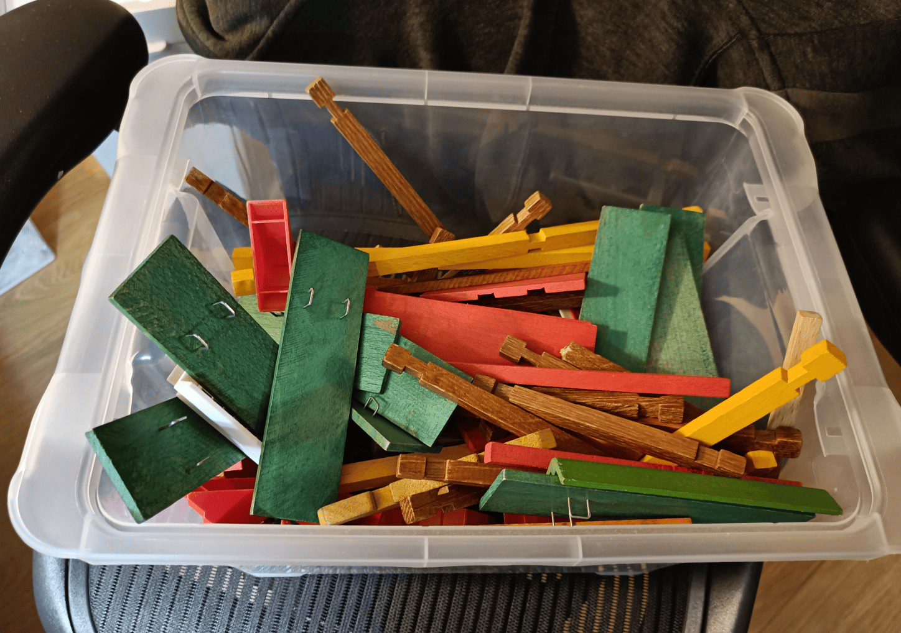

This is the base material I started with. It's a wooden construction set. I had the same one when I was little. I found it at a garage sale to play with my daughter. She didn't really appreciate it, so I wondered if I could make something out of it myself.

<!-- Image 3 -->
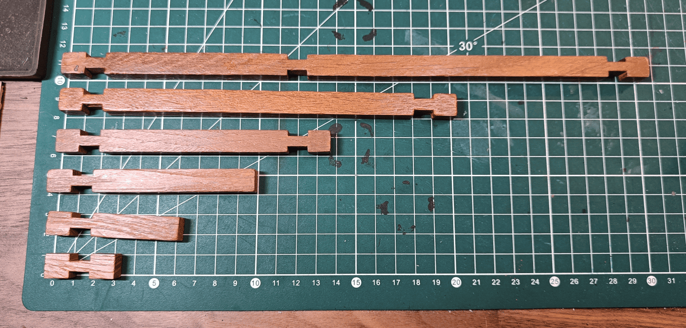

These are different elements from this building block set. They're large wooden sticks that fit into each other. They come in different sizes. Some sizes are quite interesting because they fall almost exactly right. The small one is nice because it's about 3cm, and my squares are 3cm. The next one is a bit more than 6cm, so that doesn't work very well. The one after that is 10cm, so it's not really a multiple of 3 either. There's one that's 14cm, then we get to 20cm and 30.5cm. They're not super practical measurements, but I thought I'd try to work with them.

<!-- Image 4 -->
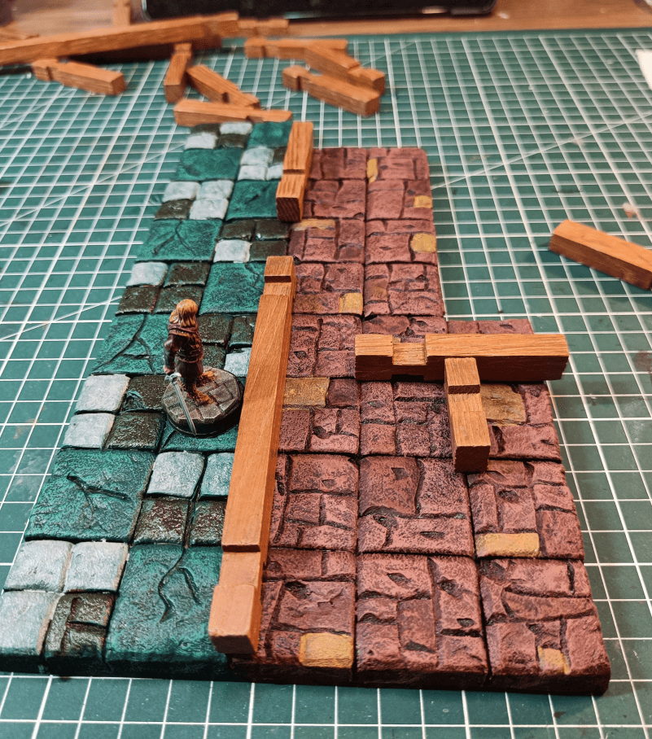

This is how I'm planning to use them. The idea was that in the scenario I needed, the green corridor has a kind of door on the side, and I wanted to be able to put walls to separate where the door is located. It doesn't fall exactly right on the different tiles, it sticks out a little bit.

<!-- Image 5 -->
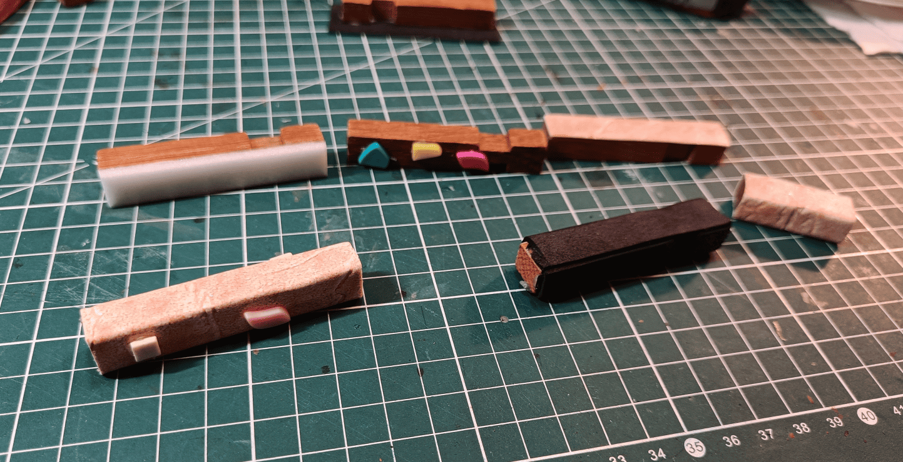

I started thinking about different ways to make the stone texture around it. In the top right, I glue foam on it. Then I glue small tiles to make a protruding stone effect. I tried wrapping with different elements, but the problem is that it increases the width of the wall enormously and it ends up taking up too much space.

<!-- Image 6 -->
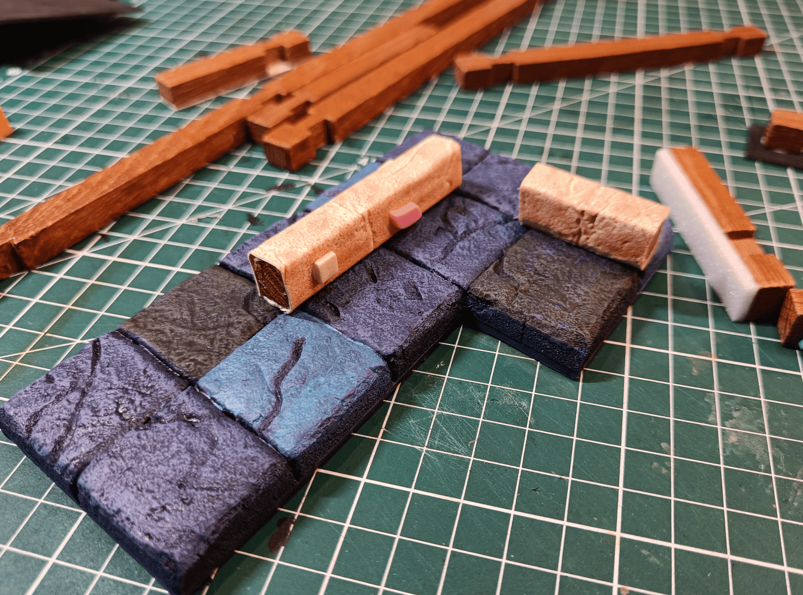

I ended up going with the simplest solution: wrap them in a kind of [textured wallpaper](../3X3TexturedWallpaperDungeonTiles/) I have. I wondered if I should glue bricks on top to give a bit of a relief effect. In the end, I think that would make the wall way too thick, so I just used the wallpaper texture directly, as you see on the small element.

<!-- Image 7 -->
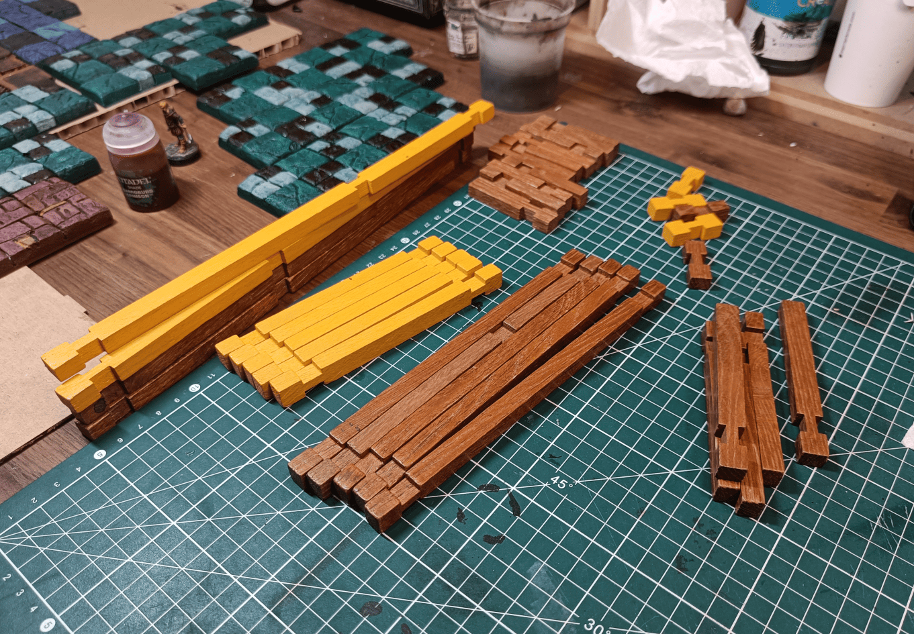

I tried to take about 5 of each size, except for the ones that are about 3cm long. I took a few more of those because I thought they would be more versatile.

<!-- Image 8 -->
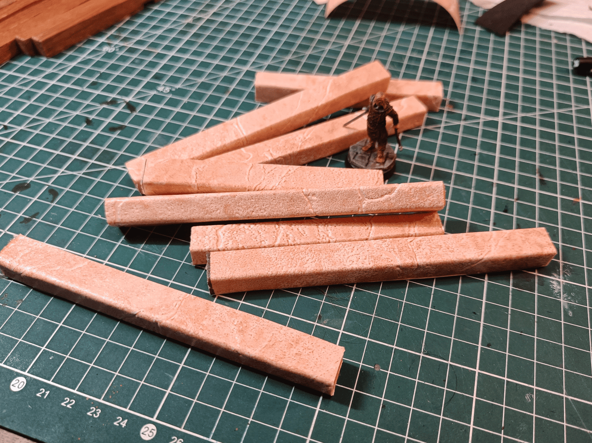

I wrap them inside my wallpaper. It's not very complicated, and since the wallpaper absorbs well and the other side is wood, just using wood glue works very well. I just need to put wood glue on one side of my wooden stick, stick it on the wallpaper, then put wood glue on another side, roll it and go around like that, and I wrap my wooden sticks with the wallpaper.

<!-- Image 9 -->
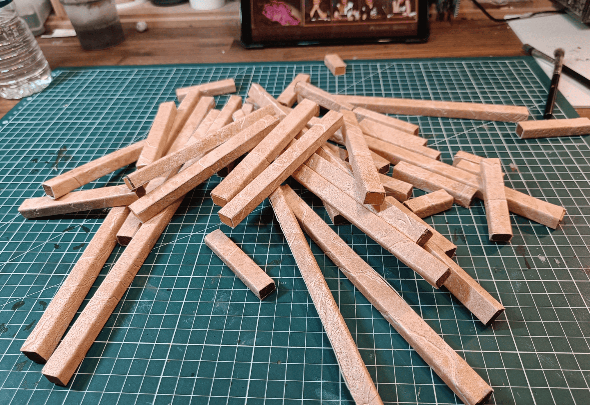

Once I've wrapped them all. All I need to do after is cut the ends that stick out a bit.

<!-- Image 10 -->
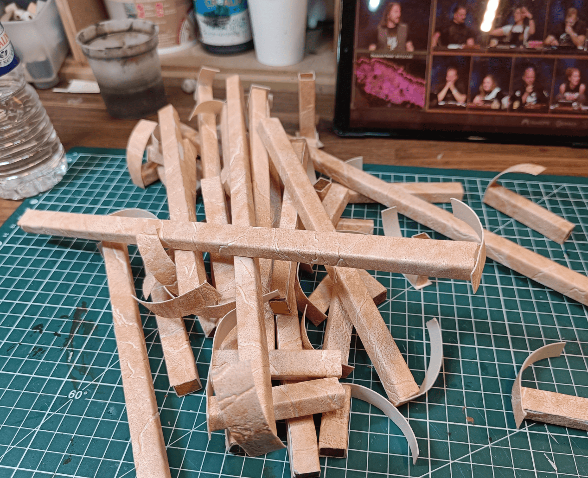

For the ends, I want to have some stone texture in those areas too, so what I do is put a drop of glue gun, press onto wallpaper, and then cut the ends. Rather than cutting the elements to the right size beforehand, I do it afterward.

<!-- Image 11 -->
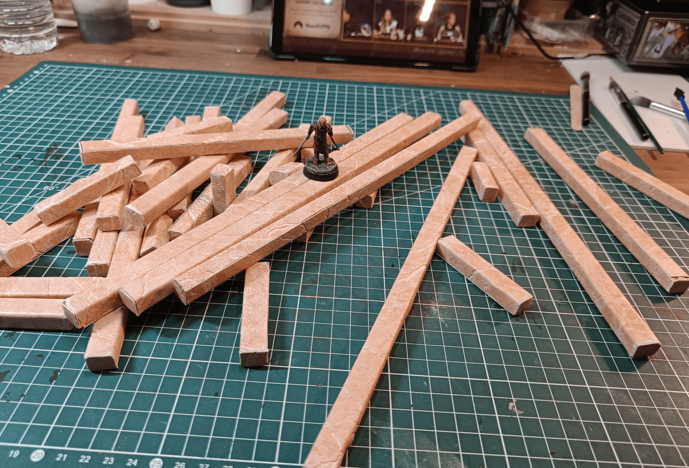

Once finished, with the miniature again for scale to see what it looks like.

<!-- Image 12 -->
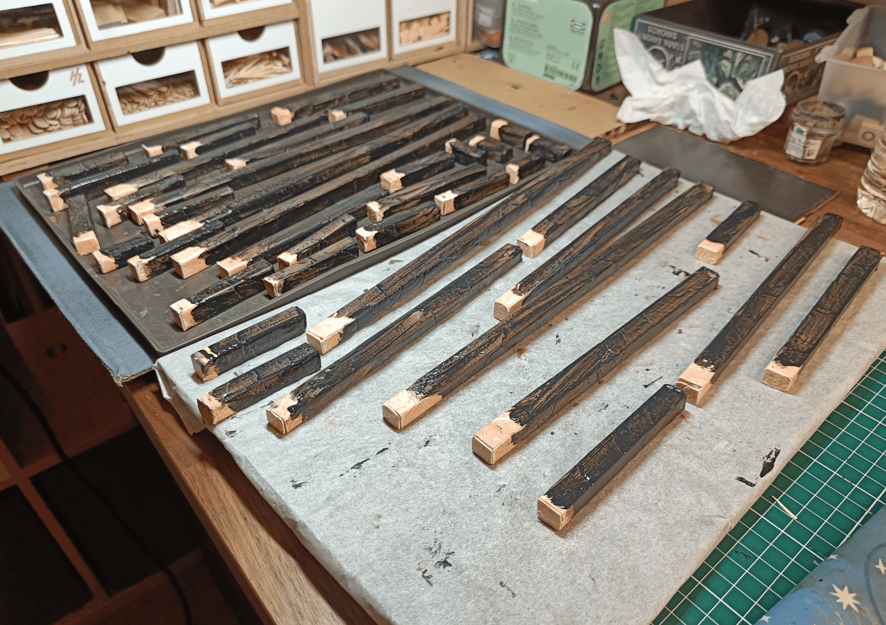

I start painting them with the usual modpodge black texture. I have to paint it in two steps because I need to keep a spot to put my fingers, which is why there's a whole section that's not painted. I let it rest overnight and the next day I paint the other side.

<!-- Image 13 -->
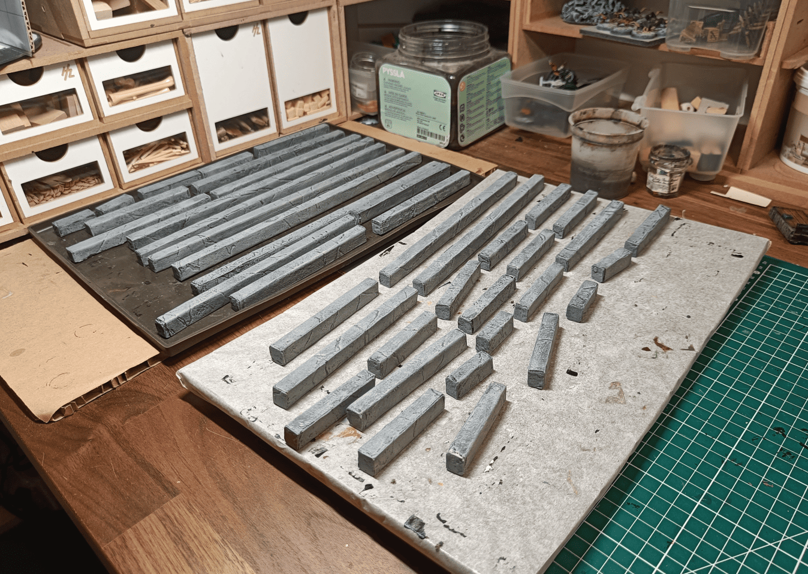

Once it's well dried, I do the first drybrushing in grey. It's already starting to look interesting.

<!-- Image 14 -->
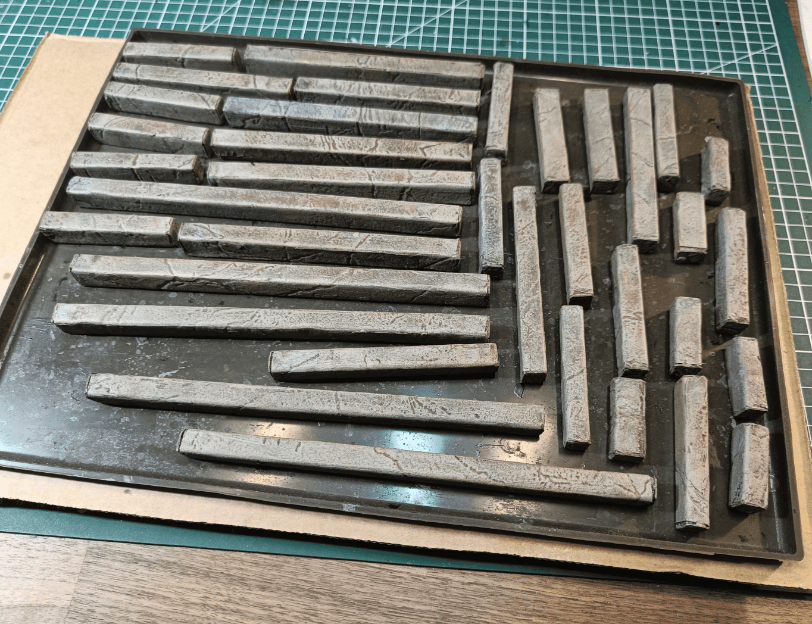

Here I've added the washes. I do a black wash with oil paint, but I also took a bit of blue, a bit of green, a bit of brown to try to make small spots in different places to break up the uniformity a bit. I still want them to be fairly neutral colors that don't clash on the game board. These are walls that are just there to make separations, so the eye shouldn't be drawn to them.

This is what I made in the end. It's not completely a failure, but it's not completely a success either. The advantage is that they're quite heavy, so you can place them and they stand well. Plus they're at the right height so you understand they're walls without blocking the lines of sight. The major problem I have with this is that they're not the right dimensions, so it's super difficult to position them on my tiles that are made in multiples of 3 without them sticking out in all directions.

So the technique is good, it's just that the dimensions aren't right. I would need to make some with the right dimensions if I really want them to be modular, because I play with tiles that are multiples of 3. But for a world where you don't really care about dimensions and just need to quickly make the shape of a room, it works very well.

I also had a problem after varnishing them. What happened is they became super sticky, and the walls would stick to each other and to my fingers. I ended up solving the problem by putting my fingers in baby talcum powder and rubbing it all over them, then dusting off a bit. That greatly reduced the sticky effect and now makes them completely usable.

