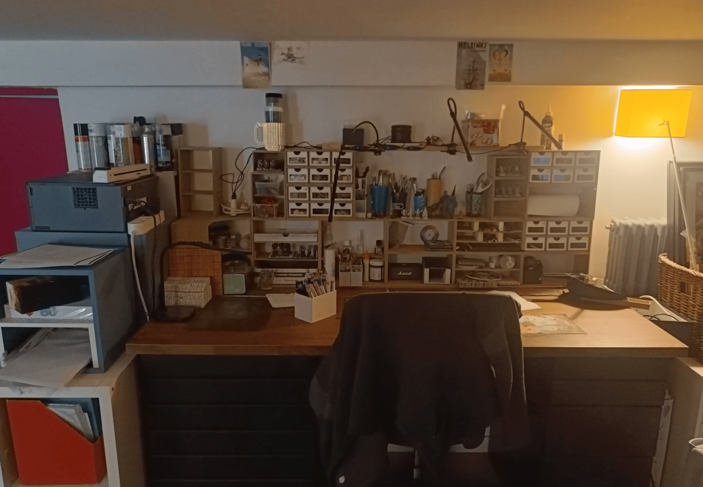
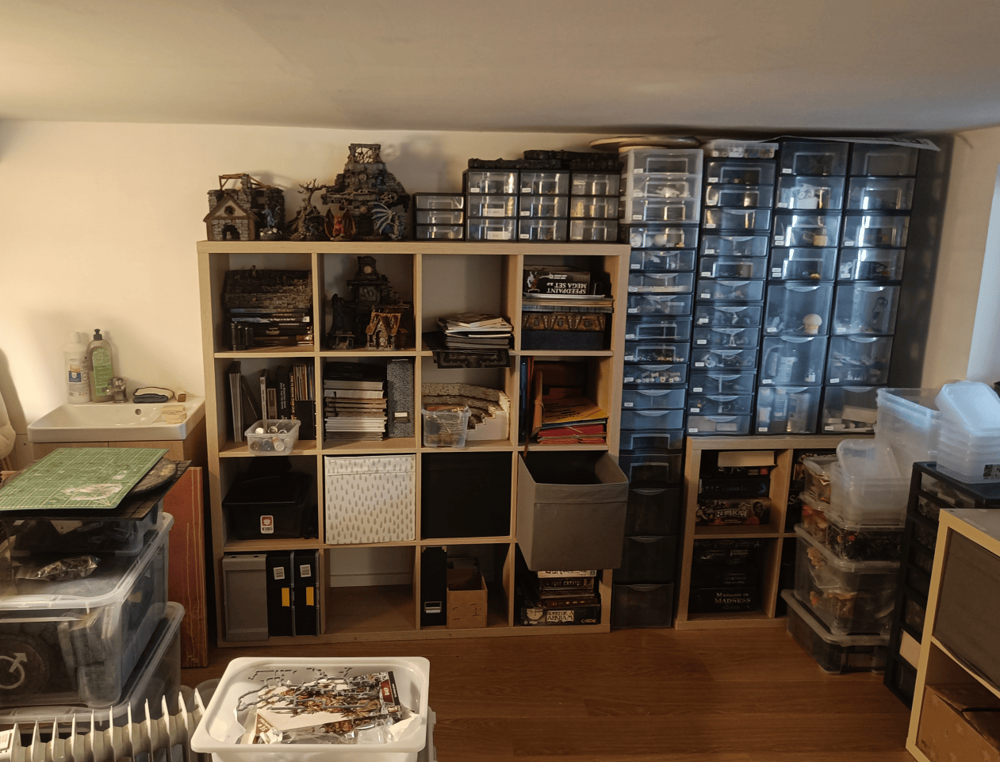
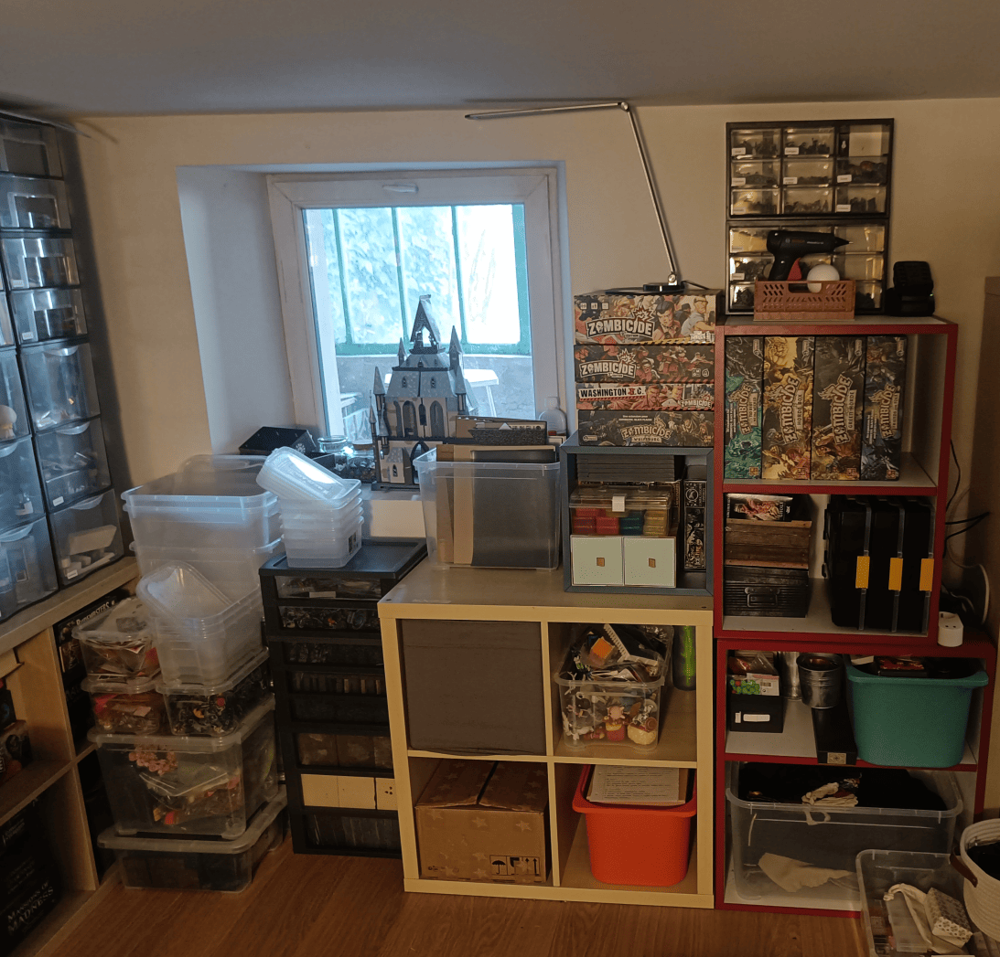
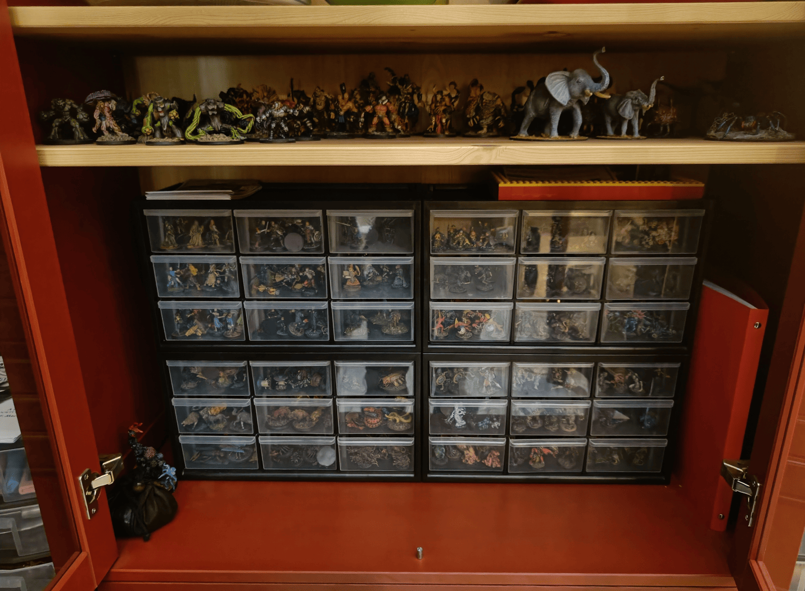
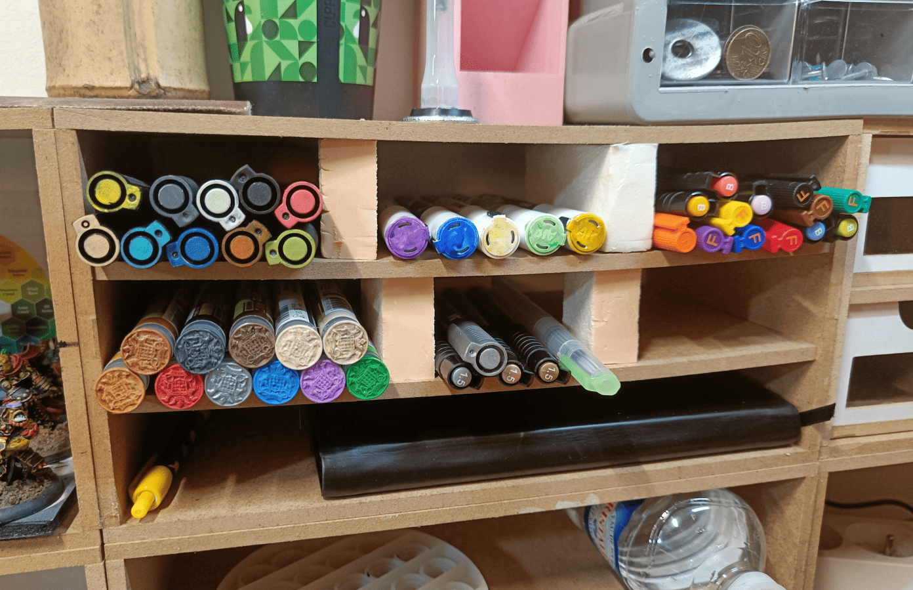

<!-- Image 1 -->

This is a commemorative post to document the current state of my workshop in April 2026, before major renovations begin. This is where I've spent countless hours crafting and painting, and I want to remember what it looked like. You can see [how it evolved from 2021 to 2026](../workspaceEvolution/).

This is where I craft. The main workstation is built from Ikea kitchen furniture, with kitchen drawers and a large countertop, and then a bunch of my stuff on top of that.

<!-- Image 2 -->

Another angle of the room. Since we're going to do major renovations here soon, I had to do a big cleanup and organization job. I bought a lot of drawer units to organize everything: drawers for different crafting tools, for cardboard, for foam, for miniatures to paint, and so on. All of this will change once the renovations are done.

<!-- Image 3 -->

The other side of the room, where there's still a lot of stuff. The Zombicide boxes are almost all empty but I'm keeping them. There's still a lot to sort through, but it's cleaner than the mess it was before.

<!-- Image 4 -->

This cabinet is in the dining room, right next to the big table that serves as both our dining table and RPG gaming table. When I open it, I have two shelves just for storing all my RPG miniatures. 

I have these four drawer units, and each drawer contains a different type of monster: cultists, bandits, guards, heroes, halflings, kobolds, snakes, skeletons, so it's easy to find what I need. I [sorted all my miniatures](../miniatureSorting/) by how much I want to paint them rather than by type. If I don't have what I need, I have two more units like this in the basement (visible in the previous photo), and I just swap the drawers if I know the players are going to encounter something soon. Similar to my [Zombicide 3D storage system](../zombicide3dStorage/). 

On the shelf above, I put larger miniatures that don't fit in the drawers, the ones with wider bases that I want to keep here for easy access. It's not the best location because it's hard to see the miniatures in the back and sometimes I forget about them, but it's still better than what I had before.

<!-- Image 5 -->

This is an organization I had in my workshop for a while. These shelves used to hold a lot of craft paint, the bigger bottles for making terrain. I kept only a few in a drawer now, because I'm painting more miniatures than terrain these days. 

I've been really amazed by Speedpaint markers, which let me do what I already find incredible with Speedpaints but much more easily, without having to wash my brush each time. So I started testing things with regular markers and then with official AK markers, bought a lot of them in many different colors, and put them here. I colored the tops to more easily see what they are. 

For the Speedpaint markers specifically, I glued a textured shirt button on top and painted it with the marker color to see what it will look like in real life, and that worked well. 

Now this has evolved because it's so easy to paint with markers or Speedpaint markers that I don't have to be at my workshop to do it. I put everything in a small box that I can carry around the house and paint when I'm in the dining room or on the couch. 

This workshop has served me well for years. It will be interesting to see what comes next after the renovations.

