<!-- Image 1 -->
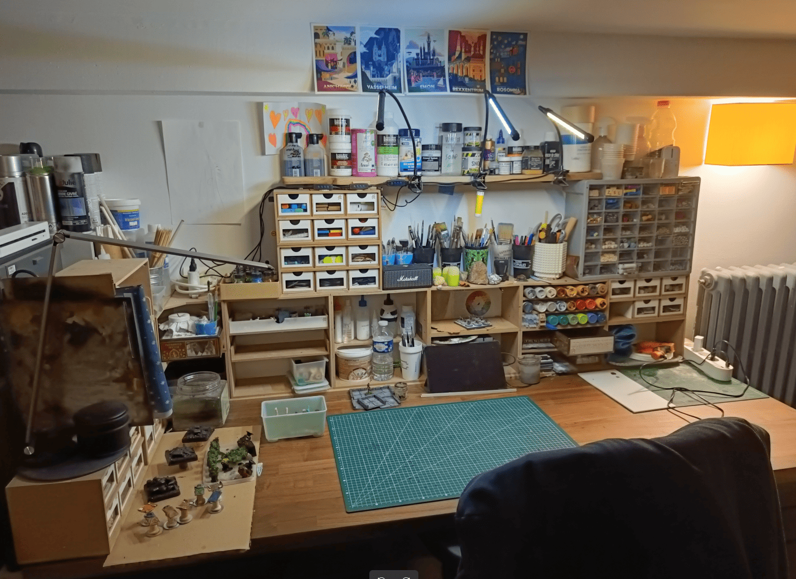

My workspace evolved quite a bit between 2021 and 2026. These are photos I took without any particular goal, but they show how things changed over the years. It's about to evolve even more because we're doing renovations in the basement to make something really custom. The photo you see above stayed like this the longest. It was more or less the version that worked best for me, and I kept it that way for quite a while, to the point where I stopped trying to optimize it.

<!-- Image 2 -->
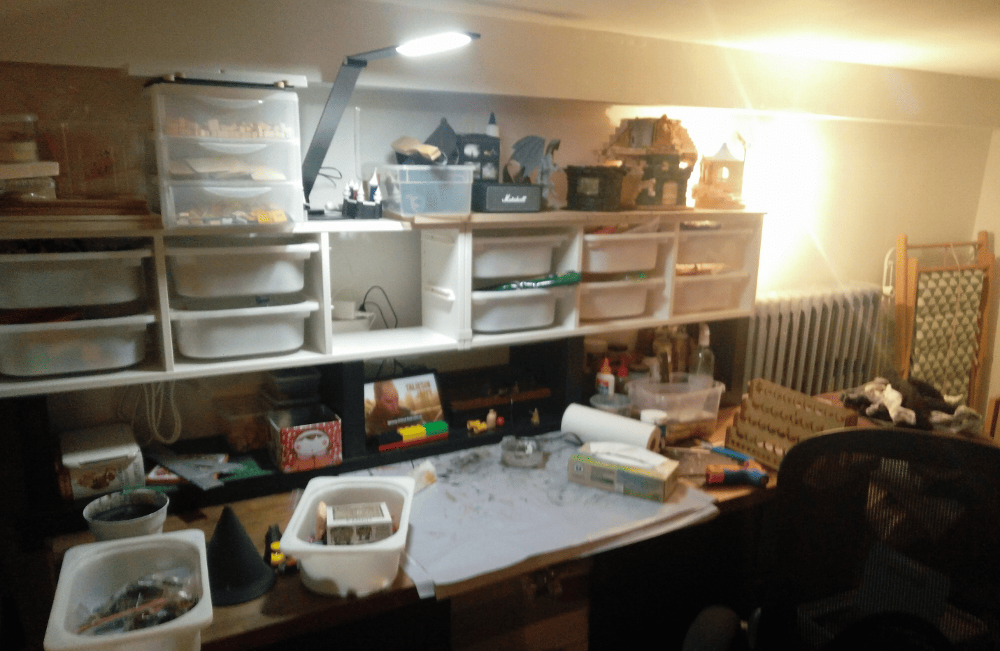

But it didn't start that way. At first, I stacked IKEA furniture called TROFAST, which is actually meant for kids to store their stuff in bins. I had put a bunch of things randomly in the bins, but it took up a lot of space, the bins were often too small, and I couldn't easily see what was inside. I needed a bit more granularity in what I wanted.

<!-- Image 3 -->
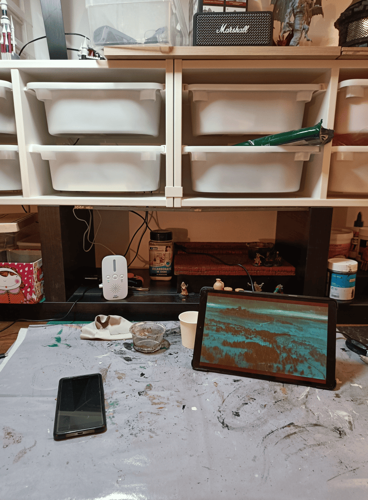

This is a bit of a zoom. I had started to set something up with whatever was lying around. We had just moved into this house, and these were the furniture pieces we had left that we didn't know what to do with. The dimensions weren't super practical and it took up a lot of space, so I didn't like it that much.

<!-- Image 4 -->
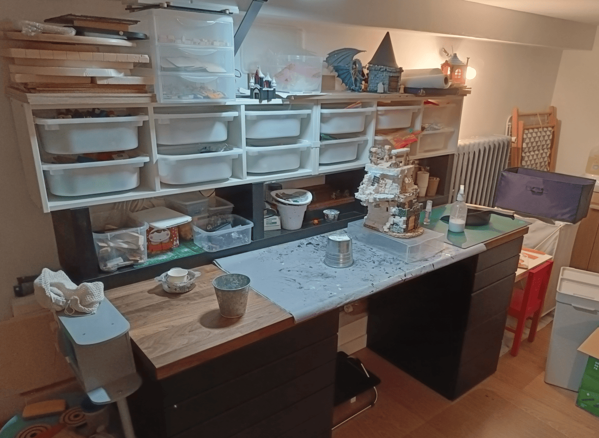

Looking back, I realize how small my work surface was and how my storage surface was huge but poorly optimized.

<!-- Image 5 -->
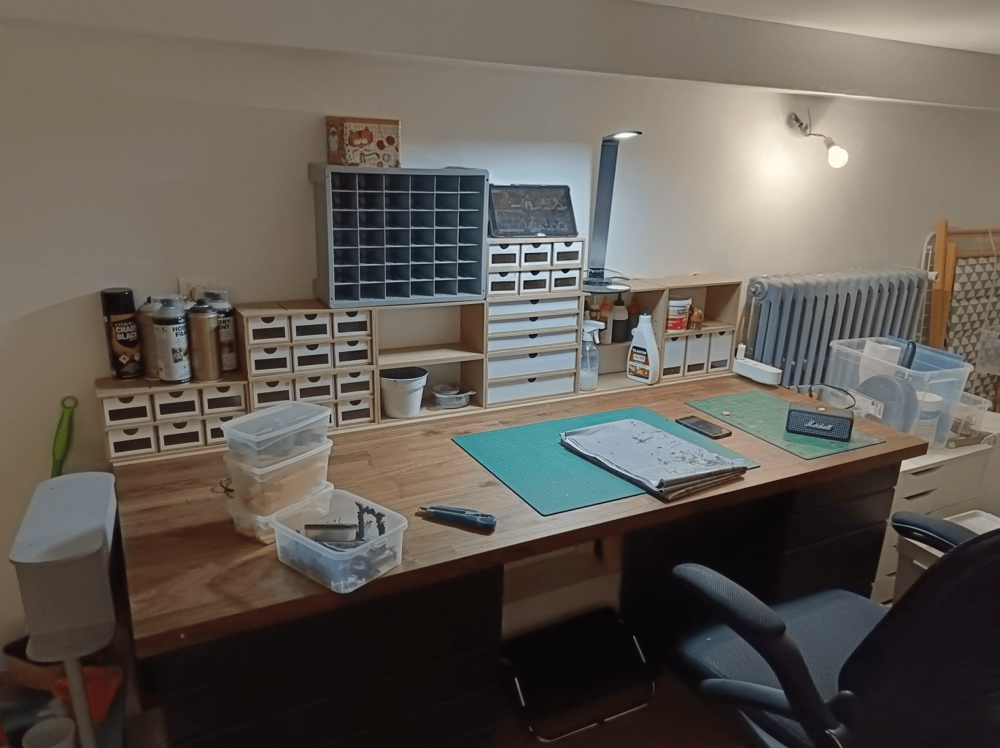

That's when I decided to invest in special modular boxes. I can't remember what they're called or exactly where they're from, somewhere in Eastern Europe. They're blocks that all have the same dimensions (simple shelves, drawers, large drawers, small drawers) and they stack on top of each other using magnets, so they fit together very well. I bought quite a few to set something up, and this is what I managed to do with them. It was pretty good, starting to be really functional, and you can see they served me for a long time.

<!-- Image 6 -->
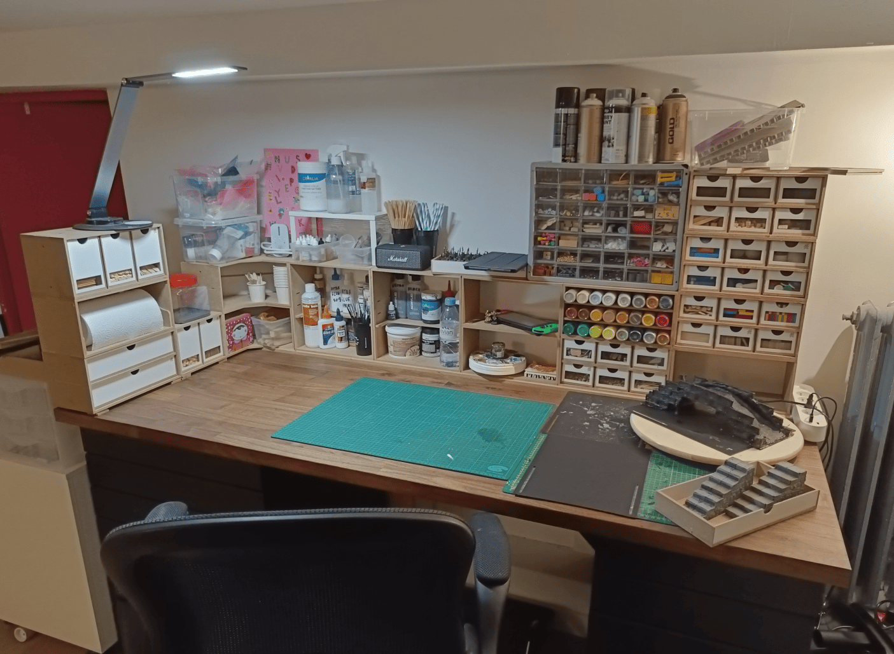

After using it a bit more, I bought more units to make the corner on the side. What I discovered is that the big, long drawers weren't very interesting for me. I preferred to use them as shelves where I could see what's there directly, rather than having to open a drawer to get it. That was a first lesson: the more shelves I have, the more pleasant it is for me.

<!-- Image 7 -->
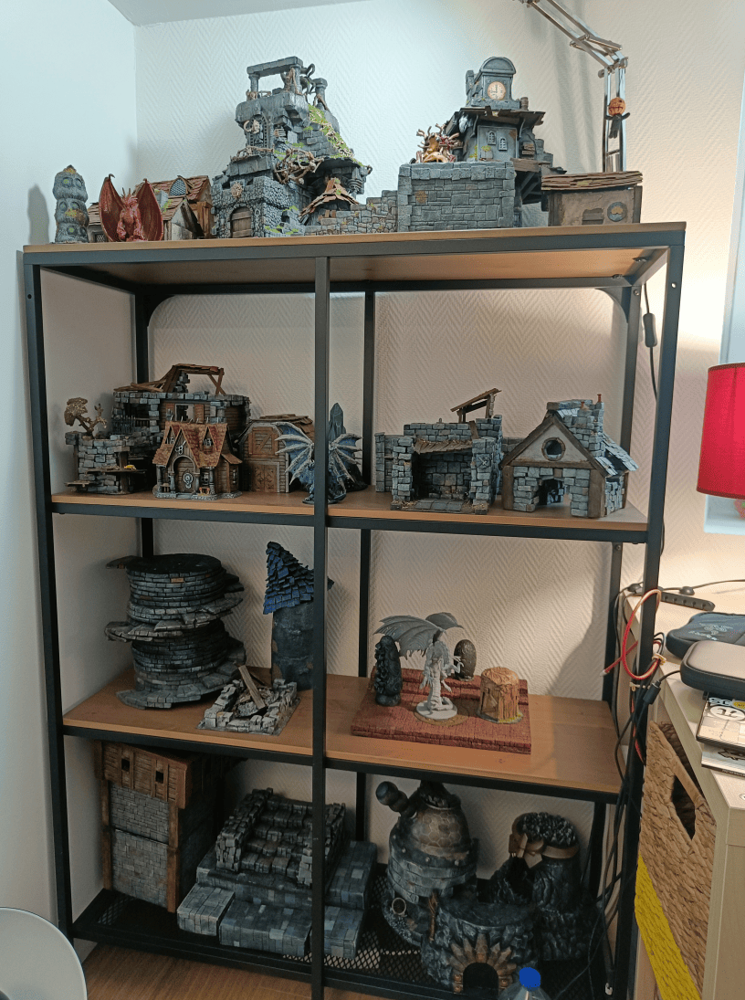

This is another shelf I had on the side, where I stored all the terrain pieces I had made. This kind of stuff takes up a lot of space, and I didn't really know where else to put them. Today, I think I've given away or thrown out half of them. It was fun to make at the time but I never used them. I realize they served to learn techniques, but they never actually got used in a game or anything, so I ended up throwing most of them away. Things like [scatter debris](../scatterDebris/) that look okay but take up too much storage space for what they add to the table.

<!-- Image 8 -->
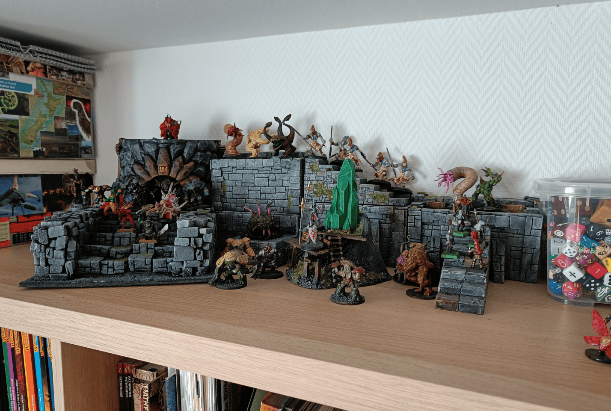

I had made the top of a shelf with some other elements to make a kind of diorama where I could put some of my miniature.

<!-- Image 9 -->
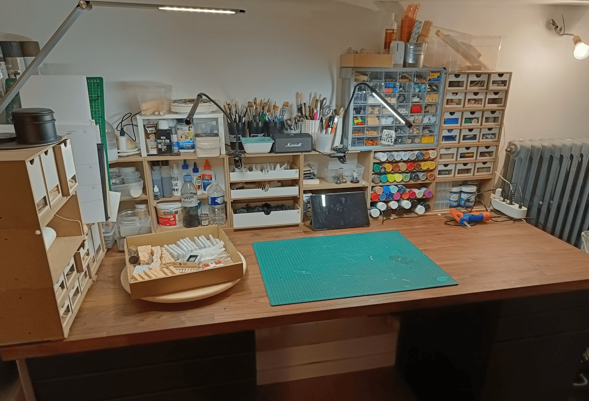

This is starting to be how my workspace functioned. I was painting a lot of terrain at the time, so I needed lots of acrylic paints (that's what you see on the side), and putting them horizontally like this allowed me to find colors directly. Over the years, I reduced the collection because I was always using the same greys, browns, and greens, so all the more special colors ended up in another box elsewhere. I had heaps and heaps of brushes, but similarly, I don't need hundreds of brushes when I often use the same ones.

<!-- Image 10 -->
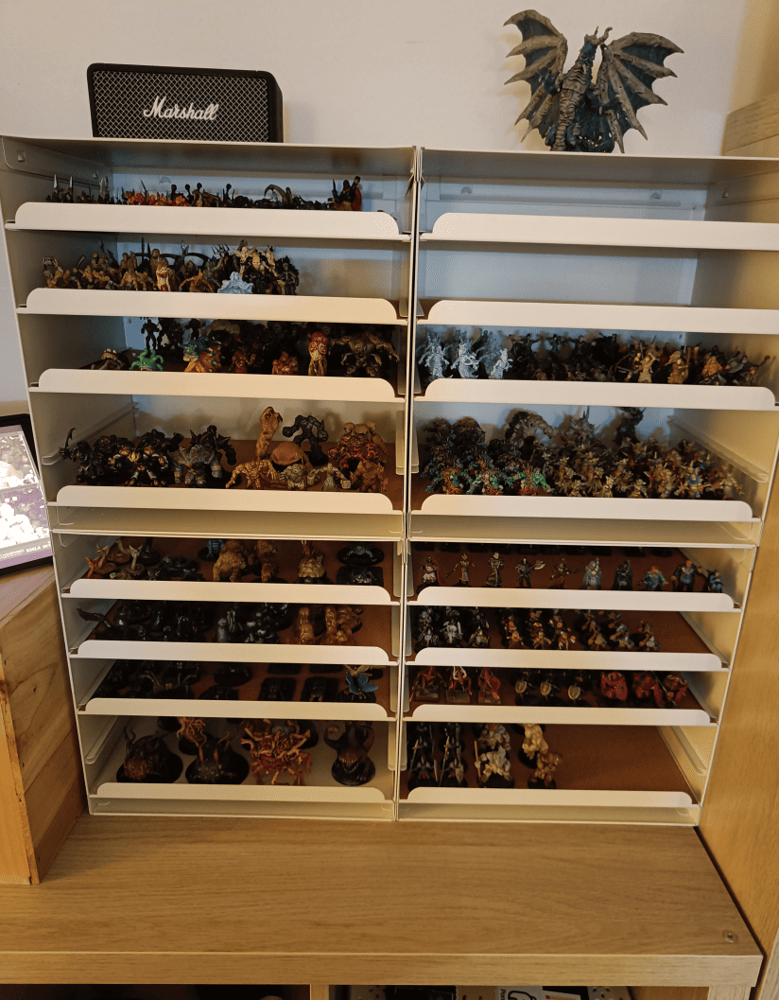

These are other IKEA furniture that are normally made to store sheets of paper, but which I used to store my miniature. I had miniature in closed drawers where I couldn't see them, and this was my solution. I'm happy to see the miniature I've finished painting.

The problem is that I only see the miniature at the front, and even then, I only see half because there's a big bar that blocks them. If I need them for a game, it's easy to go get them but a bit complicated to put them back, because you have to make sure they stand upright. So it was okay, but not great yet.

<!-- Image 11 -->
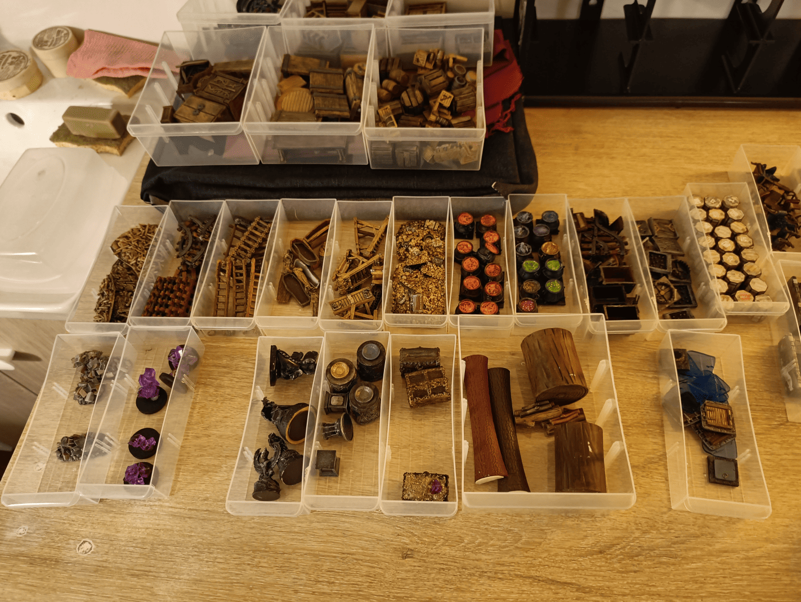

I had furniture with lots of plastic drawers (the kind normally used for storing screws and nails), and I used them to store my small terrain elements. It was a false good idea because it constrained me to store similar things in the same drawer, so when you're in the middle of a game and you need something, it's hard to find exactly what you want.

<!-- Image 12 -->
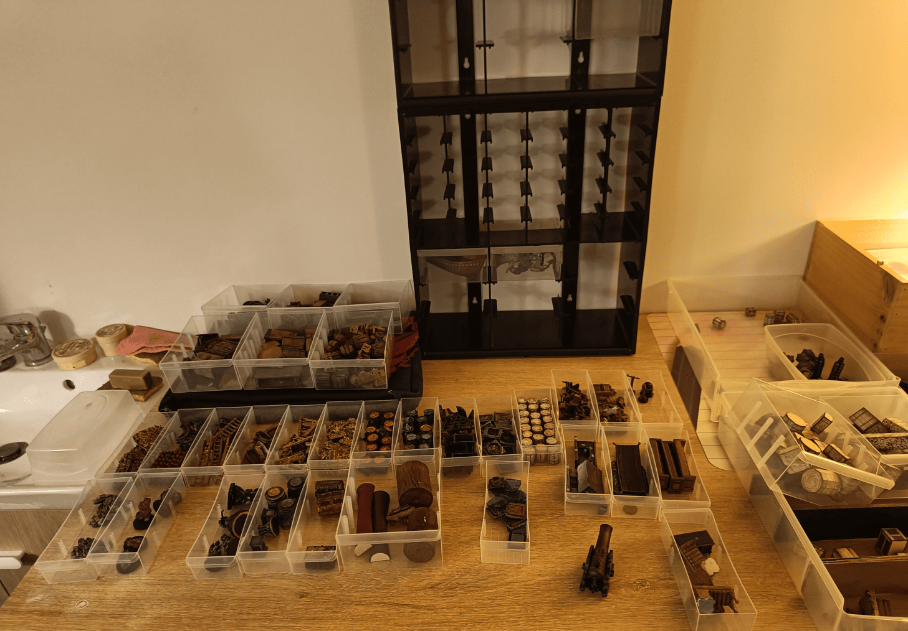

The large drawers turned out to be much more practical. That's what I ended up using later, storing miniature by type: a drawer for bandits, one for guards, one for kobolds, another for goblins. It's enough for my RPG sessions because it allows me to store about twenty at a time inside, and my players will never fight more than 20 guards or 20 kobolds at once. So that's a very good format for me.

The smaller drawers are way too small and force me to be way too specific about what goes where. Today I have larger ones where I put, for example, all the scatter terrain you can find in a cave, in a manor, or in a house. I'll post photos of that later.

<!-- Image 13 -->
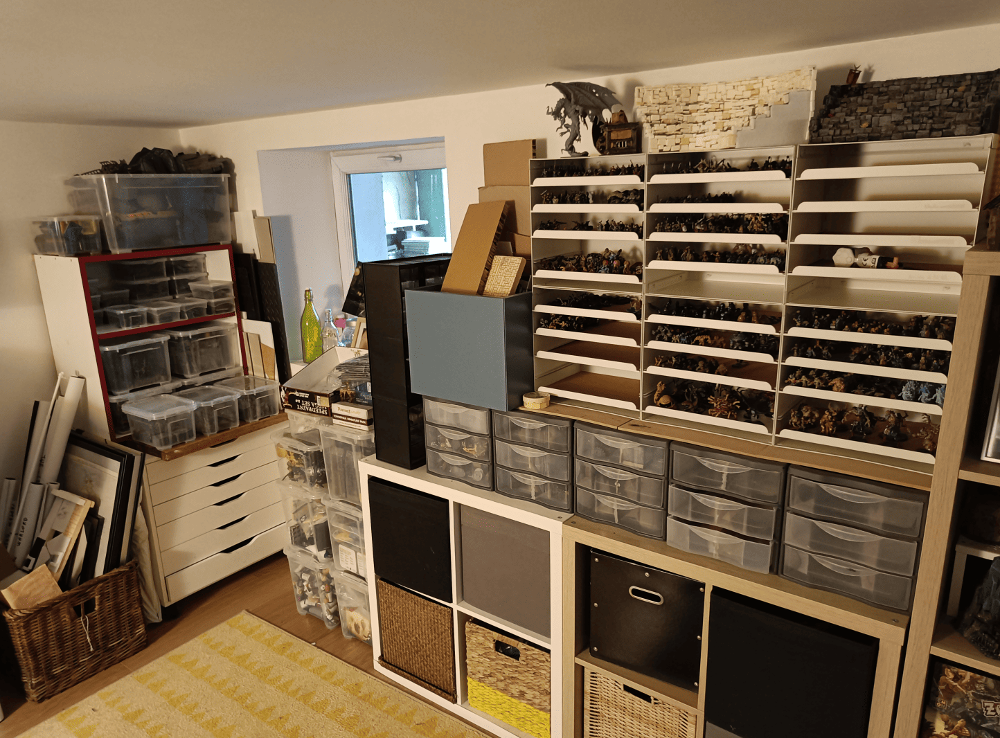

This is another corner of my room in the basement. You can see how it's organized: the white furniture with my miniature, below that lots of drawers with terrain elements, and below that the IKEA furniture with the bins holding materials for crafting in bulk, like foam scraps and plastic toys.

In the corner, in the boxes, were the terrain pieces I had already made, and in the big box at the very top, you can vaguely see a Playmobil boat and other Playmobil elements I told myself I'd do something with one day. I bought all of that for cheap when I was just beginning to learn how to craft, thinking it would be easy to make terrain with. Yes, it's easy, but it's not very useful, so I ended up giving them to kids.

<!-- Image 14 -->
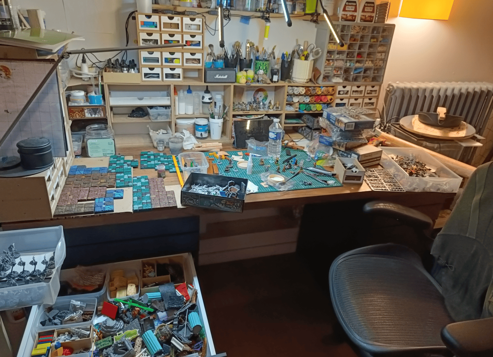

This is a very good representation of how it generally looks on my workspace. I do several things at the same time. Here you can see I'm making tiles on one side, assembling miniature, and putting other things away.

<!-- Image 15 -->
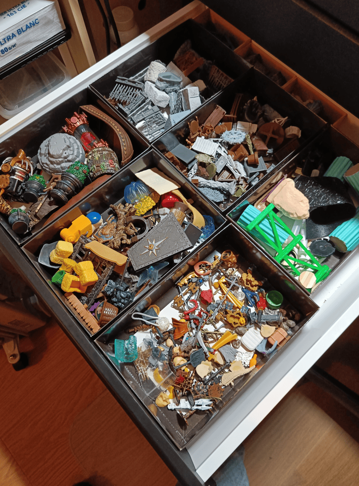

This is the contents of one of my drawers. I had put different boxes that were the right height to be placed flat in the drawer, and in each one, I put scatter terrain based on size and quality.

Some boxes have real scatter from companies like Reaper or Mantic. Other boxes contain stuff with nice textures or interesting details that I recovered from toys, telling myself it could be useful for something. It was a good way to rummage around to get ideas.

<!-- Image 16 -->
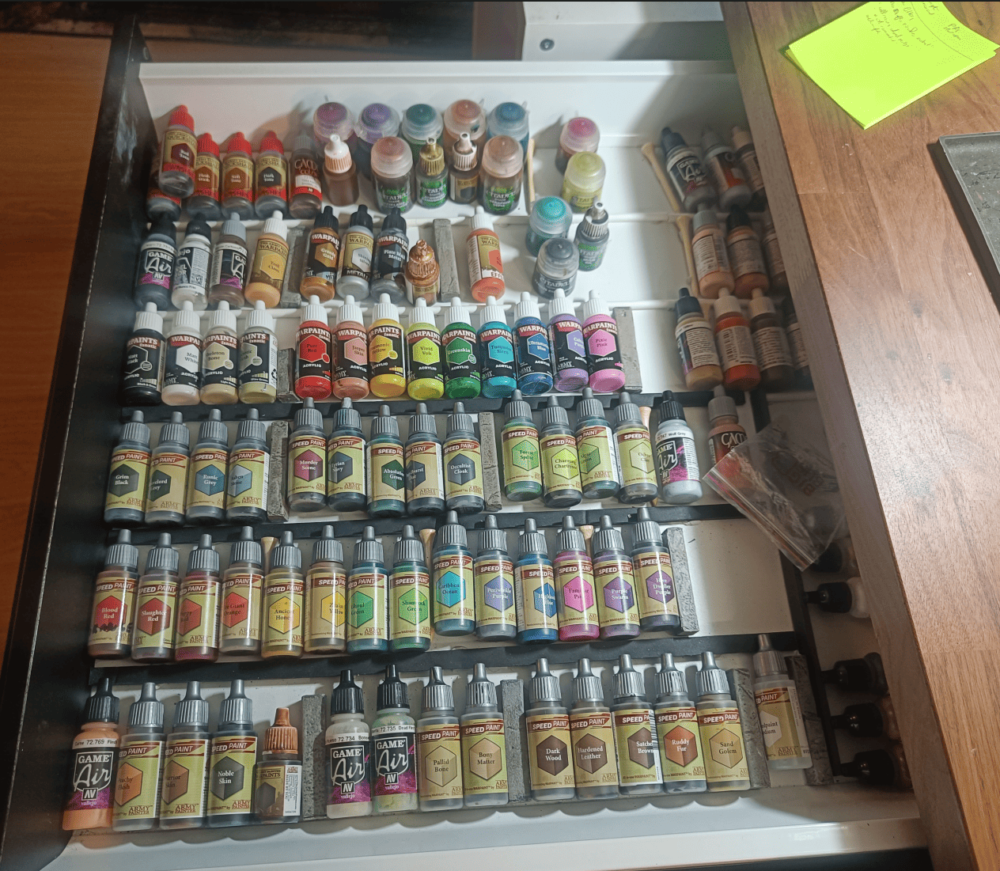

Finally, I made myself a drawer with all my paints. I glued strips of cardboard at the bottom to separate it into lines, and in it are the paints I really use.

At the bottom left, we have everything for skin, then cadaveric skin or bones, and then everything I use for leather, fur, wood, and all the little details on lots of miniature. The somewhat neutral but fitting colors are at the bottom right.

The line above is a kind of rainbow of different colors I use regularly. The line above that has black and grey at the start, then darker colors that are a bit tinted, and then lots of different greens for making camouflage.

Above that I have the Fanatic War Paints because they're extremely well pigmented, and I often use these for drybrushing. Above that are metallic paints and some other things, and at the very top are washes and some Games Workshop effect paints.

This system works perfectly for me. I can open my drawer on my left and see all the paints directly with their colors easily organized. It allows me to see exactly what I want, take exactly what I need, and make a little list of the colors I like while removing those I don't. I have a big box next to it of colors I bought and ended up never using.

