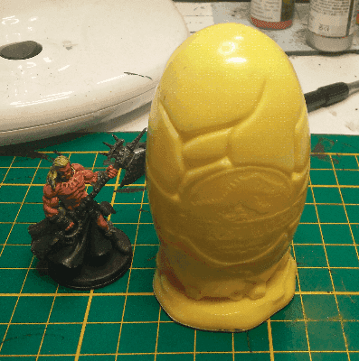

This is a Jurassic Park promotional egg, I guess it's from MacDonalds as well. I wanted to paint it as some crackling egg releasing some kind of foul energy. I had never painted anything like this before, so I thought that having such a large miniature to try would be perfect.

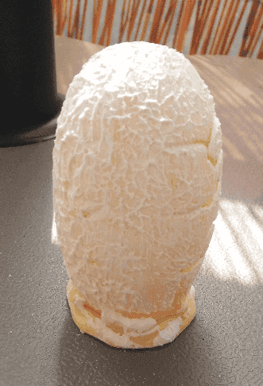

Applied a fair layer of modeling paste and sanded it to give it a smoother texture.

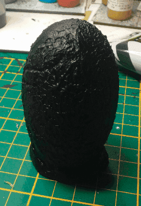

Priming it black.

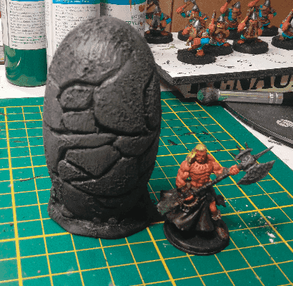

My plan was to make this a stone egg, with some weird green light coming out of it. Now that I think of it, I don't know why it should be made of stone. I must confess I didn't really think this part through. It would have been more logical if it was colored more like a bird egg, or a weird color.

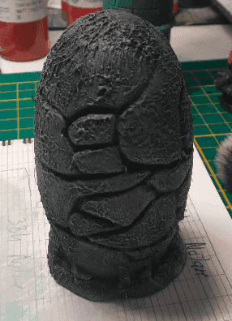

Second coat for more depth.

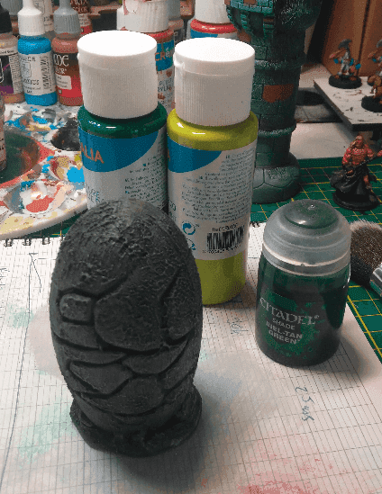

Now my plan is to paint the cracks as green light. I had never done this before but here is what I'll try to do. First paint the cracks with a deep green, then drybrush around the edges with a light green, repaint the center of the cracks with the same green, and unify this with a wash at the end.

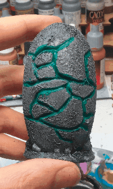

First pass of green in the cracks.

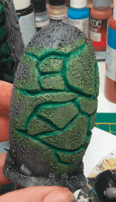

Drybrush of light green around all the cracks.

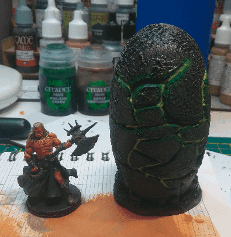

Lightgreen inside the cracks

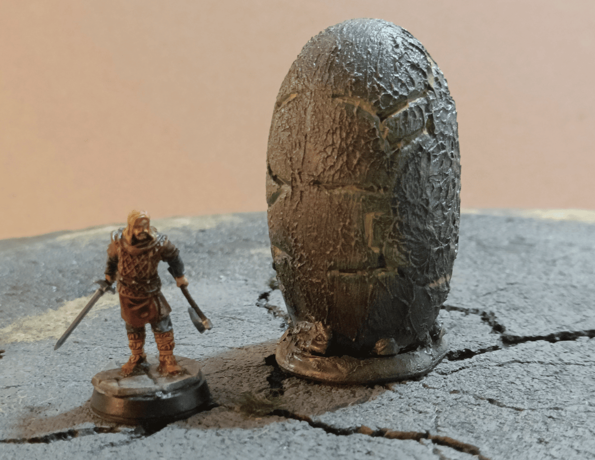

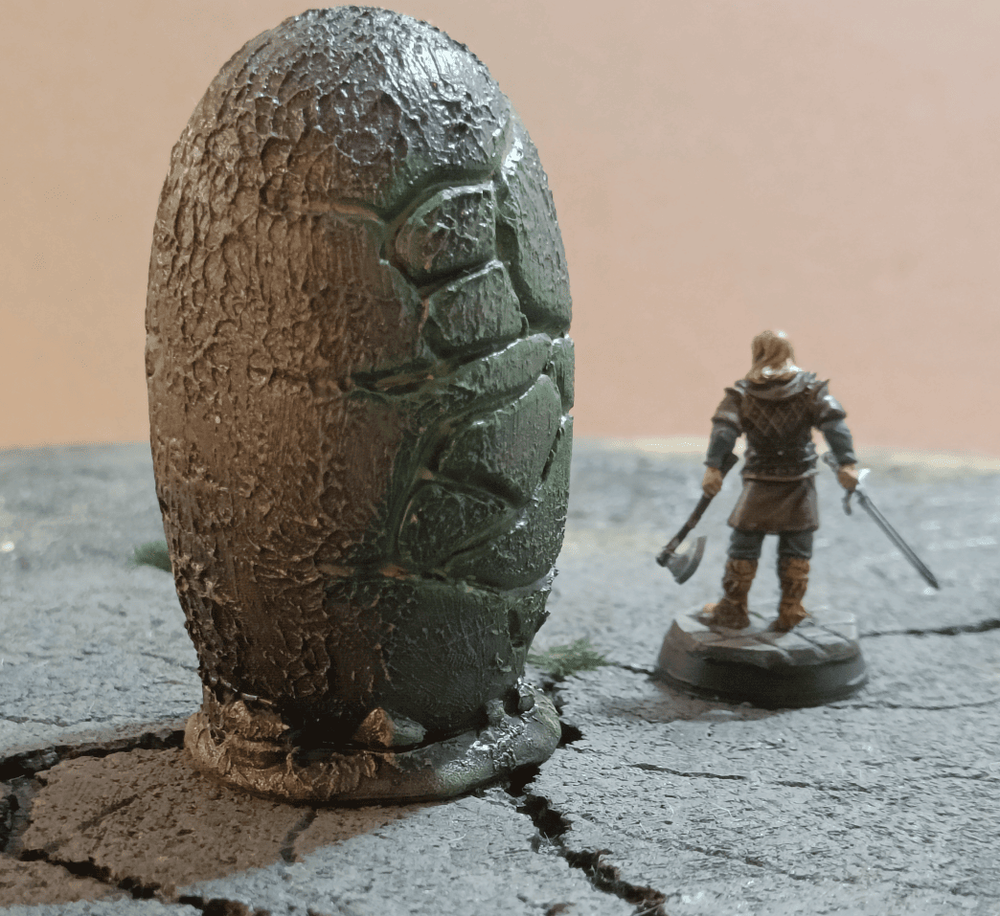

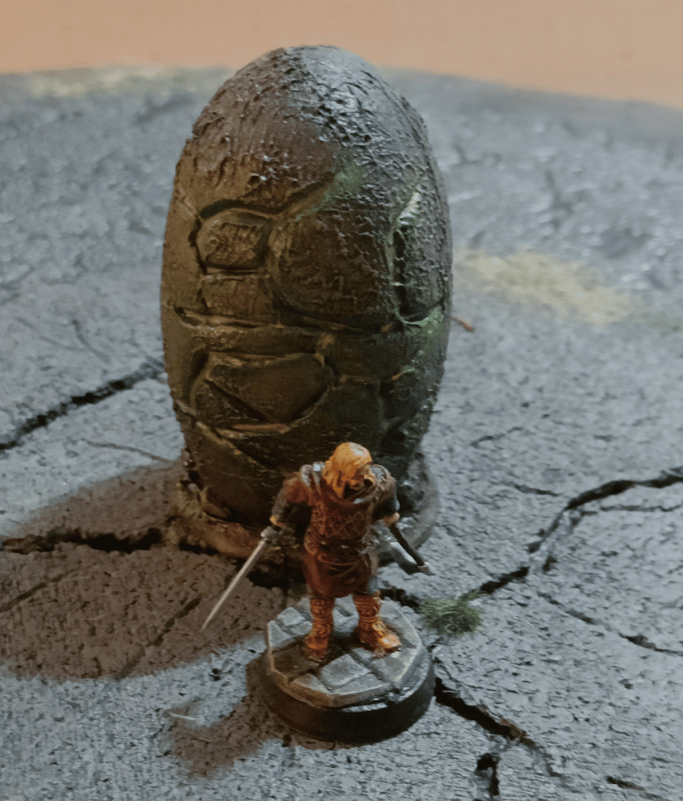

Here are some photos taken years later. I realize this is one of the first scenery pieces I made and it helped me realize that it was relatively easy to transform a piece of plastic that already had a bit of relief into something passable for scenery. 

All I needed to do was apply a bit of texture on top to correct the fact that the plastic is super smooth. Then it's very easy to do a type of painting that looks like stone with gray and dry brushing. That allows transforming it into something that works.

If I knew how to paint better I could have done better with the light effect coming from inside. It's a scenery piece I still have today even though I have very little use for it. I think I've never used it in a game but it works well and it was very simple to make. 

I'm keeping it and it's super solid.