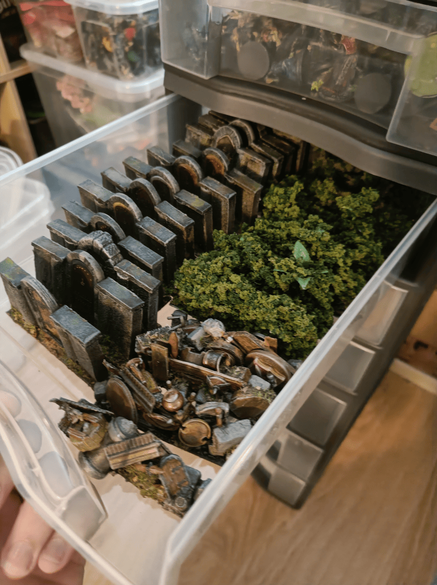
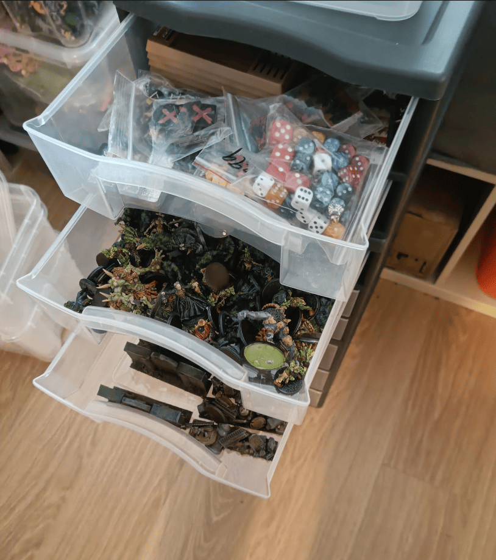
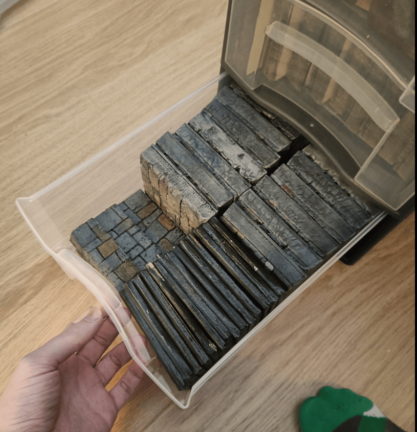
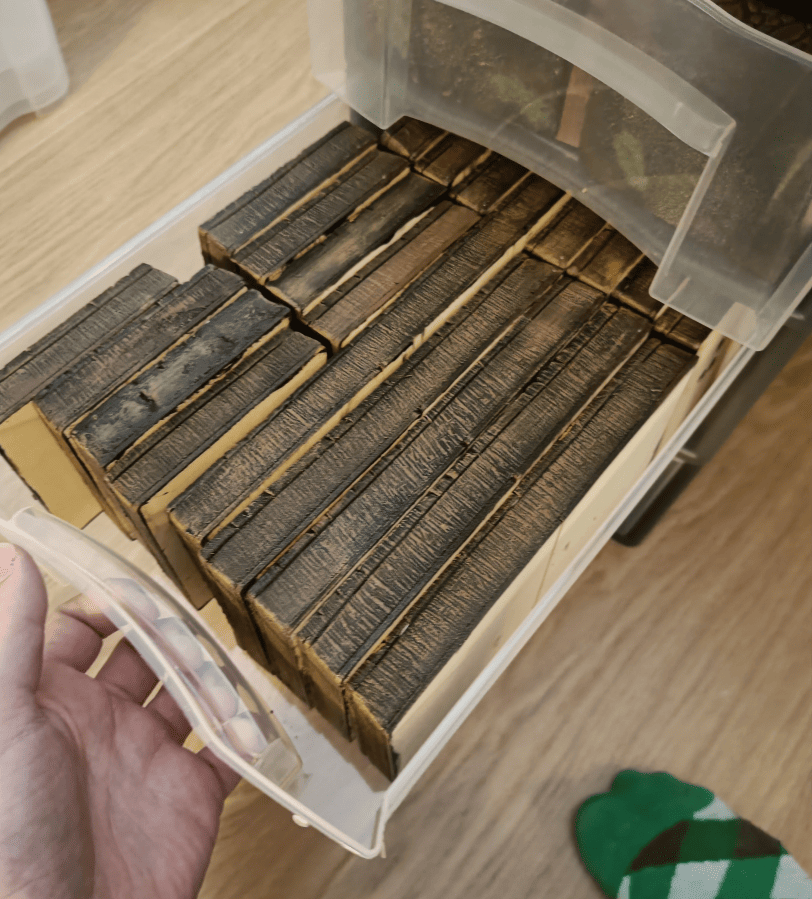
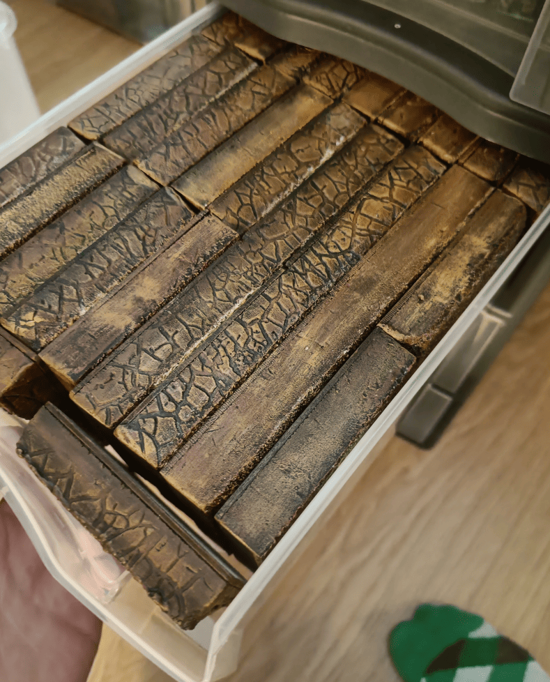
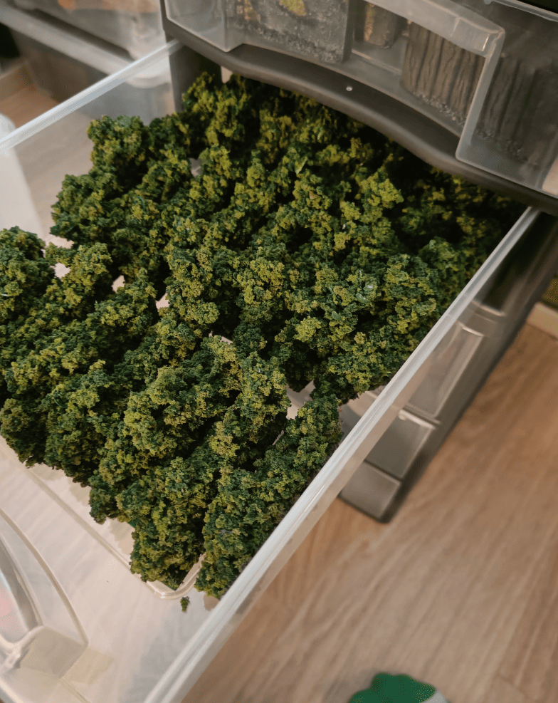
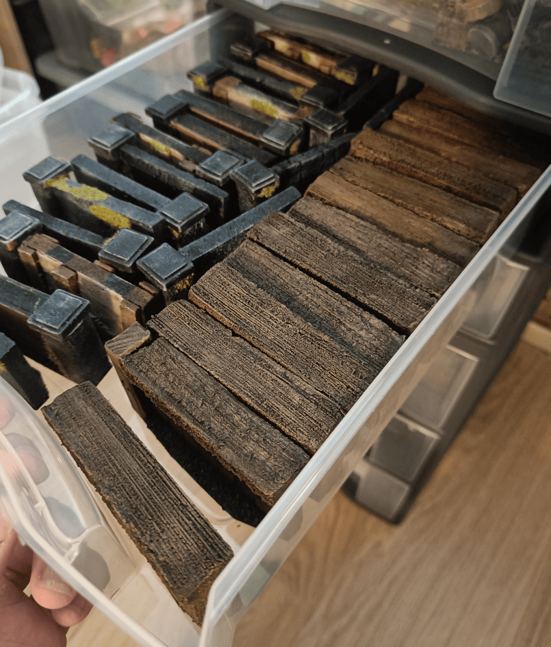
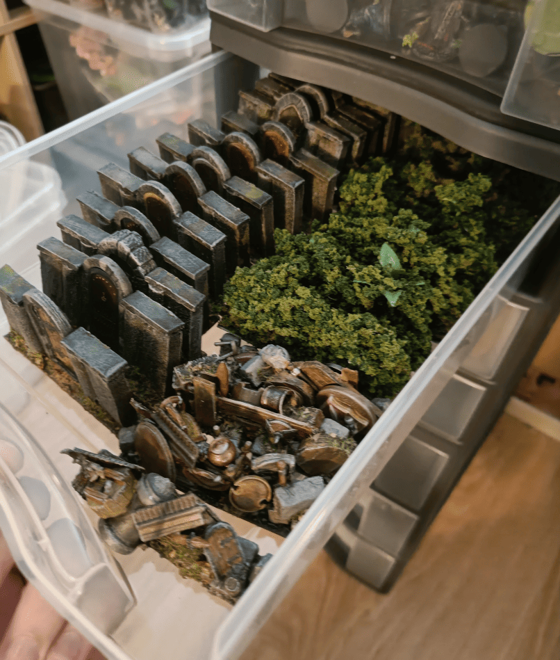

<!-- Image 1 -->

I've talked on this blog about making lots of 3D elements for Zombicide Green Horde to play on. What I haven't talked about is that it takes a lot of space to store. For a long time I used all the Zombicide boxes to store the elements inside. Not very practical since you never know exactly what's in which box. Sometimes I need certain terrain pieces for other RPG games. I found a better system: [shelves with drawers](../zombicideGreenHordeGameSession/). As you can see, I can store much more inside than in boxes.

<!-- Image 2 -->

Drawers for elements that are more rules-related rather than scenery. The top drawer has character sheets, dice, cards, all the tokens needed to play. The second drawer has all the different zombie types you might need. The third drawer has scenery elements like barricades, and small indicators for marking treasures.

<!-- Image 3 -->

A drawer for all stone tiles, including stairs that let you descend into water. You can't see them well because they're on their side, but the bottom right corner has the thinner water tiles.

<!-- Image 4 -->

[Wood tiles](../zombicideWoodenTiles/) for house interiors. Most rooms are one square, but some scenarios have rooms that are 2 or even 3 squares long, so I need tiles that size.

<!-- Image 5 -->

Same thing for stone tiles, all the outdoor squares that aren't on main streets. Again, some are 2 long, sometimes just 1x1.

<!-- Image 6 -->

All the [hedges](../zombicideHedges/) that block line of sight. Not nearly enough are provided in the base game, so I made my own.

<!-- Image 7 -->

All the [walls](../zombicideModularWalls/) you might need. I made different wall types: stone walls, wood walls, different styles. In the base game there's no difference, but it adds variety when playing.

<!-- Image 8 -->

The drawer I mentioned at the start with various elements like barricades, some hedges that didn't fit in the other drawer, and all the necessary [doors](../zombicideDoors/). I went through every scenario in the game and counted the maximum number of doors needed for any given scenario, the maximum number of hedges, and made enough to play all scenarios.

