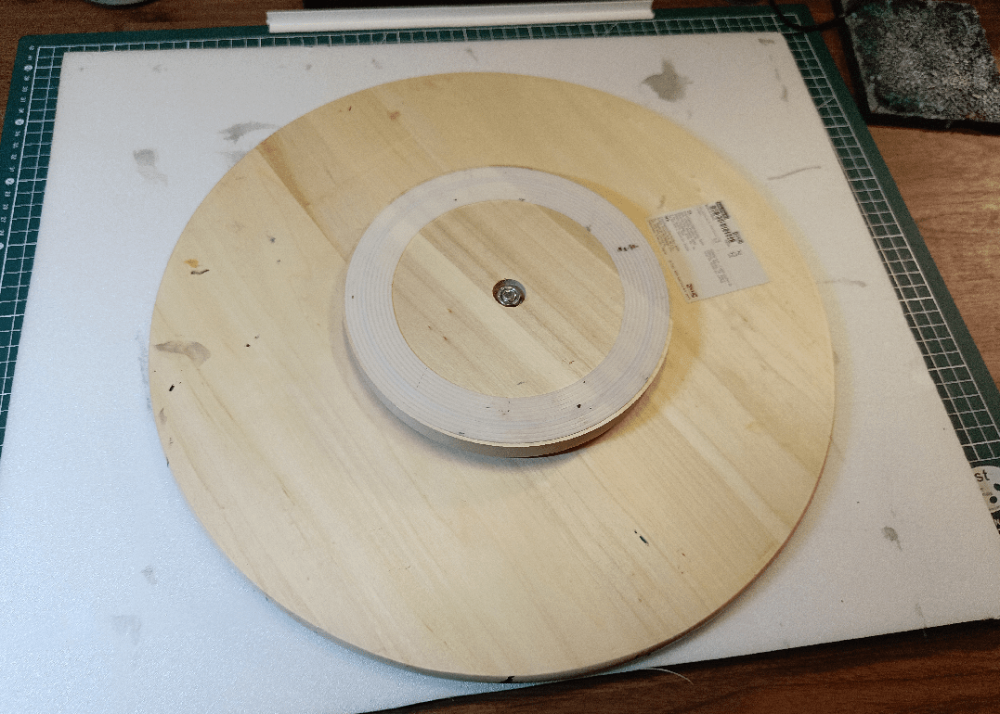
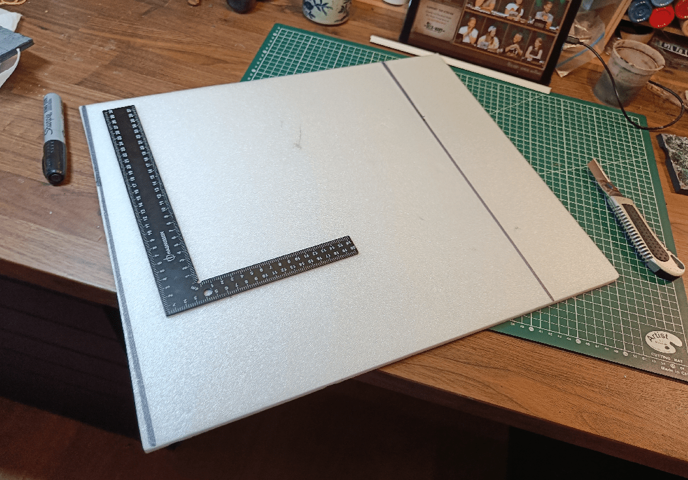
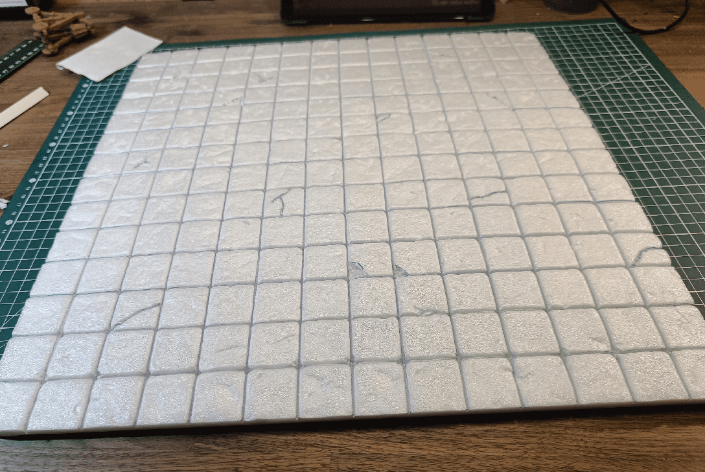
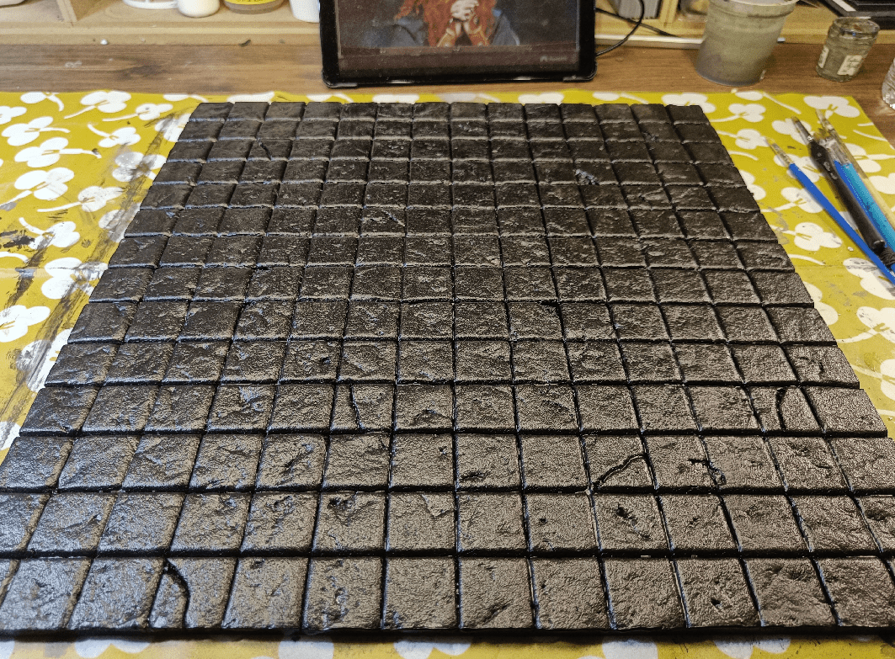
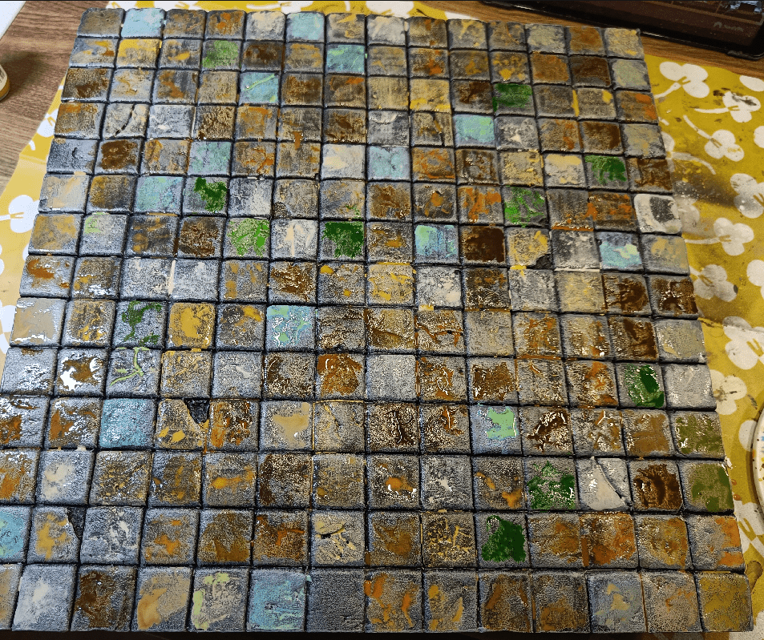
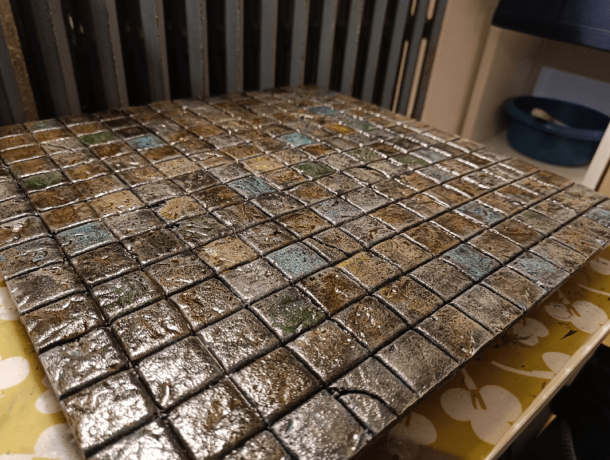
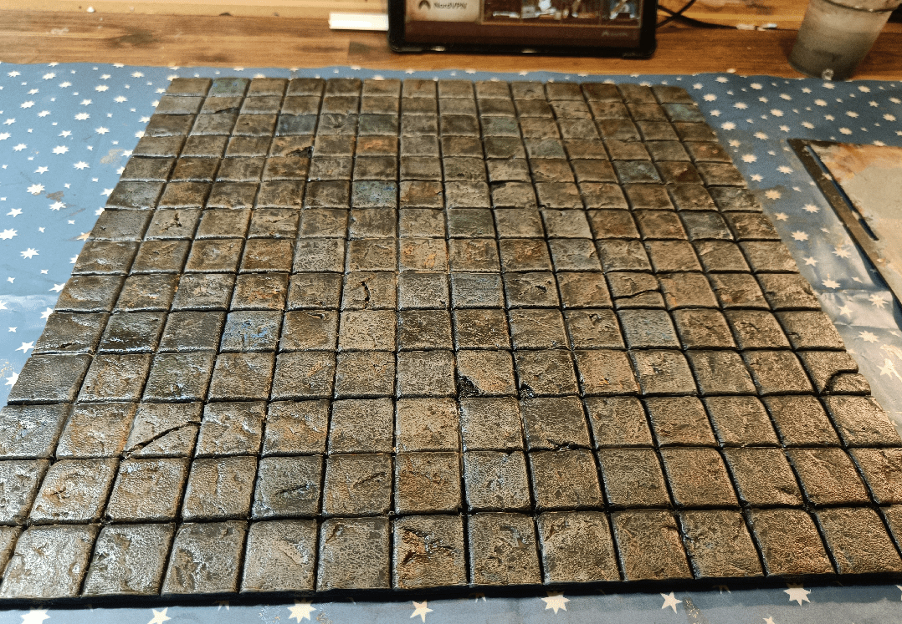
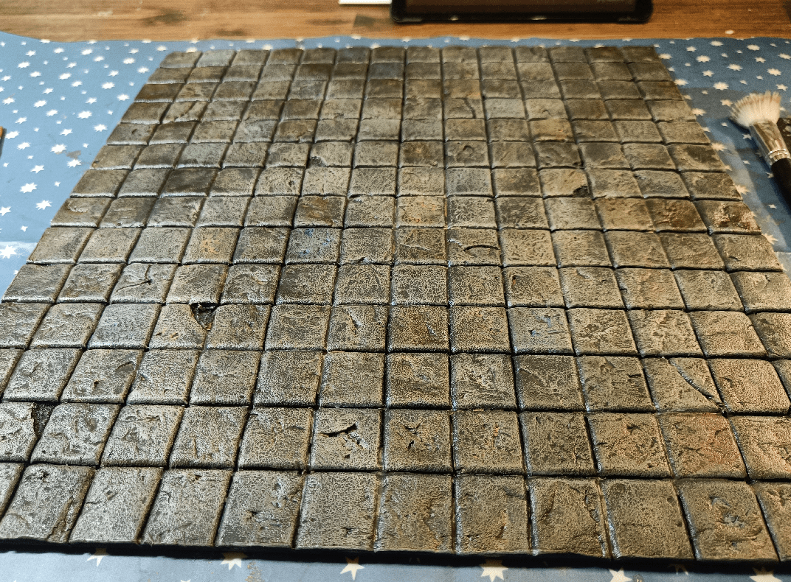

Sometimes, for big battles, I find it easier to use a large board instead of placing the individual floor tiles, so I made large 14x14 board.

I wanted it to fit on my lazy Susan, so I used it to make sure it would not go over the edges too much. It's only foam after all, so too much weight it it will break.

I used my new awesome metal ruler to cut straight lines.

And here we go for the usual carving process. Straight lines, shallow cut with hobby knife, then enlarged one with ball pen. Texture with a tinfoil ball, and some manual carving of broken stones to add some irregularities.

Nice uniform coat of black (it actually needed two coats)

I then did the usual gray overbrush, followed by various acrylic inks on the each square. The acrylics inks I use tend to remove the previous overbrush if I brush too much, so I needed to apply them with a very low brush pressure.

I let it dry, then added a black wash. Once again, very low brush pressure.

I like the final effect. Next time I might use less colors, or at least colors that are closer to each other, like various blues instead of blues and greens.

Once dry it looks much better again.

And a drybrush to bring it all together. Really, the wash and drybrush really mutes the colors, so I can go heavy on the blues.