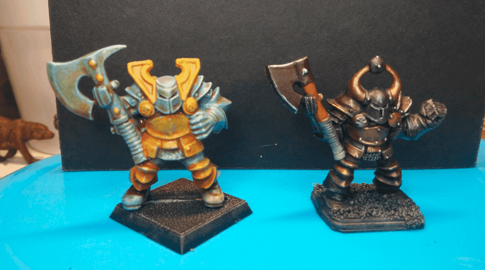

I like to keep those two minis on my bench, as they remind me of the progress I made in a little more than a year of casual painting.

The first one is one of the very first minis I painted when I got back to painting. Two colors, and a heavy dip into wood varnish.

The second one is after I tried on metallic paints. Dark silver and copper, and some light silver highlights to make it look like a dented old armor. And of course a Nuln Oil wash on top of it.
