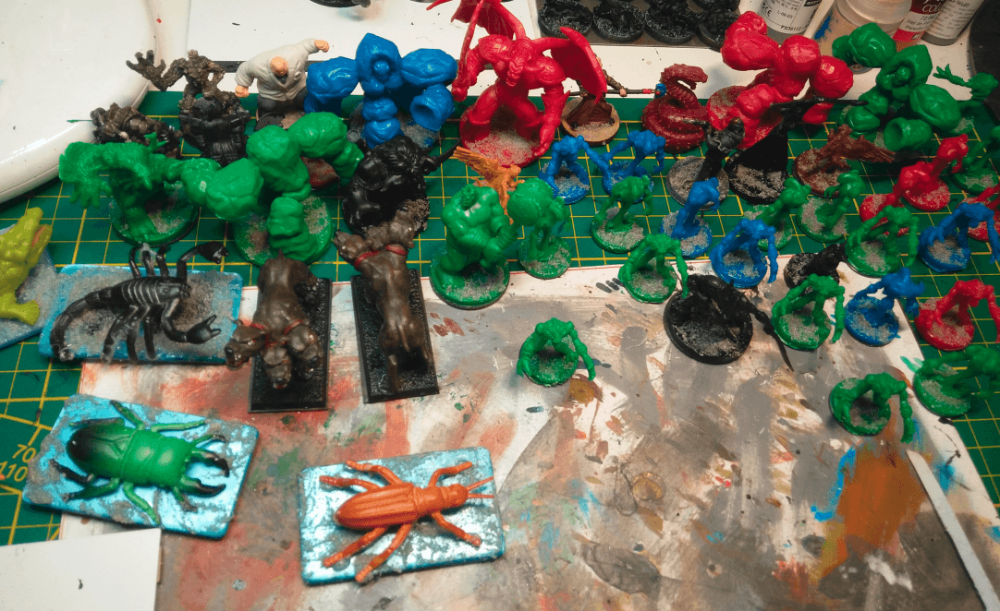

Here is a dump of all the minis I started during 2020. I will move them into dedicated posts as I make some progress on them.

This is mostly cute small toys that I'm sure I can repaint and give them a darker look.

Lots of Heroclix, and a few other minis found here and there on garage sales. I usually wait until I have a batch of 6-8 similar minis before painting them.

Here you can see flame elementals, ghouls, bat things and various other horrors.

This is a cheap plastic toy. Slightly larger than the usual scale but I think I can make it an interesting named skeleton.

Ghouls on the front row, some minis I think I will turn into rival NPCs in my current campaign

Ghoulish things and dead halfelings

I managed to get my hands on a used copy of the World of Warcraft board game and got a ton of great minis from it.