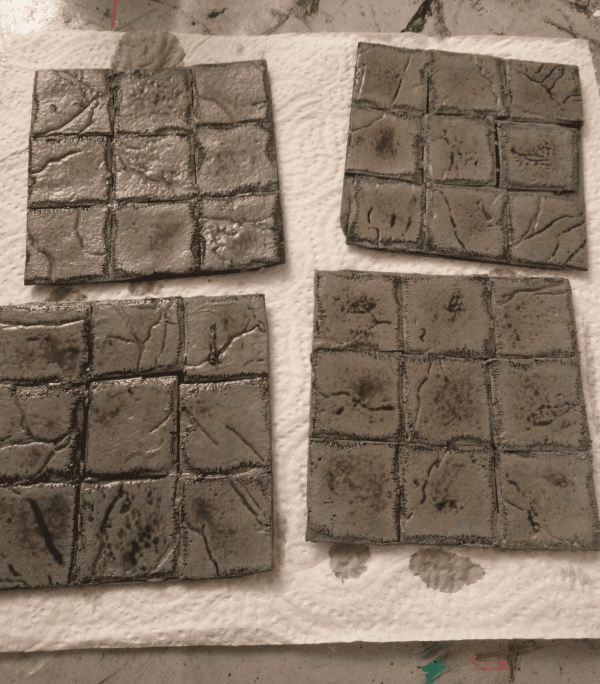
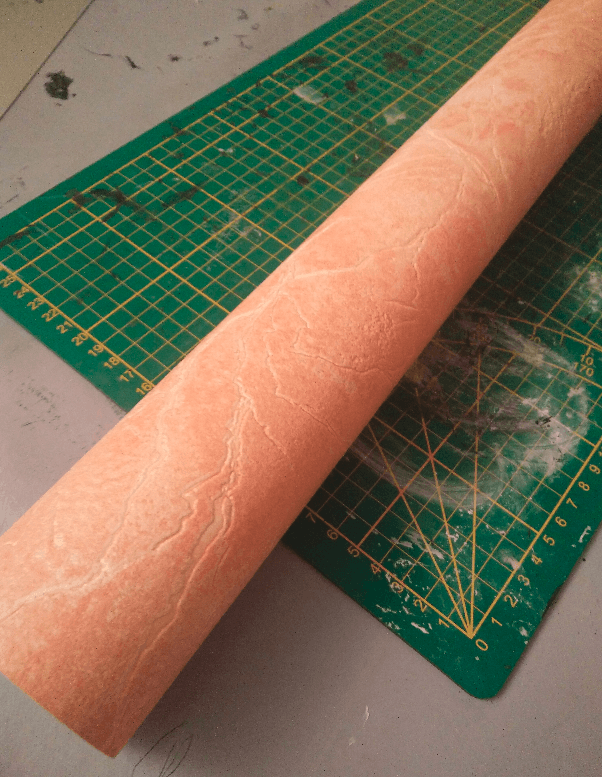
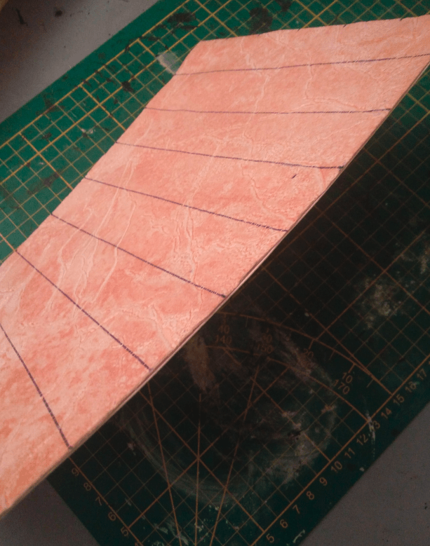
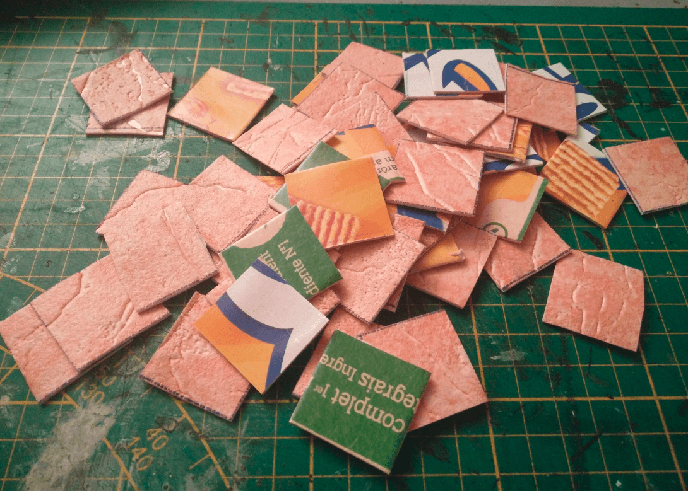
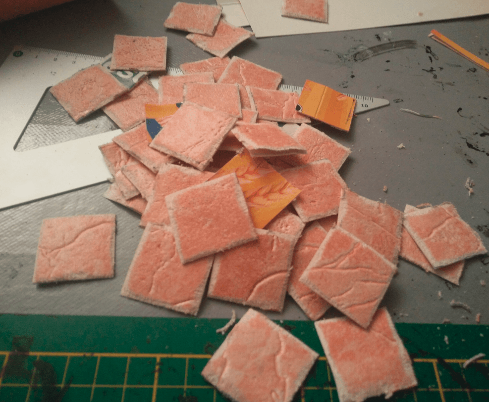
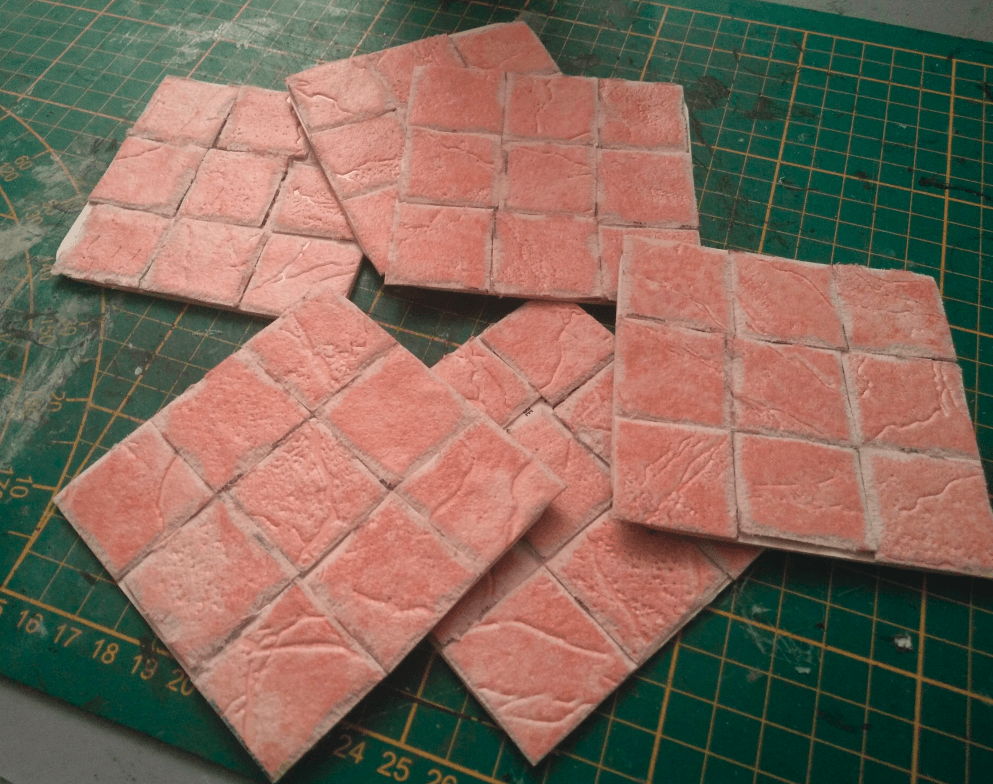
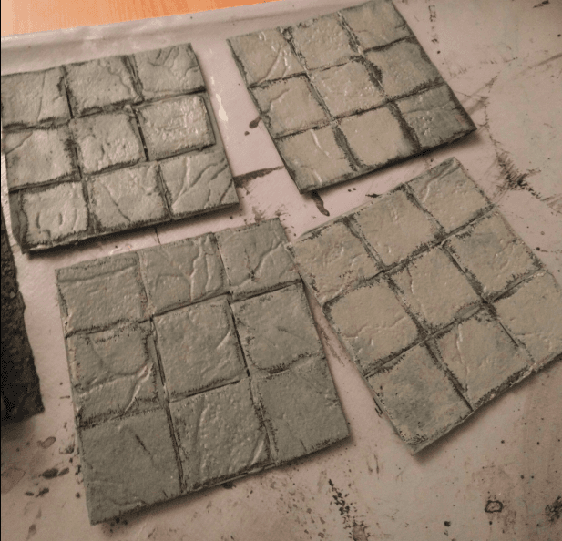

This was a proof of concept to test a new material I found: a roll of textured wallpaper and seeing if it would make acceptable dungeon tiles.

This all started with this roll of textured wallpaper I found. It has a nice texture that looks like crackled earth, but I imagined that if I were to cut it in small squares, it would make perfectly acceptable stone slabs for some kind of dungeon floor.

But, as is, it is a bit too flexible and thin, so I glued it on a piece of cereal box cardboard and started tracing squares of 2.5cm on it.

I cut the squares with a pair of scissors and got a nice pile of stone slabs. My initial gut feeling was right; this looks great.

I started sanding the edges because I thought that simple gluing the squares next to each other on a dungeon tile would not look right; I wanted to add a bit of detail that would make them look like actual stone slabs instead of simple squares.

This took some time, made some noise, and created a lot of dust and blistered fingers, but I did it.

I glued them on some beer mat I found in the same second-hand shop.

The final effect looks promising. The only issue is that the squares are a little too small for my taste. 2.5cm is fine in theory to put a miniature, but in practice it's barely enough and I'd rather have 3cm squares. Well, it was just a proof of concept to test the wallpaper anyway.

Grey overbrush on black coat.

And black wash on top.

### What I learned

- The initial texture still shows even through the various layers of glue and paint, so the drybrush is pretty effective
- This soaks water really well, which is nice for keeping the texture, but also make it warp a lot due to the white glue I was using
- The sanded borders I did do not look very good once painted, and take a very long time to make. I would cut the corners Wyloch-style next time.
- 2.5cm per square is too small