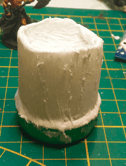
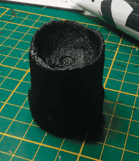
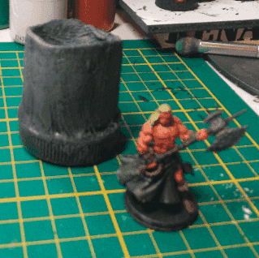

So here is the broken pillar from the remnants of my attempt at lightning the tower.

I applied a fair dose of modeling paste on it. This stuff is not good for filling small gap, but perfect to add some texture to any regular plain surface.

And sanded it.

And primed black.

This looked a bit better. I can't decide if it really looks like a broken pillar or a bit of plastic on top of a bottle top.

The second dry brush gave a bit more depth. I think it looks mildly more interesting. At this point I'm starting to consider this more like a training ground than an actual piece I'll love to have on the table.

Added some grime at the bottom, to separate the base from the pillar.