I imagine this as a forgotten guard post, hidden inside a forest, possibly the entrance to an underground bandit camp.

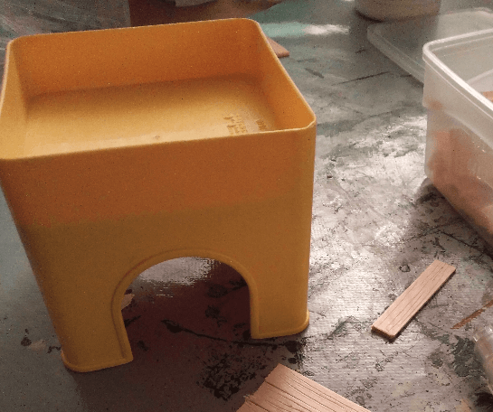

The original shape comes from this plastic toy; initially part of a set of stacking toys that I *borrowed* from my daughter. I like to re-use existing shapes and add texture to them, and I felt it had the perfect shape and scale for a small tower.

## The doors

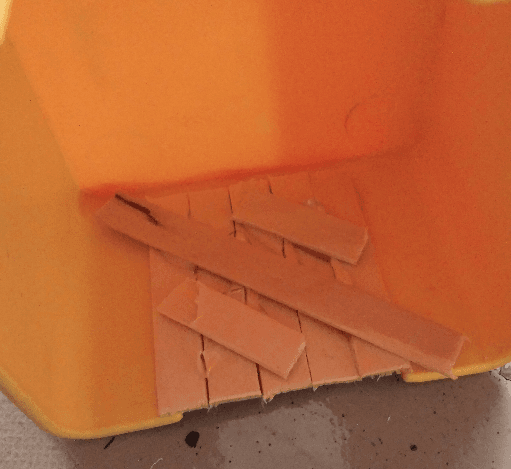

I started by gluing some ice cream sticks in the inside of the door frame, reinforcing them on the inside.

Looks legit from the outside, all I need will be a door handle and some visible hinges.

I added them once the bricks were layed, using an ear ring blocker as the handle and decorative watch handles as the hinges.

## The walls

I knew I wanted to cover the walls with foam bricks. What I learned on one of my previous projects is that I should always paint the wall black before gluing the bricks, otherwise the initial color would show through the cracks between the bricks.

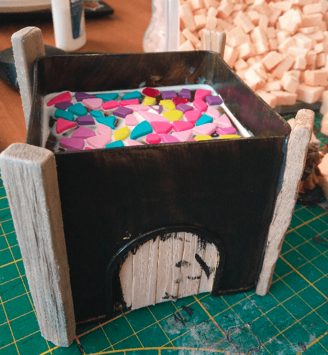

I glued decorative wood sticks at each angle. I hate to lay bricks in angles, it's too finicky, so I usually try to find lazy ways to cover them instead. Here it looks like structure beam. I'm not sure it makes any sense, architecturally speaking, but it looks nice.

Now, with a glue gun and a lot of patience, I glued foam bricks all around it. I kept an opening to add a window (it's a Lego piece) and some runic bead above the door to act as an ornament. In hindsight it looks a bit out of place (being a round bead in a largely square building).

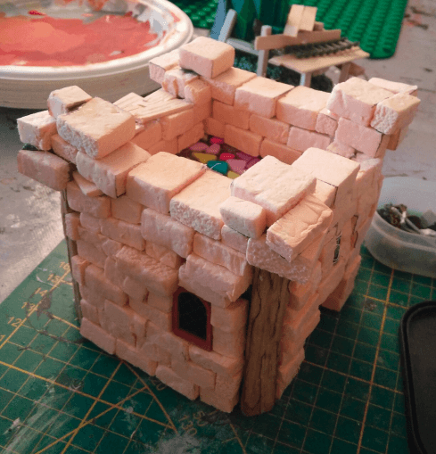

I covered it all up to the first floor and kept gluing bricks to add some kind of ledge around the first floor. Large enough so miniatures can stand on.

The I picked this metallic fence from my bit box and fitted it on one side. As you can see from the background, my daughter was playing with her own fantasy beasts at the time.

## The stairs

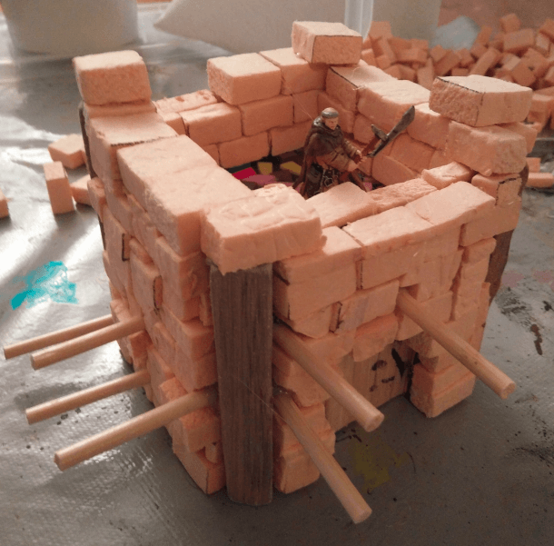

The structure was a bit plain with it being "just square", and I wanted to add some interesting bits for playability, so I started building some decrepit scaffold around it. It's basically wooden skewers that I inserted in the foam (or in spaces between foam bricks) and glued.

Then covered with textured ice cream sticks in an haphazard manner.

## The first floor

I recently got my hands on a bag of those colored plastic pieces. I think they come from some kind of puzzle toy. I found their shapes interesting and wondered if I could use them as irregular stones for flooring.

## Debris

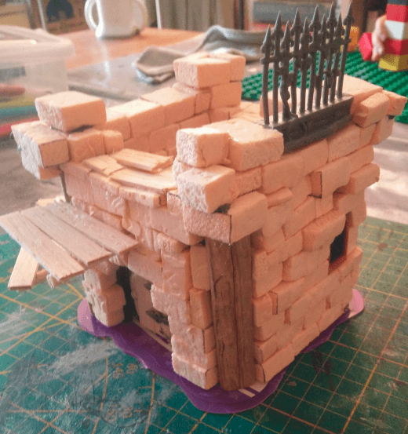

I finally glued it to a plastic base. It's made from the top of a baby food box and perfectly fit the shape of the building.

Glue on the base as well as on any the top of most protruding bricks, then sprinkle of fine sand. In hindsight, I should have sprinkled larger sand grains first and finish with the fine one. I also glued a Playmobil tree on top.

## Painting

And on to the first coat of paint before the real painting could start.

Overbrush on the wood and stone.

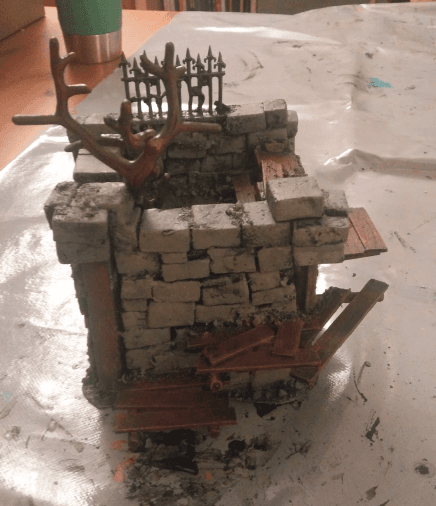

More drybrushes in lighter tones on the wood and stones again.

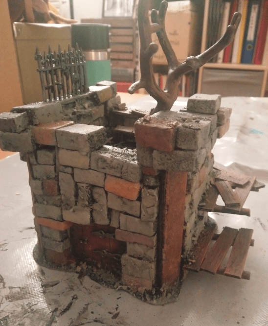

Picking some stones with highly diluted paint of various colors to add some variety.

Adding a black wash to tie everything together and make it look all dark and grimy.

## Leaves

This was the first time I attempted to make some kind of tree. I found that the shape of the Playmobil tree was pretty nice, but it was missing foliage. I have a box full of those Playmobil tree, so if I can make great foliage, I could create a whole forest pretty easily.

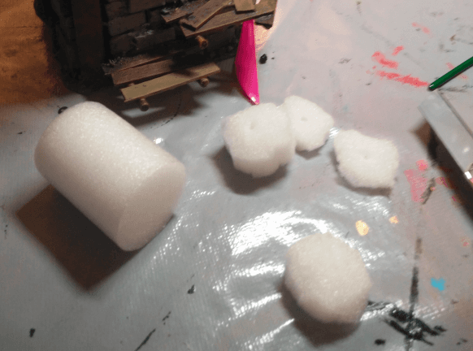

I had those foam cylinders from a packaging laying around, so I thought it could serve as a base for foliage. I cut them in irregular round shapes.

Painted them green.

And glued them on the tree (I also added grass flocking here and there as well). The tree do not look as good as I imagined it would.

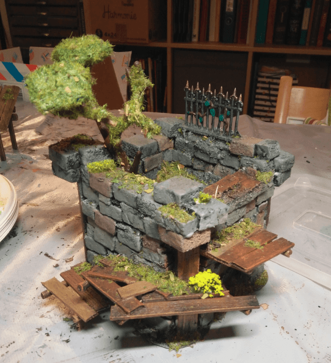

Covered with more flocking. Didn't much improve the look, but I decided to leave it like this. My tree foliage technique is not yet working, but for a first try it's not too bad. I'll have to try again.

## Final result

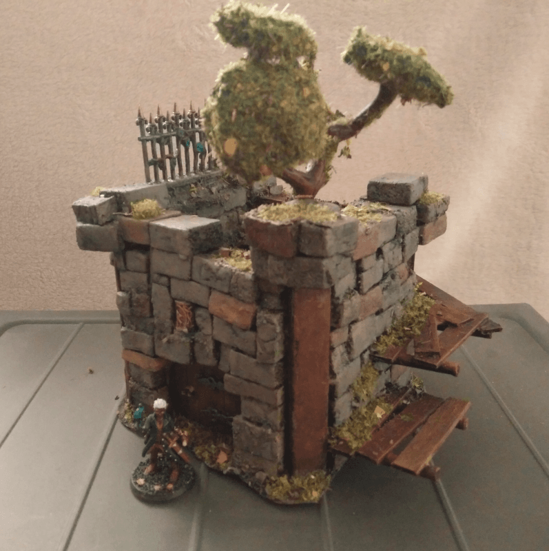

And here is the final result.

Overall I like this build. The structure is pretty solid as it's made from one block of plastic. The stone brick effect looks good enough (the wash and tinted bricks adds a lot to it). The scaffold around it, even if pretty basic breaks the monotony. Doors look like doors. The only downside is the tree that looks a bit out of place but hey, I'll turn that into a RP element: *look for the abandoned guard post with the weird looking tree on top*s