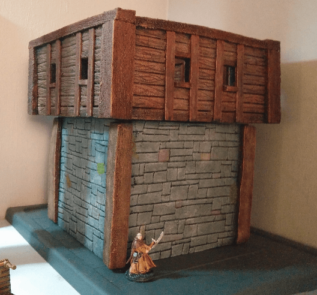
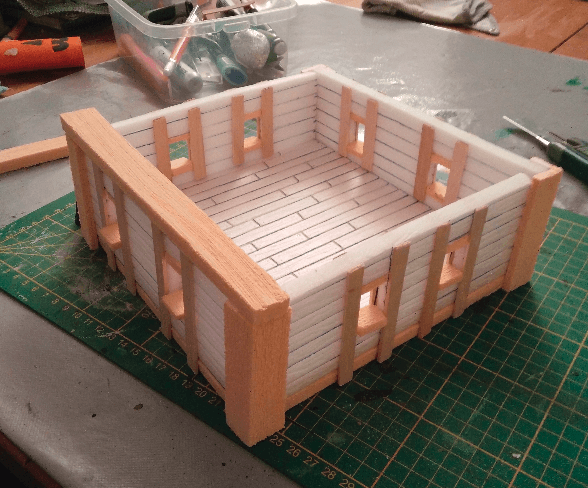
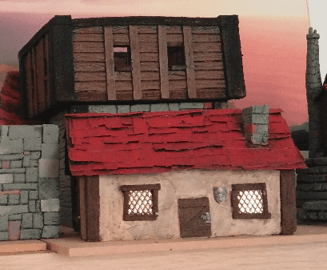
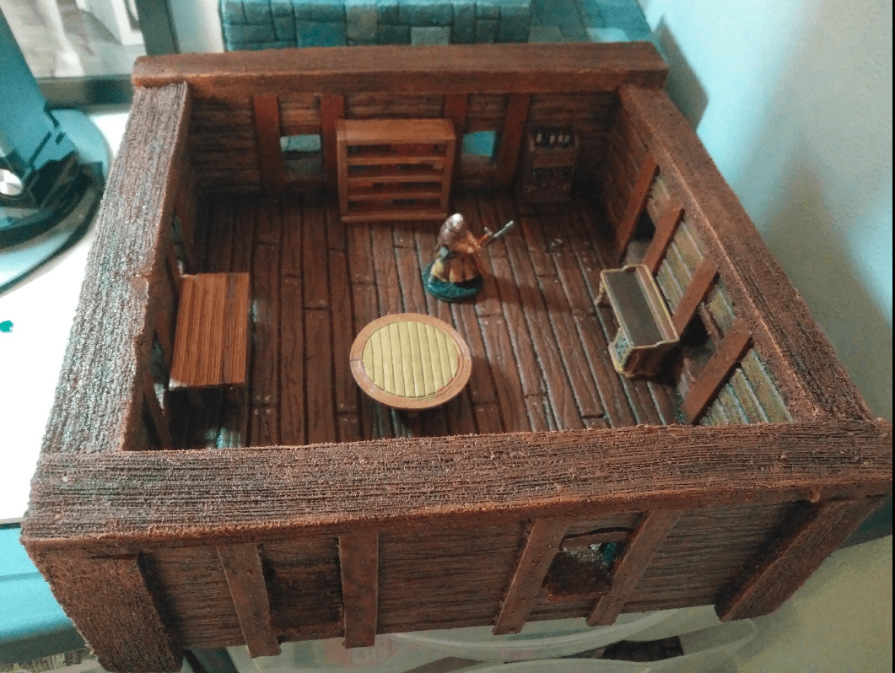
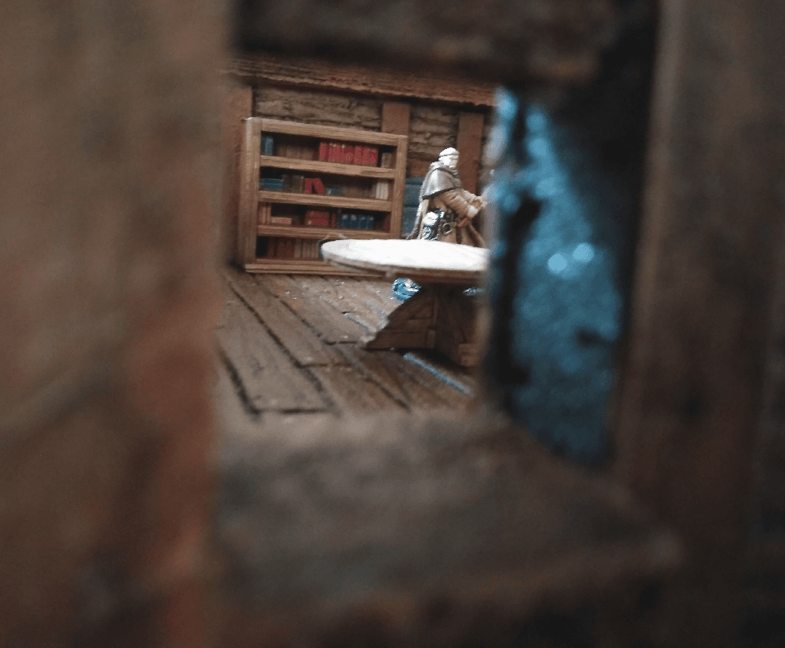
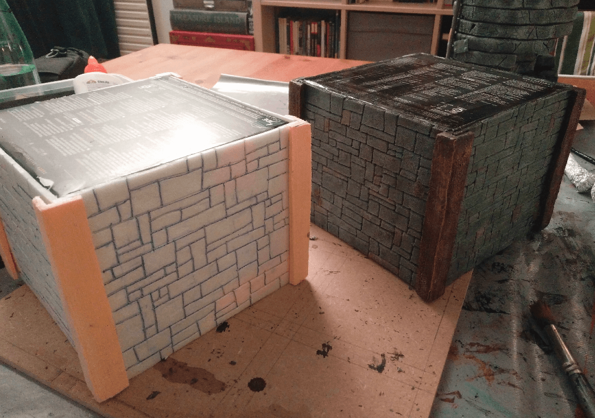
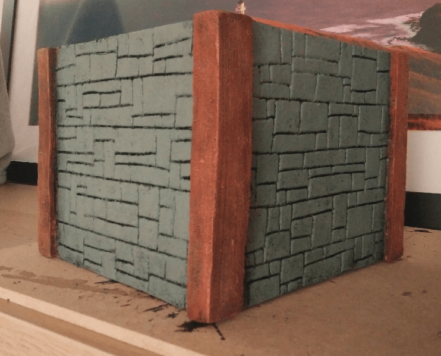
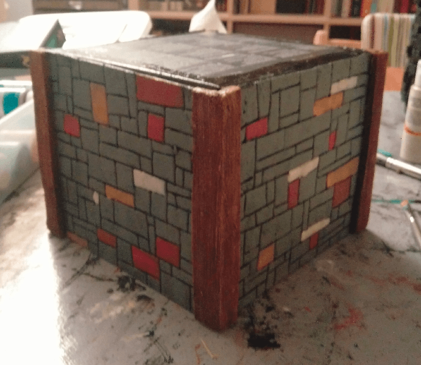
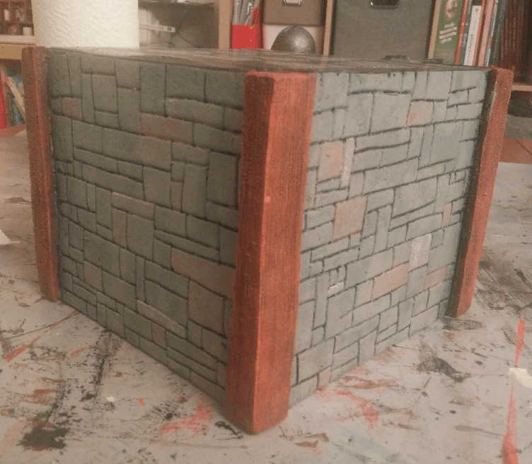
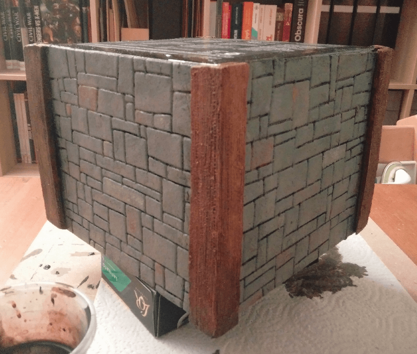

I made this watchtower, with playable interior, mostly from foam.

I do not have pictures before that stage, but this is a pretty good view of the underlying structure. Everything is made with foam, except the vertical planks around the windows.

During the painting process.

Interior view.

(kinda) artistic shot.

## The base

I made the base of the tower from a cardboard box, covered on all sides with a thin sheet of foam (where I carved a stone pattern), and I glued some more foam on the side (where I carved a wood texture this time).

Gray overbrush on the stone, and brown on the wood.

Painting some colors on individual stone to make it look like an abstract painting.

Another drybrush on top to tone down the colors.

And... I don't even remember what I did on that step, sorry. A wash maybe?

And both pieces on top of each other.

This is one of the crafts I'm the most proud of. The top level wood really looks like wood, and because I coated it in modpodge and varnished it, it is also very durable.

