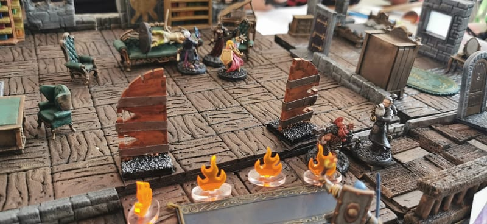
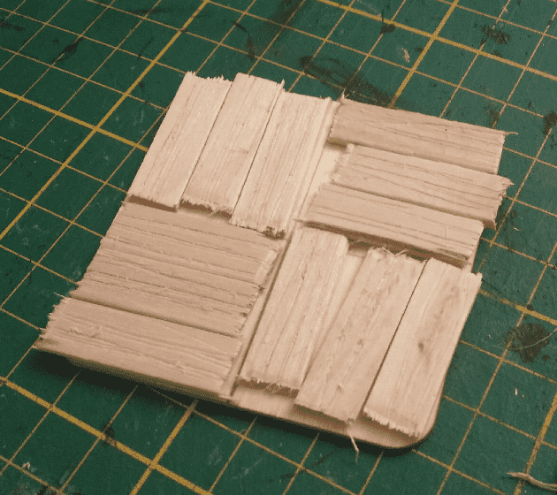
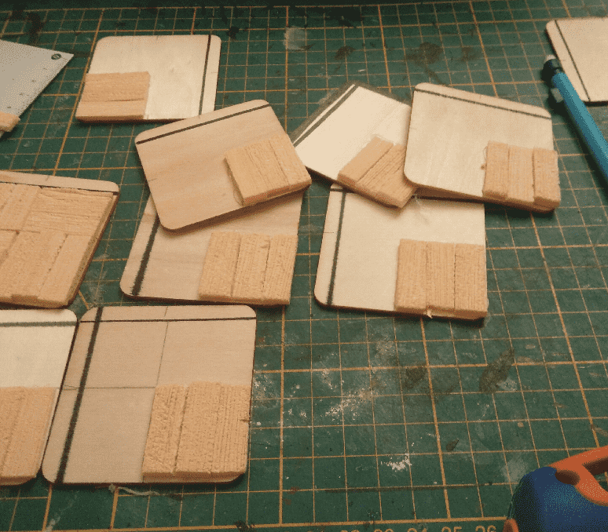
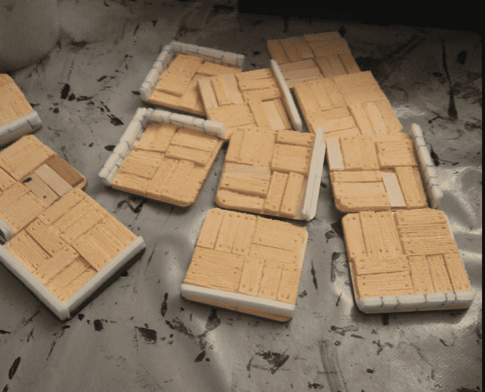
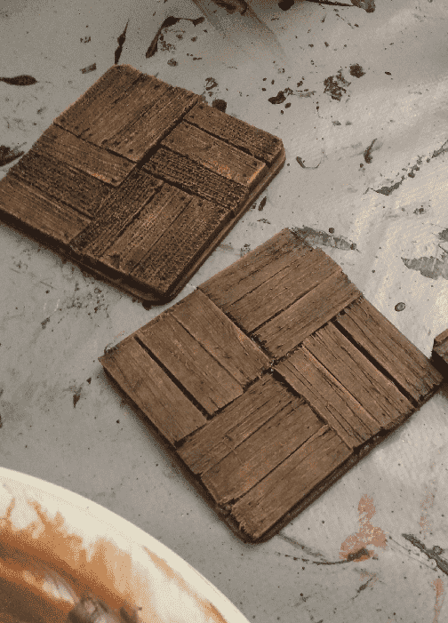
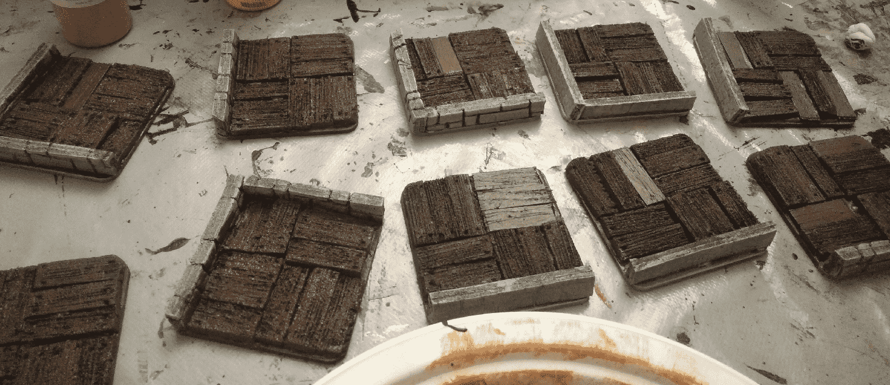
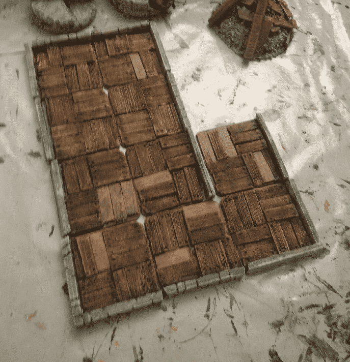

On some pics you can see alternate wooden tiles (on the right here), that were an earlier attempt. They have a very rugged aspect, because not all plank has the same height, and also took much longer to craft.

For the sake of documenting my successful crafts and my less successful ones, here is how they were made.

For some, I glued ice cream sticks together, and used a screwdriver to carve the wood to make it look more like wood.

For others, I cut smaller foam planks that I textured, and individually glued.

​	

This resulted in a weird mix of planks and also took forever to put in place.

The final look of the one made with ice cream sticks is actually pretty interesting, visually.

But adding walls to them means I needed to cut the ice cream sticks shorter to accomodate for the wall. And cutting those damn strips and texturing them is such a messy job that I abandoned this way of crafting after a few tiles.

The final result looks a bit like an abandoned house. This is an interesting look to go after, but I'm happy with my other wooden floors so far.