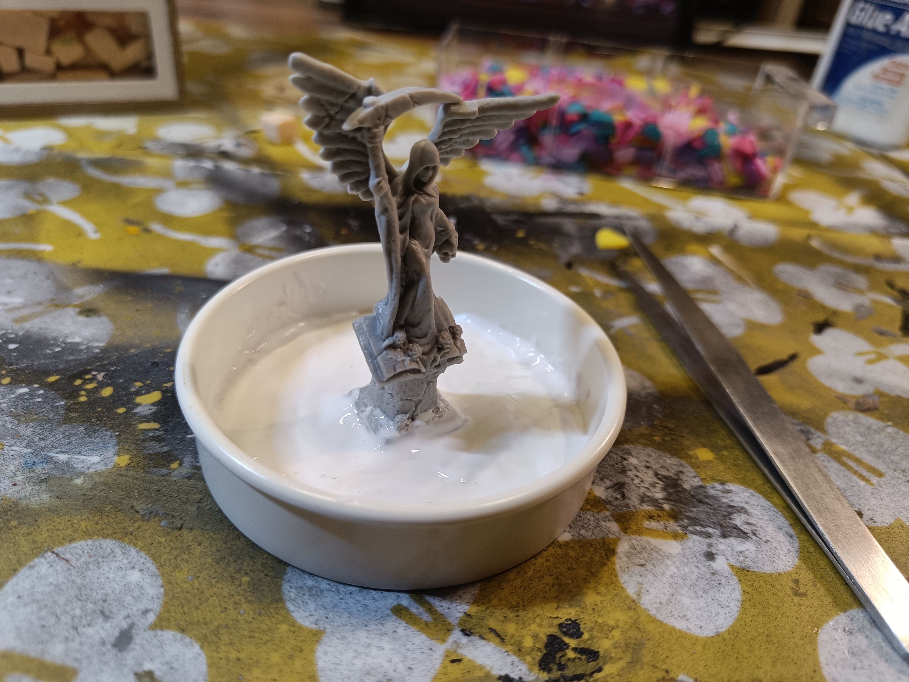
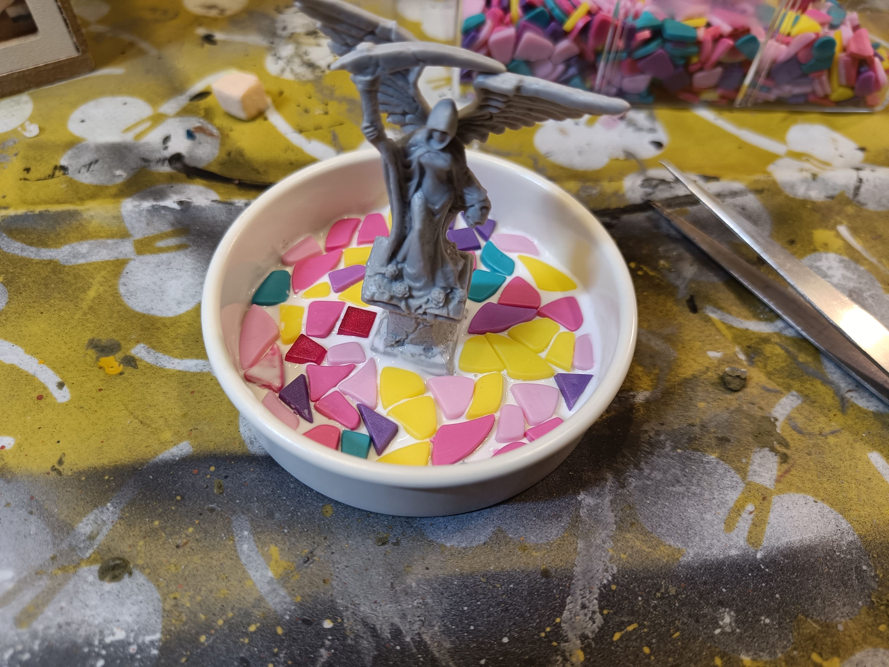
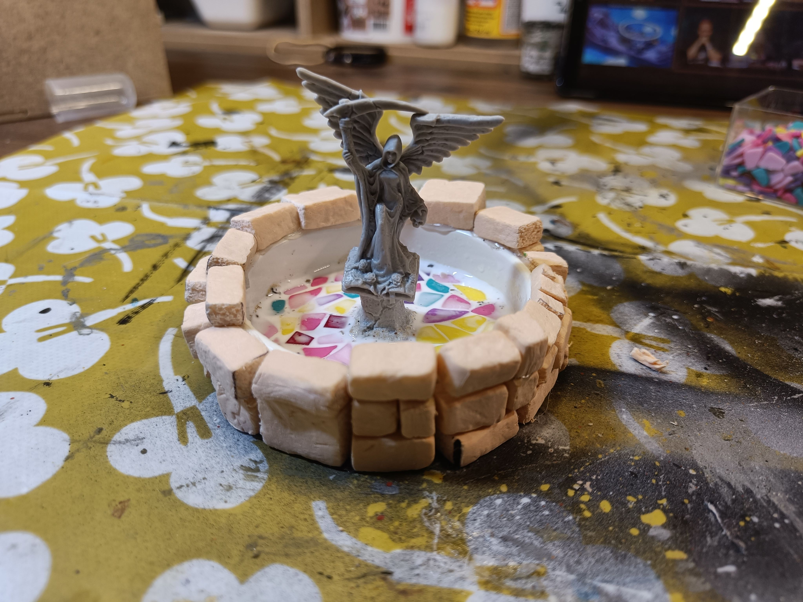
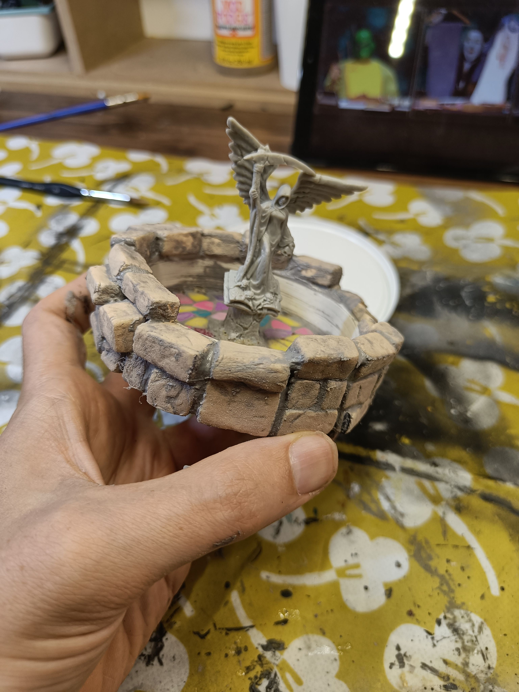
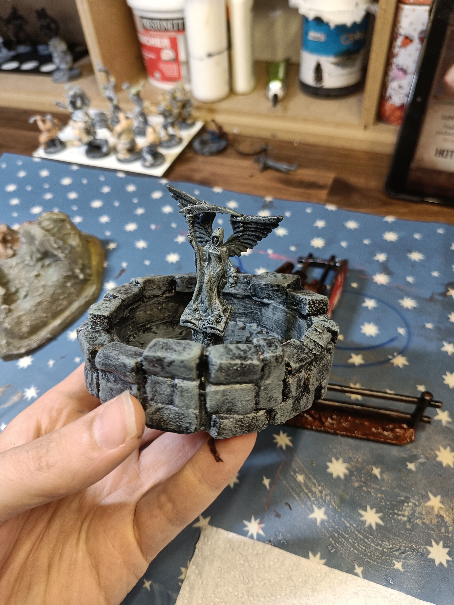

I started working on this craft without really having a specific idea at first. The tray underneath is actually a little Playmobil pool that came in a toy pack for my daughter. She didn't want it, but I thought it looked perfect. It seemed about the right size and it's solid, so it could be a good base if I ever wanted to make a fountain in the middle of a village scene.

I also salvaged the main sculpture, which I think is a Reaper Bones figure. I don't remember exactly where I got it, probably from some secondhand thing. I know I would never use the miniature just as a basic statue on a miniature base, but would incorporate it into a bigger build, so why not make a fountain out of it?

I wanted to try something with these little plastic pieces. They come from another creative game my daughter had when she was little - the kind where you make drawings with blocks of different colors.

I thought these elements had a pretty nice shape and that I might be able to use them to represent pebbles on the ground or cobblestones. So I covered the bottom with PVA glue and positioned these different little pavers on top.

Spoiler: at the end of the build we don't see them at all anymore.

I went around the element with lots of regular foam bricks

I mixed some filler compound with a bit of water and a tiny bit of paint to give it some color and make it more spreadable. Then I spread it all over the surface.

The idea is that when I run my finger over it, the compound goes into all the recesses and fills them up like mortar would. After that, I just wipe off whatever's left on the surface with a paper towel.

In the end, this should help tie all the different bricks together visually, so they look less like foam blocks glued next to each other and more like an actual wall with real mortar holding it together.

I painted it black with the modpodge thing, and added a drybrush on everything. I honestly don't remember if I did one drybrush or several different shades at that point.

You can see on the front that some bricks are too well aligned. If I'd done this better, I wouldn't have ended up with three bricks creating that groove right down the middle. They just aligned that way unfortunately.

I have to say, I didn't have much inspiration for this build. I just thought "I should be able to do something with these miniature pieces I have, let's give it a shot." So I just moved forward using techniques I already know, but the creative spark wasn't really there for this one.
