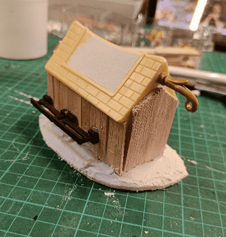
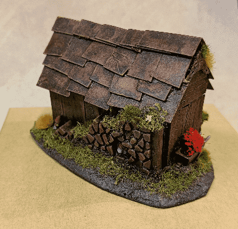

I made this small scatter terrain wooden house out of, what I think is, a MacDonalds Toy.

I liked the shape of the toy, so I thought I could cover it with some wood and cardboard and it would make a nice terrain piece.

I started by gluing it on a base, and added bits from my bits box here and there. The doors is balsa cut to size, the walls are ice cream sticks, and the light and dark brown stuff are plastic thingies I had scavenged from toys at some point.

I decorated the backside with a Playmobil wood pile, and a Mantic Crate wheelbarrow.

Glued on cardboard shingles.

Usual black modpodge basecoat, and also added some jewellry rings for the door handles.

I then didn't take much pictures of the painting phase, just slapped on some colors with drybrushes. Added flower for the nice touch.

Put some flowers in the wheelbarrow as well, and mushrooms here and there to add more life to it.