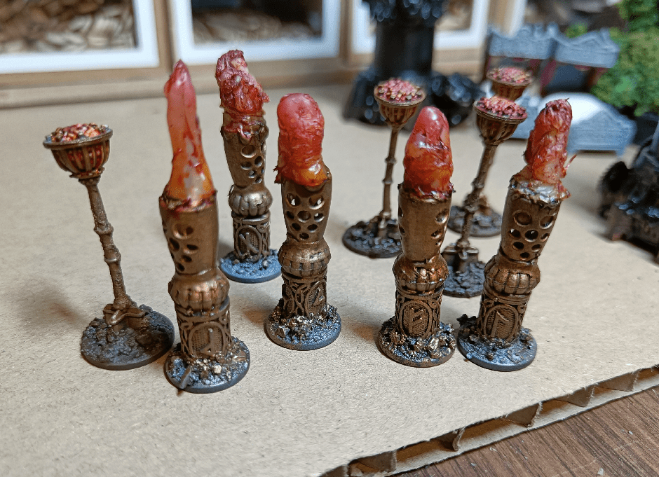
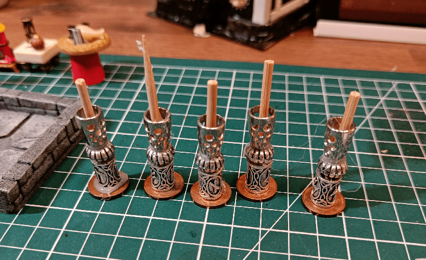

I realized I needed more torches and braziers to act as dressing in my adventures. One scenario specifically that I intend to run by my players requires them to be wary of light sources, so I needed a way to represent such light sources.

I stacked a few different beads and stuff I had. Added small skewers in the middle for stability, and filled them with hot glue. Then I added more hot glue around the top part to kinda look like a flame (not very well done, but that will do).