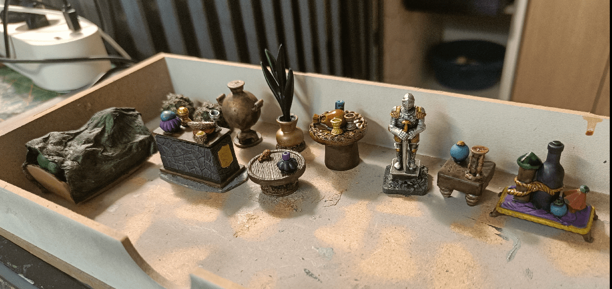
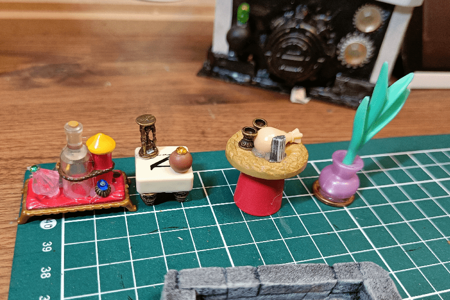
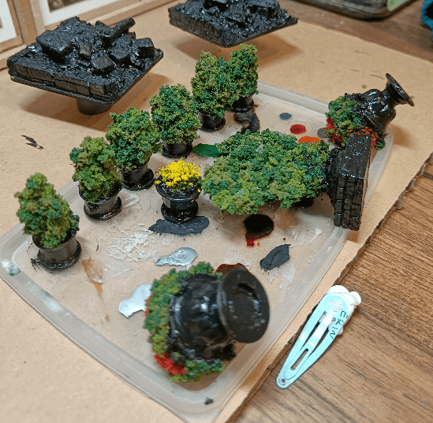
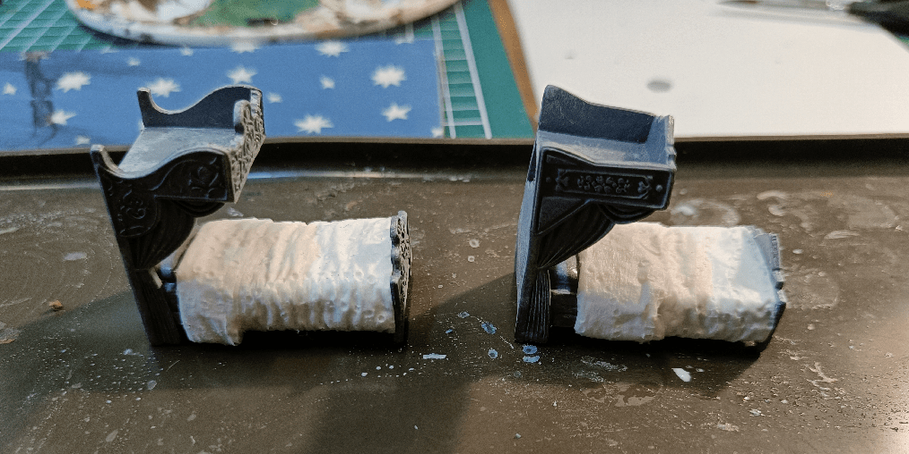

Dungeon Tiles are great, but they are not enough to convey the mood of each room adventurers explore, especially in large dungeons.

Scatter pieces, or dressing, are what really "sells" what a room is about. So I decided to extend my collection of scatter bits, suitable for what you would find inside of a mansion.

I took various bits from my bits drawer, glued it all together, trying to have some interesting shapes.

I found toy vases (Playmobil and others), added a few balls of tinfoil into them, then glued real foliage flocking on top, to make small decorative trees.

I recycled my daughter Elsa and Anna beds (from a Frozen toy). Added bed linen made out of tissue paper on top. I don't have much picture of the final painted result, but... it doesn't look very good.

