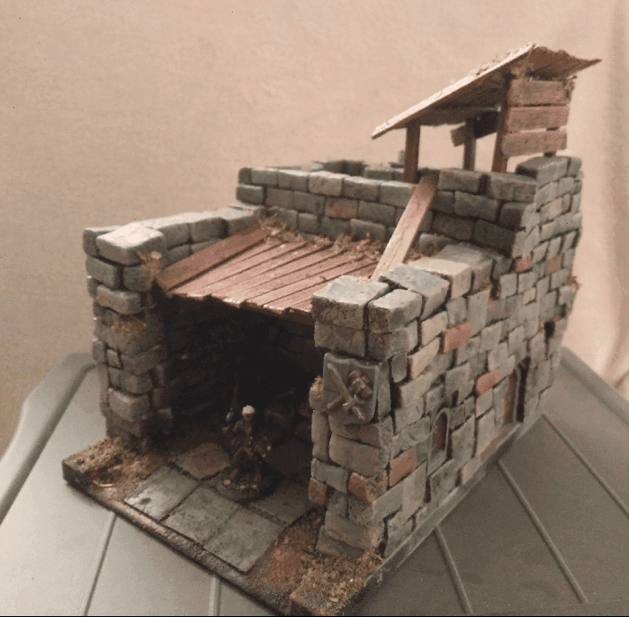

I made a blacksmith forge out of the structure of a toy. Honestly, I could have made it without the structure underneath and it might have actually turned just as good, but I like the constraint that using a pre-made structure adds.

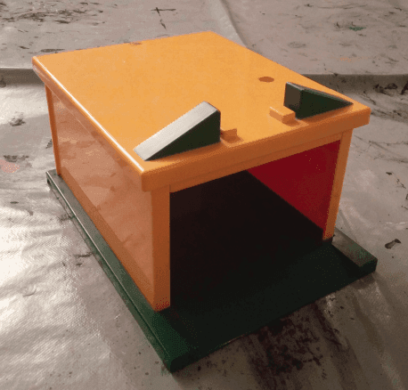

This is the original toy I found in a second hand shop.

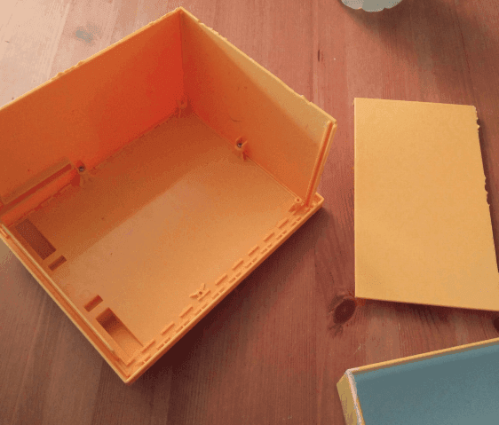

The plastic was very brittle, so I started by removing all the walls and unscrewing it. I would then glue it back together, but I didn't want any small part to break as I was working on it.

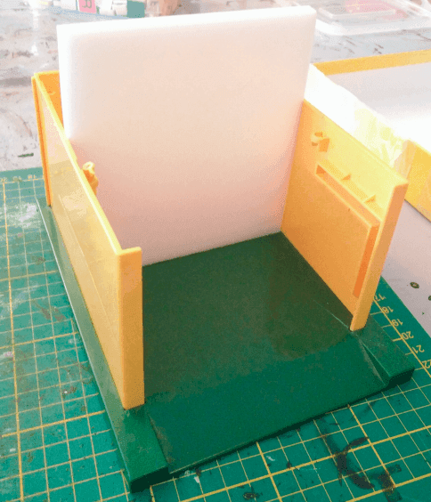

It was also a bit too deep, so I added a fake back wall with a foam board. I thought it could also act as some kind of house for the blacksmith.

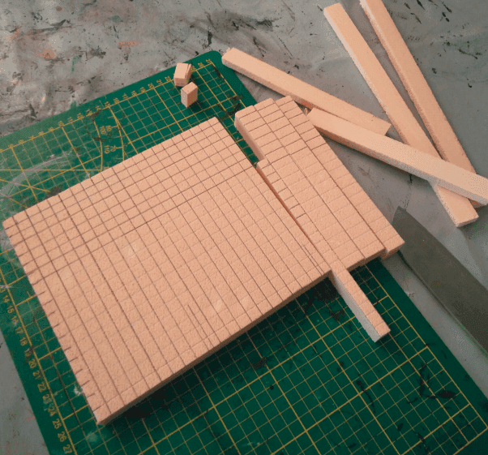

I started working on cutting foam in bricks.

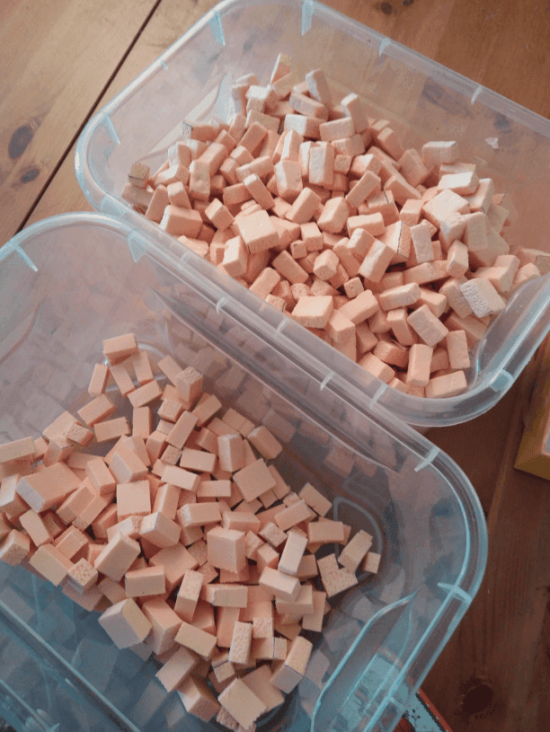

Which gave me a fair amount. I textured them by throwing them in a box with some real stones and shaking it until the stone texture was embedded in the foam bricks.

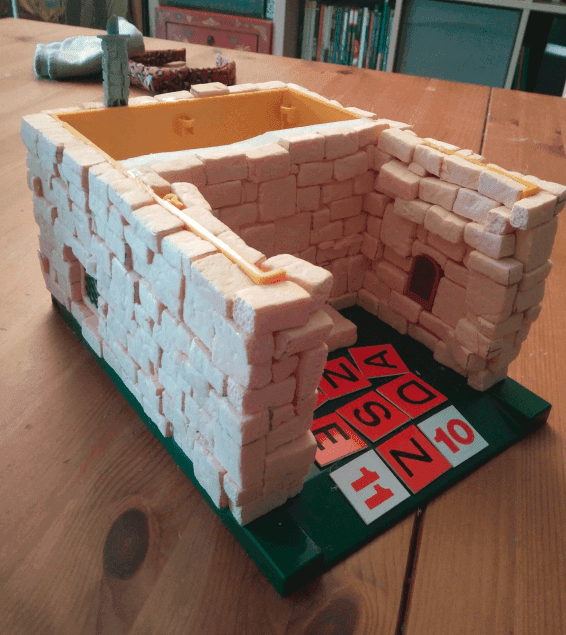

And then, it's just a matter of gluing the bricks one by one on all the walls. I do it with a glue gun, applying glue on the back of each brick and gluing them to the walls.

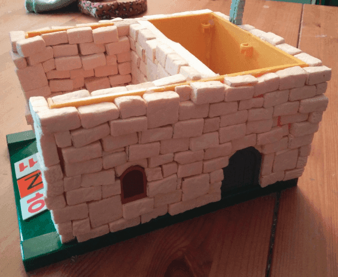

I added some windows and doors from Lego pieces and miniature leftovers I had.

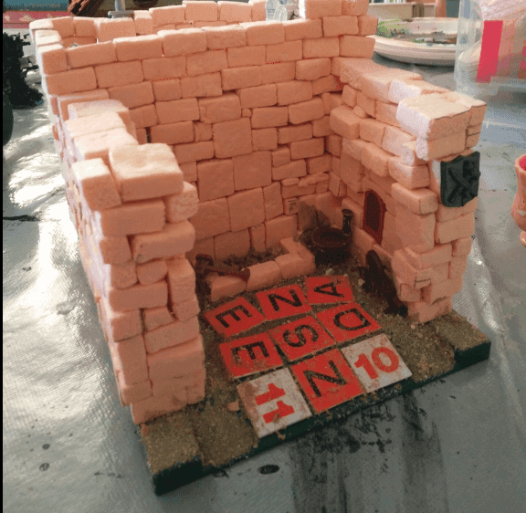

I decorated the forge area with some more toys and miniature stuff.

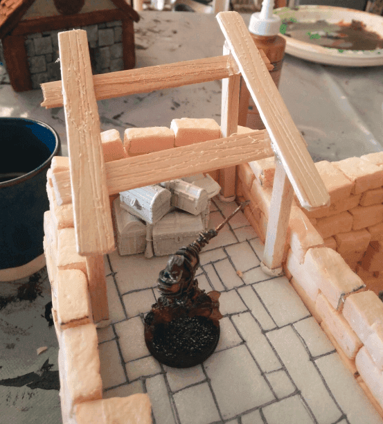

Upstairs I engraved the floor with some tiles pattern, and built a shack out of some balsa wood and popsicle sticks.

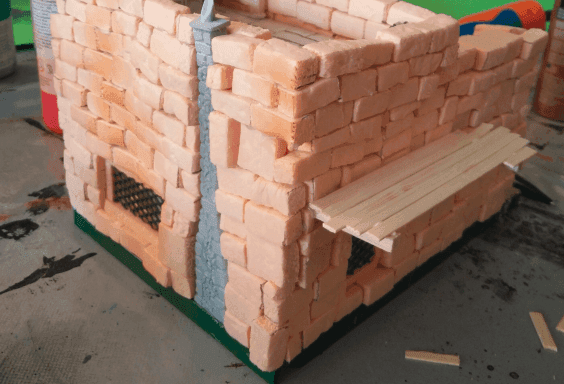

To make the side slightly more interesting I ever get to play a skirmish game with this terrain, I added a small wooded part.

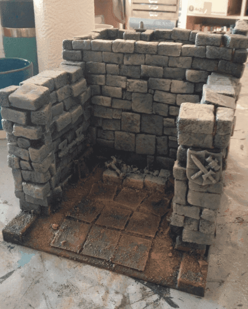

After a first overbrush of the base colors.

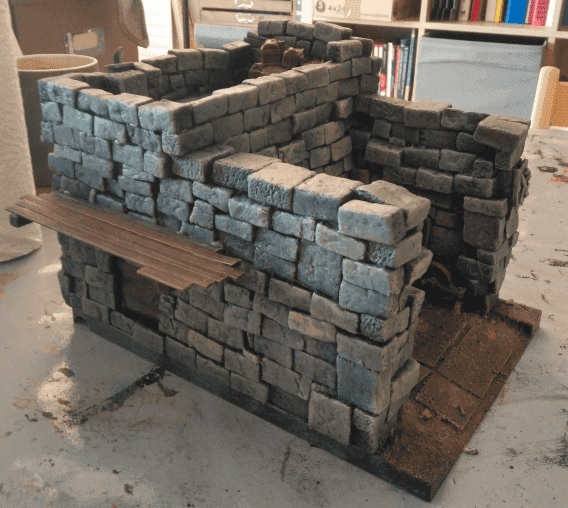

View from the other side.

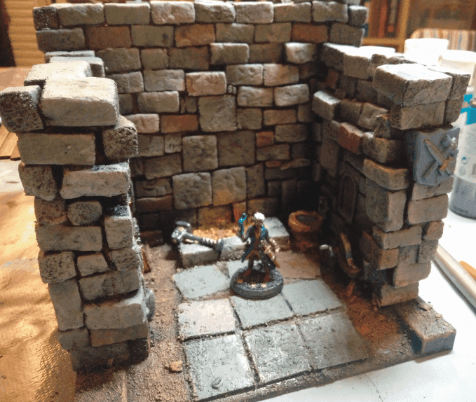

Painting stones in various colors for variety, using highly diluted paint, and adding a glow effect on the embers.

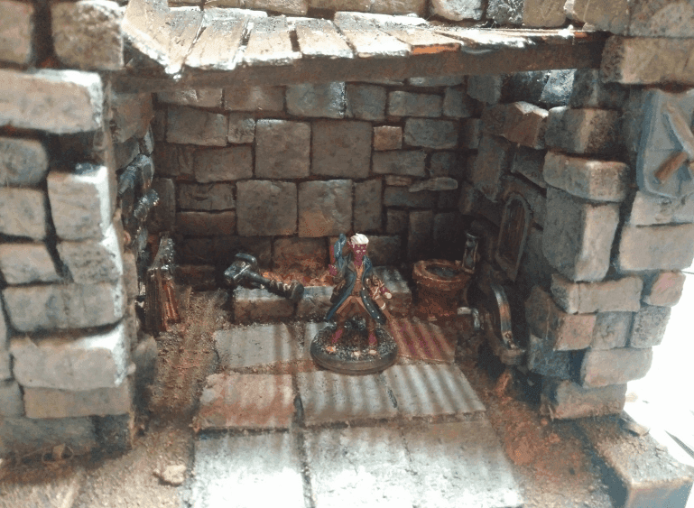

Added ramshackle wooden planks as some kind of ceiling. Not sure it makes sense that a forge ceiling would be made of wood but hey. 

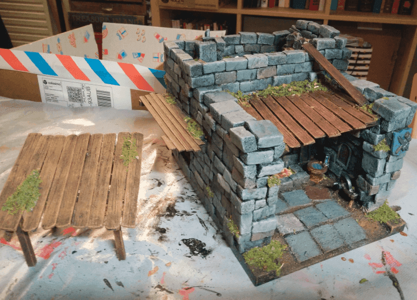

The top shack is not glued, for easier storage and also because it can be used in other contexts.

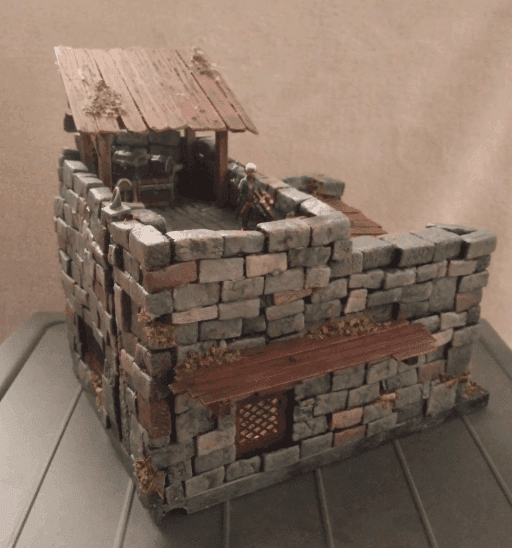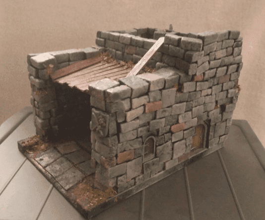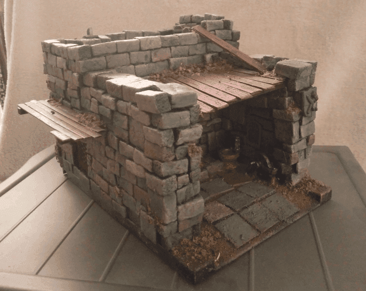

Final glamour shots from various angles.
