I was about to throw the plastic packaging of my Bo Bun, when I realized the shape could look like a nice dome for an astronomy tower.

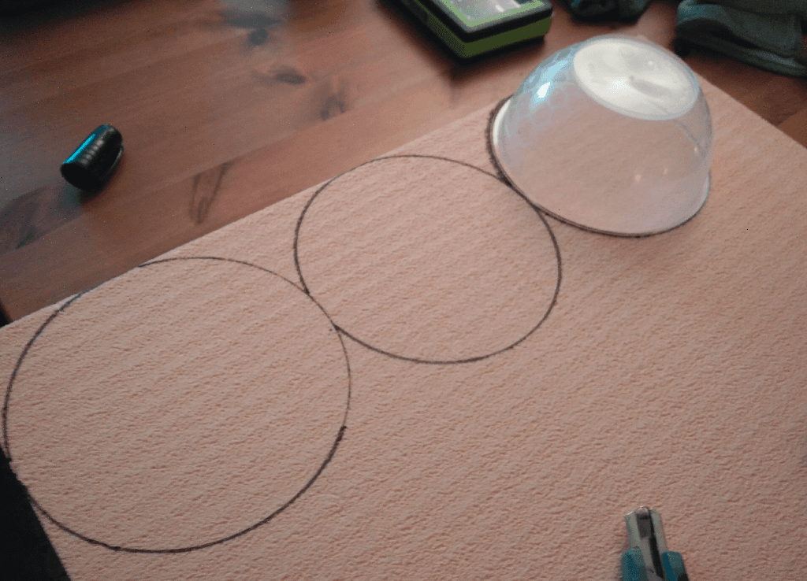

I started by drawing circles on my foam board, using the final Bo Bun bowl as a template.

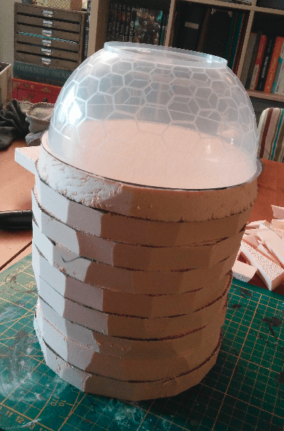

I very roughly cut the circles with my utility knife and stacked them to have an idea of the final height of the build. I was going with a used stone look so I didn't mind that my cuts were a little rough and not perfectly round.

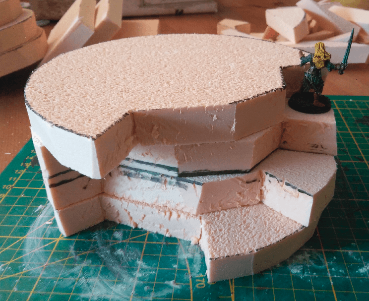

I then started carving the stair inside the tower itself. Keeping a mini handy for scale checking.

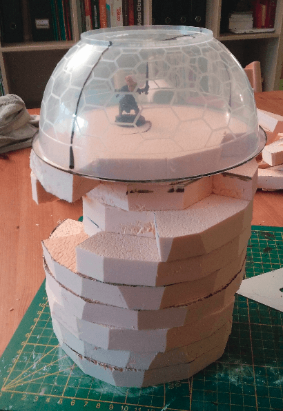

And once the whole stair was carved. I liked a lot the way it looked, but as I wanted to keep this piece playable, I decided to cut the final dome in half, to keep one side flat where I could place minis.

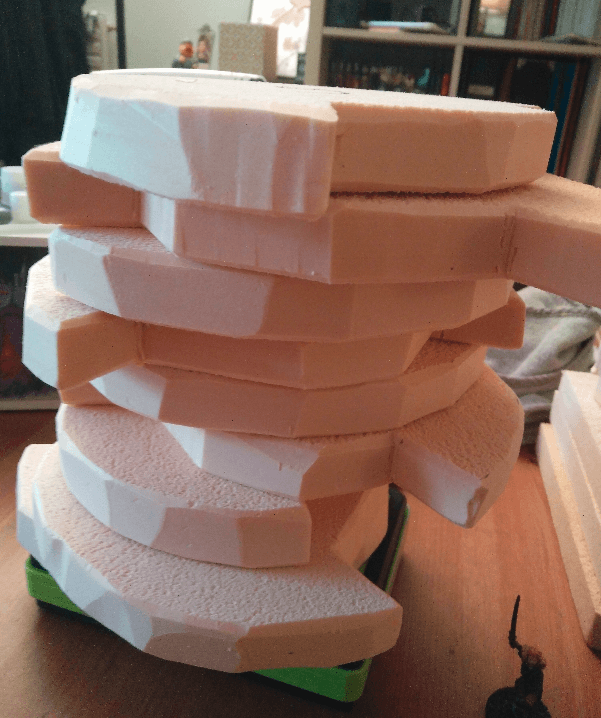

I smoothed the edges of each layer to make them look more like stone.

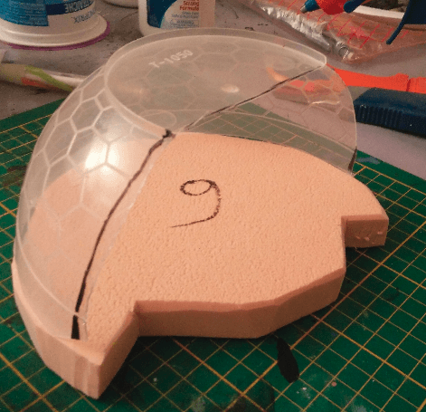

And I cut the bowl in half. The noise it made was horrible, but I finally managed to have a semi-clean cut.

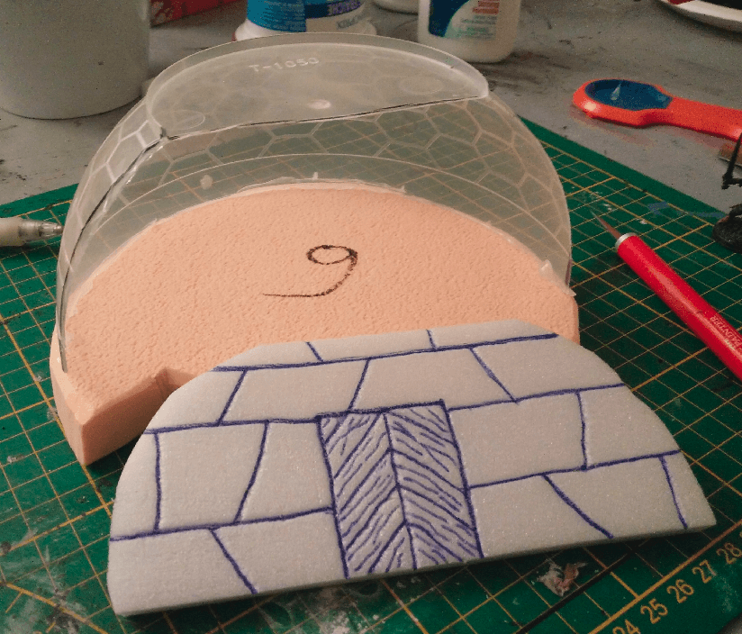

I took a fine piece of foam, carved some stone texture on it, and cut it to shape to fit in the hollow bowl. I completely forgot to apply stone texture with the ball of aluminium foil at that point, damn.

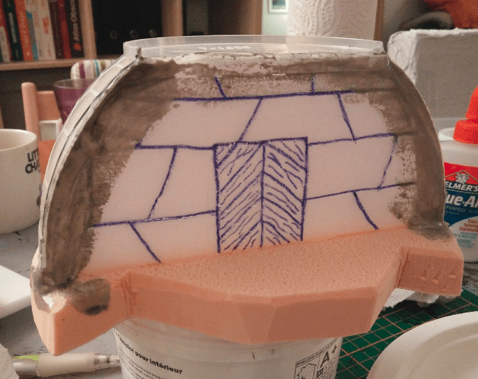

I then glued it in place, and added some filling paste to cover the gaps. This is very messy. And once again I forgot to add stone texture to the floor before gluing stuff. Adding if once everything is glued is much harder.

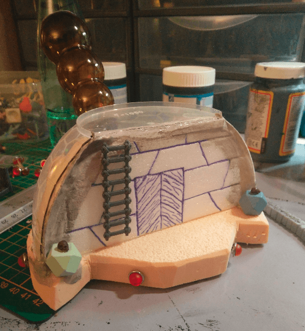

I added a bit more details to try to cover the sloppy build with distractions. The red pins and d20-like shapes I bought in a craft store. The skulls are from Mantic Games (in their awesome kickstarter for dungeon scatter furniture).

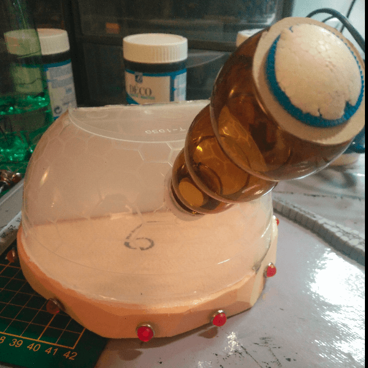

The telescope itself is a candy packaging I found in the street (I think, TBH I'm not even sure what it is)

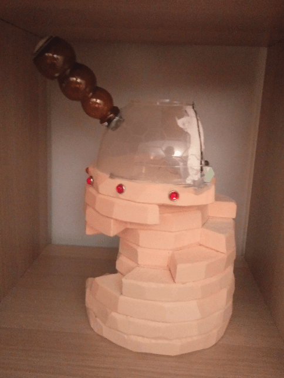

And the final piece, in its unpainted glory.

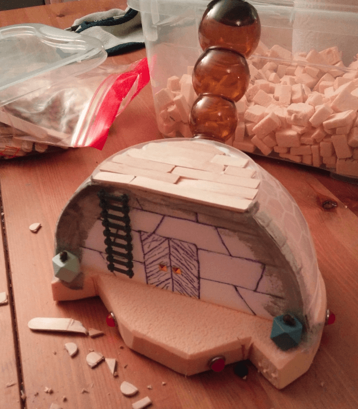

I added some wooden planks on the top floor.

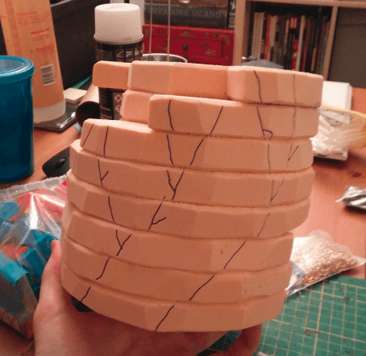

And I then had the idea of adding cracks all around the tower, to give it some kind of crumbling feel.

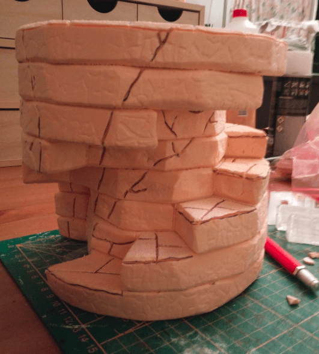

I textured it, and carved the cracks.

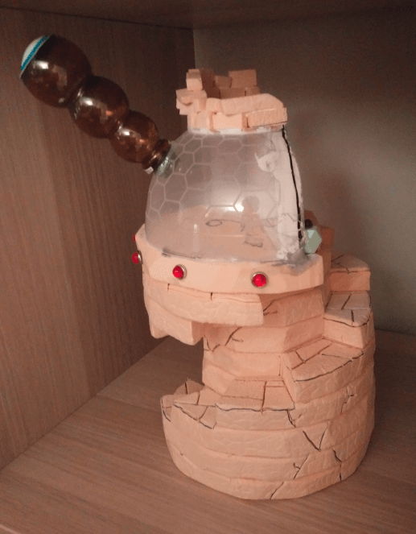

And added some broken bricks all at the top. From an architecture POV, this building makes absolutely no sense.

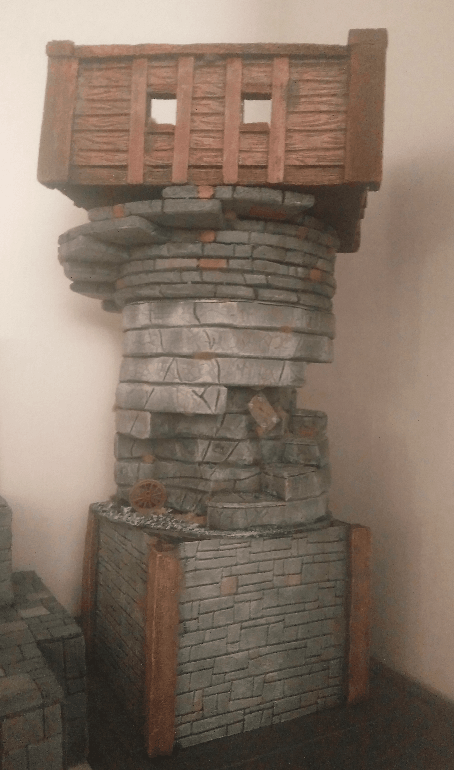

Apparently, I forgot to take more pictures of it while I was working on it, so all I have is this group shot with other projects I was working on at that time.

