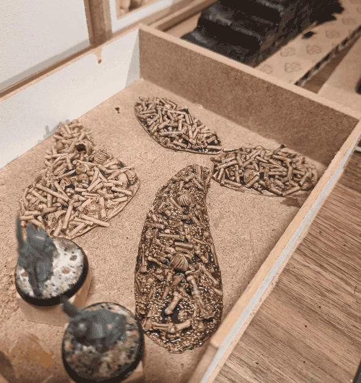
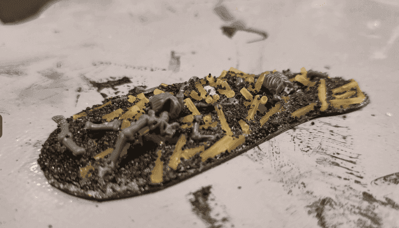
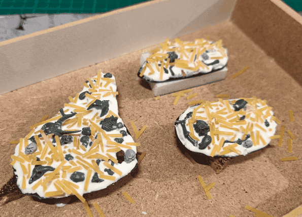
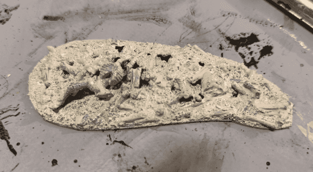
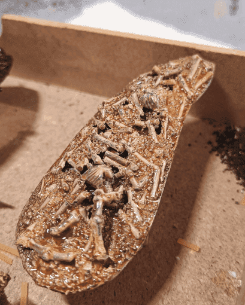
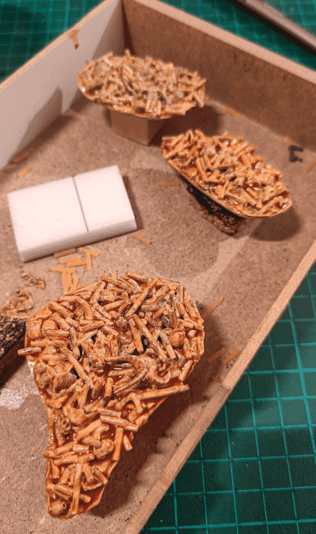
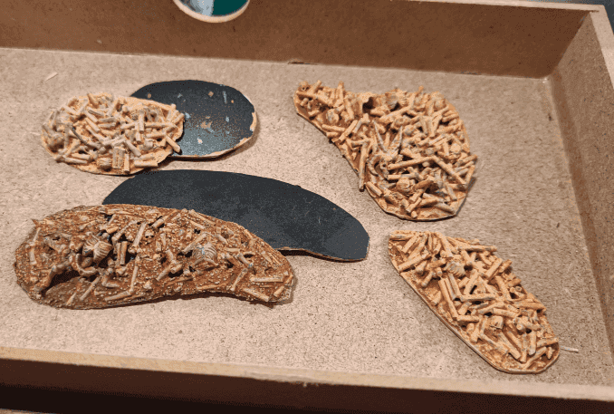
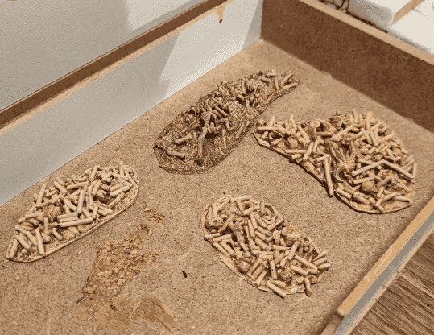
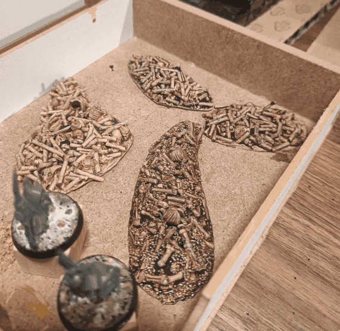

Those are some scatter bone pile terrains. Made mostly from plastic skull and skeleton leftovers, as well as spaghettis.

I cut the basic shape in some plastic, added some Vallejo stone texture on top and sprinkled various bits of plastic skeleton, skulls, spaghettis and fine sand.

I made several of them, and soaked them in wood glue heavily diluted in water (50/50 mix). This will help all the sand and pieces to really stick together.

I started with a base of bony/cream color.

I wanted to use this project as an opportunity to test oil painting, so I added some burnt sienna on top.

I thought the result were not dark enough, so I added a second diluted layer.

I think that at that point I forgot that I wanted to use oil paints and I started drybrushing them out of habit.

This doesn't look so bad, so I kept going.

I then added the traditional wash on them. I wasn't sure where to go next, so I left it at this.

If I had to do it again, I would keep adding the fine sand, but I would first dry brush in various tones of brown the whole piece, and then pick individual bones with cream paint and brown wash.

