This is an abandoned temple, made from cake packaging trash.

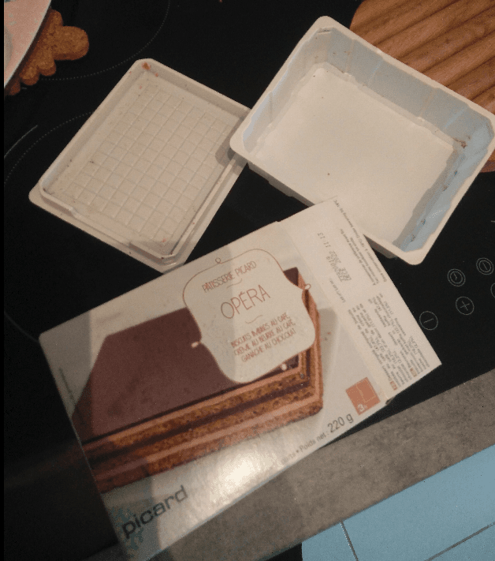

It all started with this packaging. A frozen chocolate cake in its plastic box. The bottom of the plastic box had this engraved squares, and I thought they would look like stone pavement, and the sides could look like ruined walls.

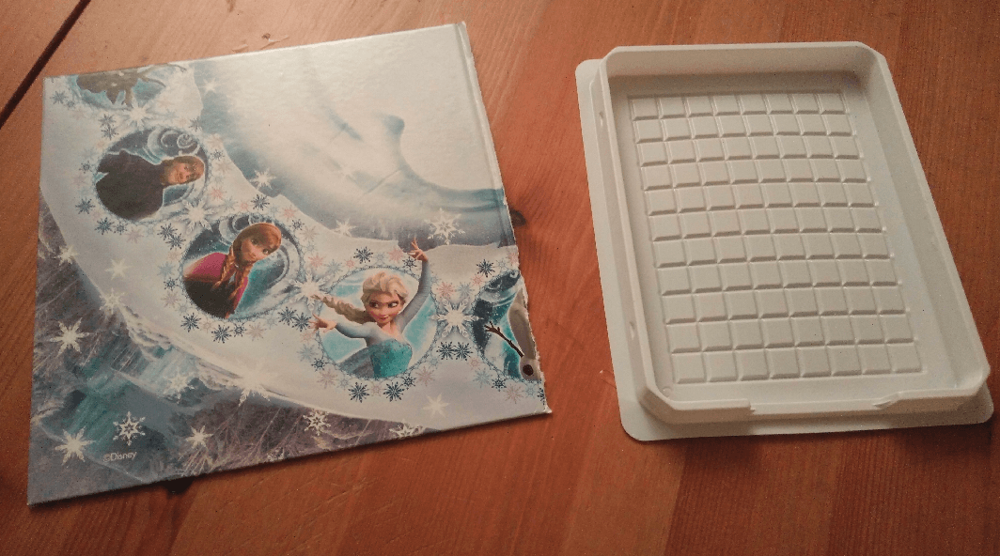

I took a square piece of hard cardboard to act as a base. The cardboard is coming from a second hand Frozen game (I used other parts of this game for another conversion).

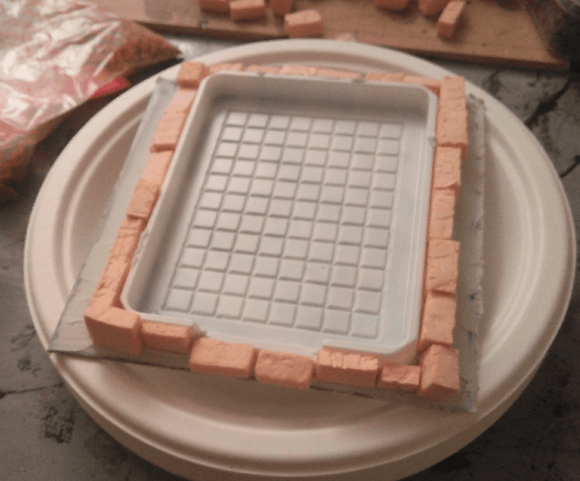

Started gluing bricks all around, and added some filling paste on the sides.

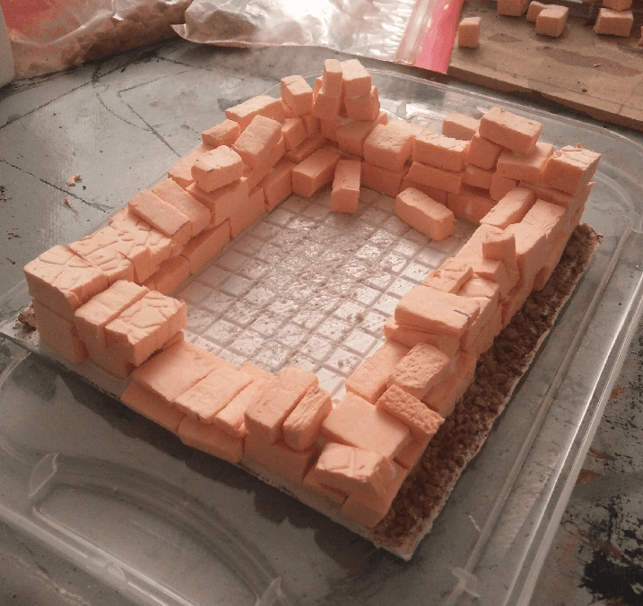

More bricks, and some sand on the sides.

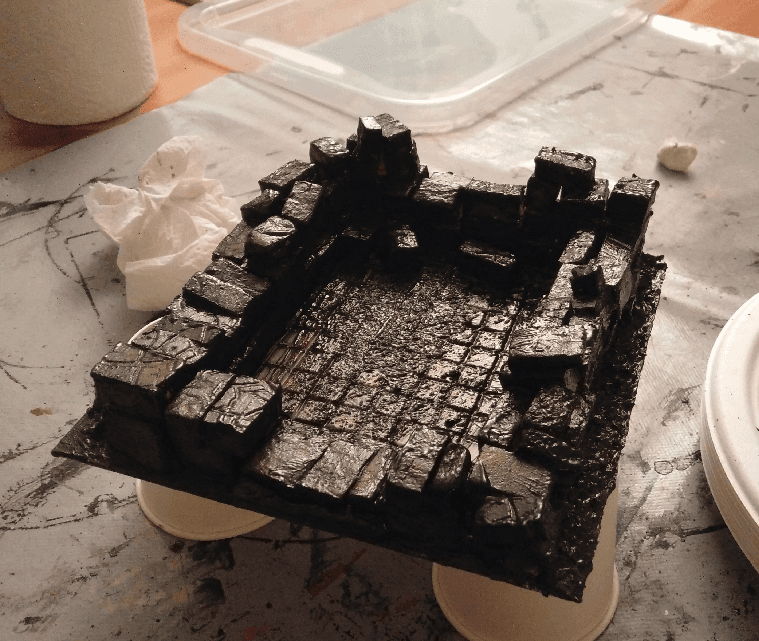

Black paint, and this is where the trouble begins.

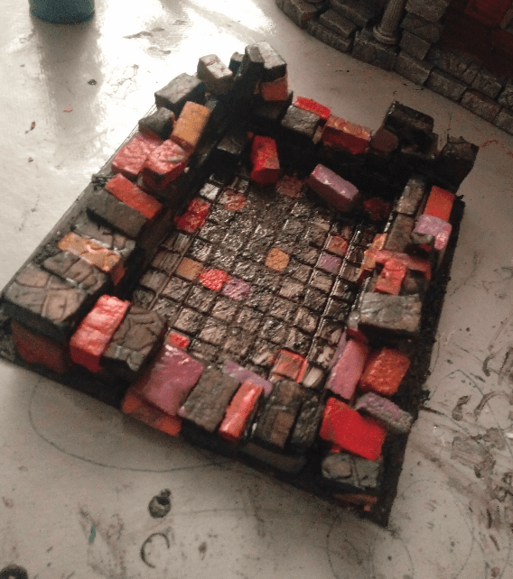

I tried setting some bricks in brighter colors, to give it a kind of roman ruin, with bricks in the red/orange tint. But this made it look like a kid chocolate cake.

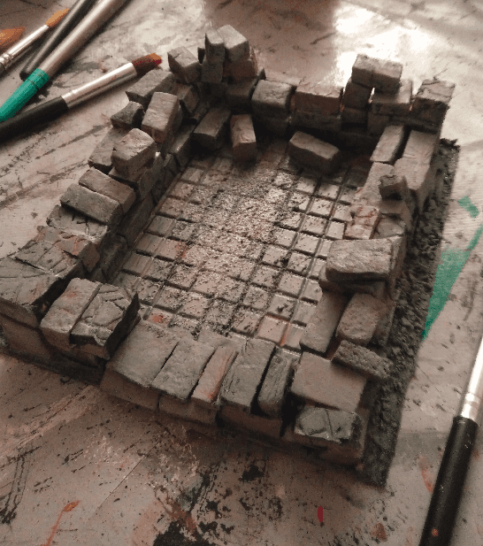

I drybrushed on top, hoping to mute the colors, but the result was ugly.

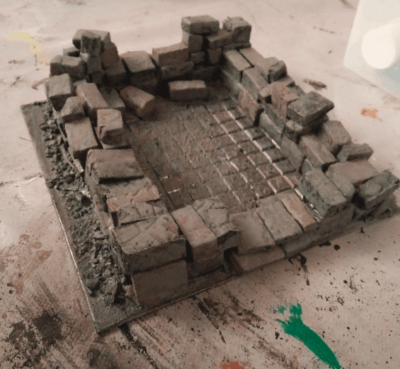

I applied a wash. Slightly better, but the underlying colors are showing way too much and ruining the effect.

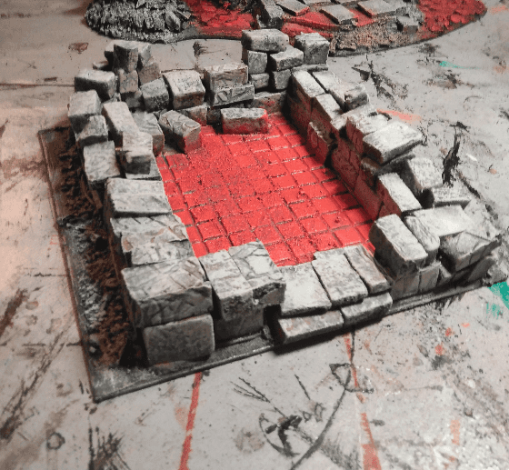

I painted the floor red, to have the eye focusing less on the stones, and re-applied a gray overbrush on all the stones, mostly hiding all the previous coloring job (for the better).

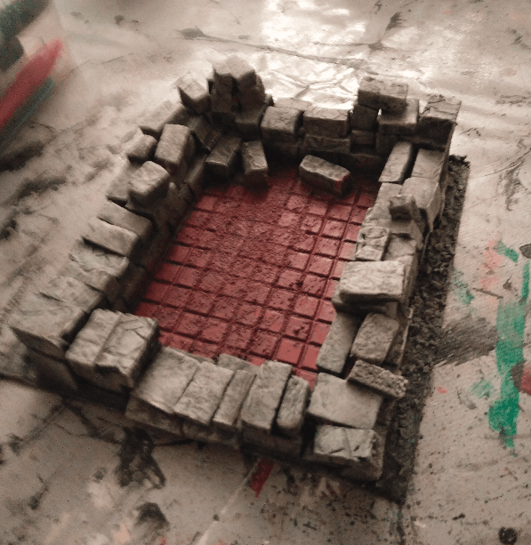

Much better!

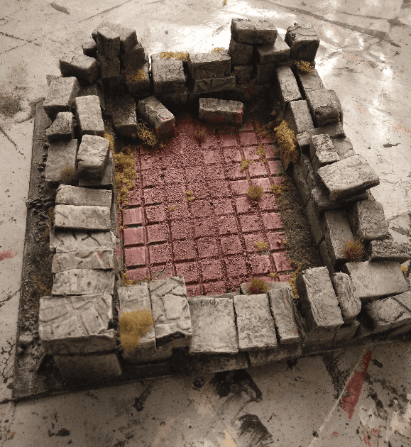

Some flocking later, and it really looks like a ruined temple now.

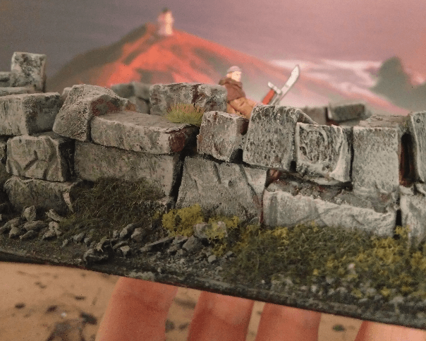

View from the side, with a mini for scale.

And after a final coat of glue and varnish to keep the flocking in place.

