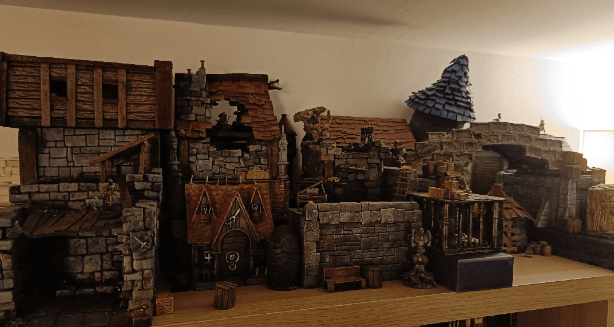
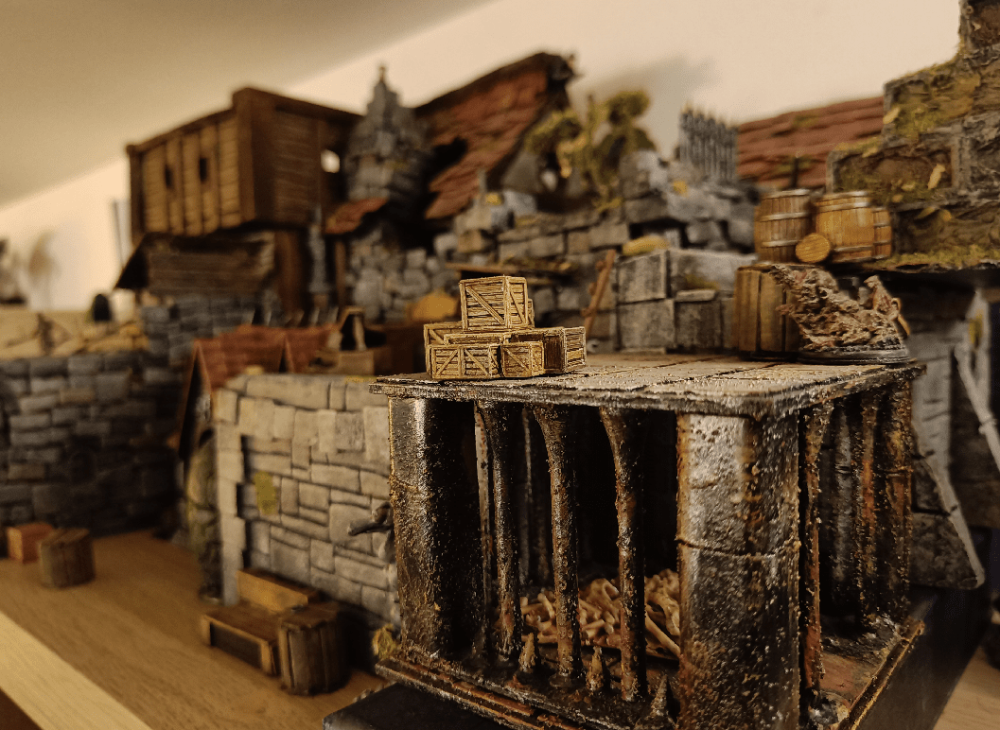
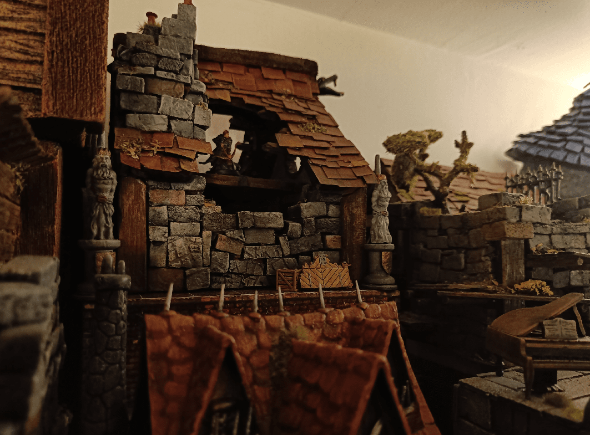
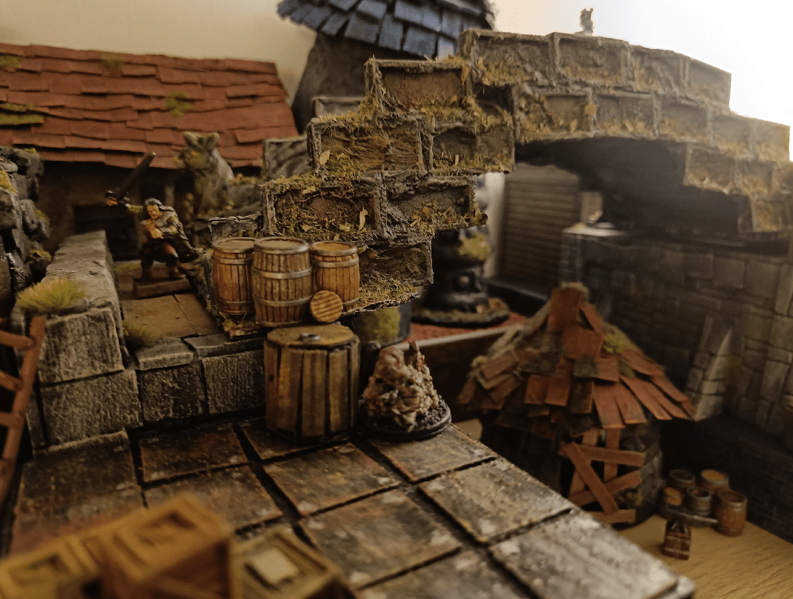

I put many of my terrain pieces on the shelves at the back of my crafting room/office. There will be no step-by-step pictures of me building anything in that post, just pictures of the pieces together, to feast your eyes.

I built so much stuff, and never yet got the chance to play with it. So much terrain would be great for a Mordheim (or Mordheim-like) game.