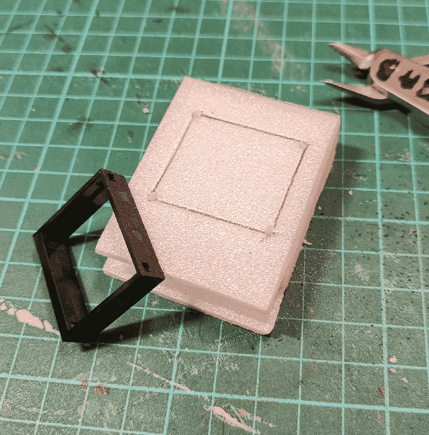
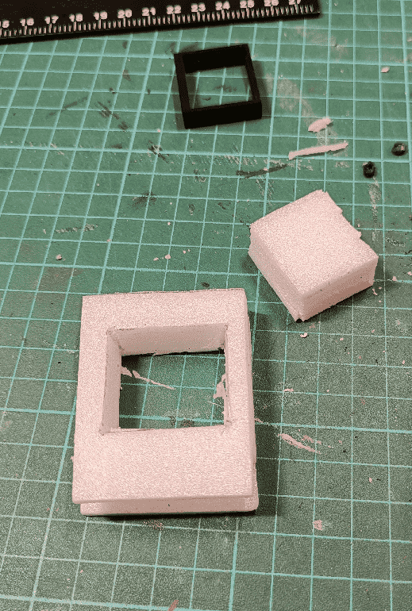
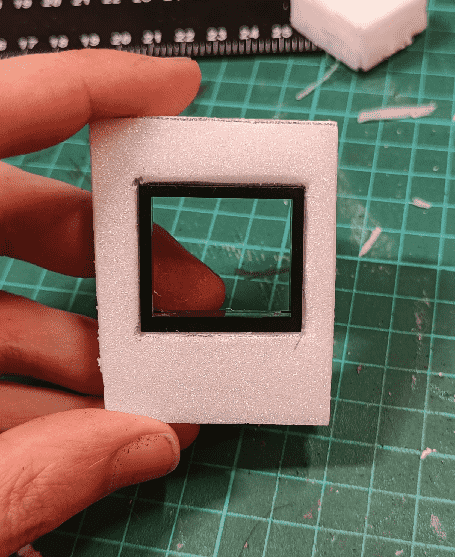
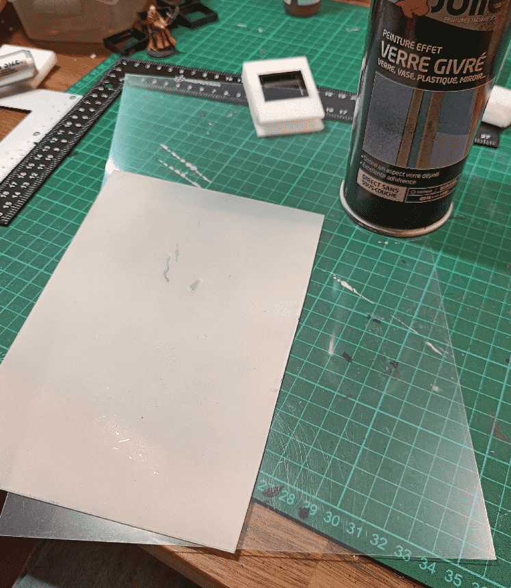
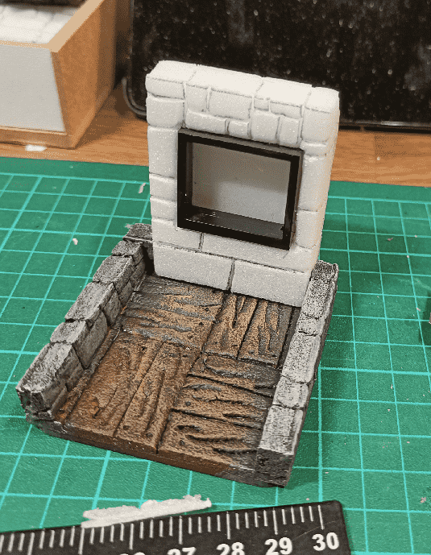
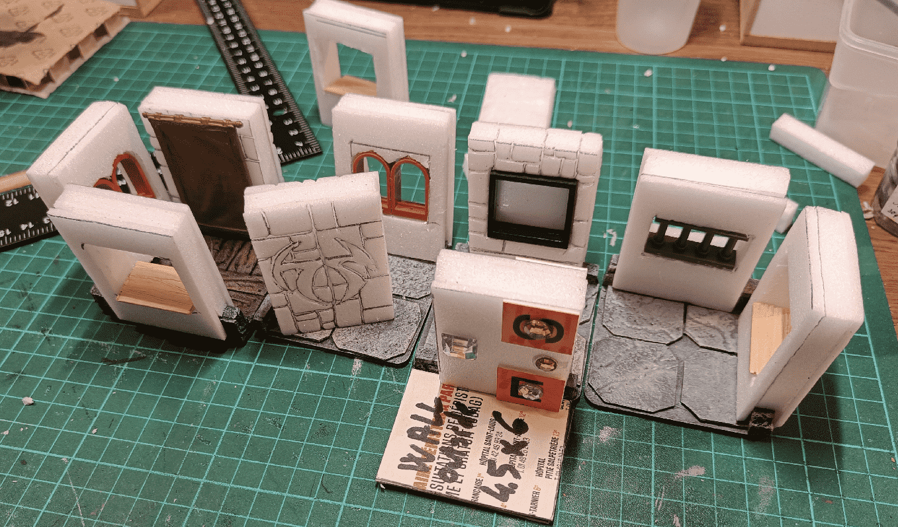
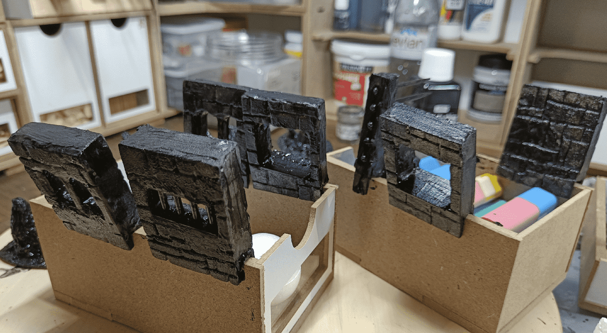
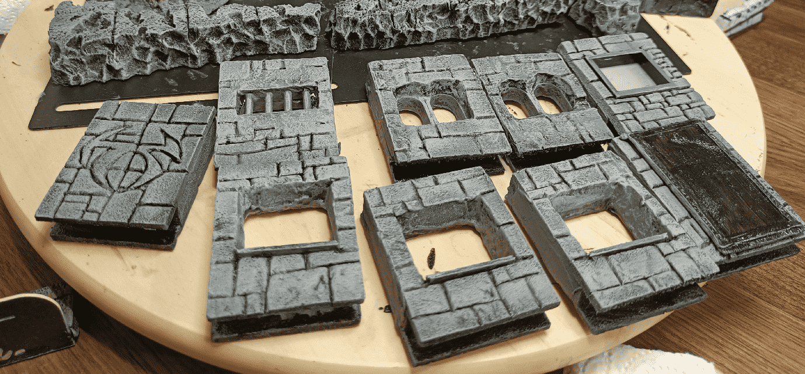
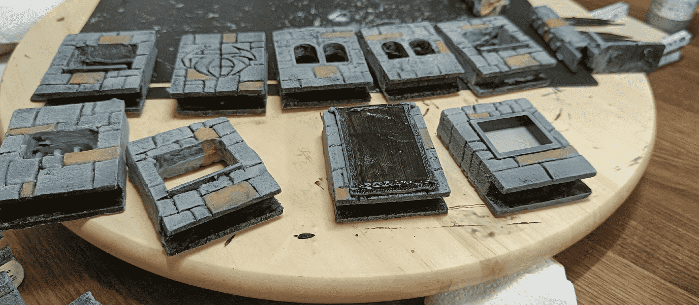

The fight against their evil twin took place in a Mansion, and I wanted a way to visually symbolize the walls. I wanted a way to differentiate between the inner walls (separating two rooms), and the external walls (separating the mansion from the outside). 

For the inner walls I made small half-height foam walls, and for the external walls I crafted some higher walls that I could clip on top of the small ones (original idea credit goes to Wyloch, even if I used different materials and dimensions).

I started with a foam frame cut into the same foam sheet that the one I used for the half-height walls. Then I glued on some thinner foam on each side, and let it extend at the bottom. That way I was 100% sure that the spacing between the "legs" was exactly the width of the walls, as they were coming from the same original foam sheet.

To do windows, I then cut out the desired frame. I used a Lego windows as a template, to have consistent dimensions across all my crafts.

I even added the frame inside the hole.

For the glass, I went with a frosty glass. I took a sheet of transparent plastic and applied a spray of frosty glass, and it turned it into a translucent sheet of paper, as you can see on the picture.

Test fit. It works well. The trick is to make it wide enough so you can fit a window in it, but short enough that you can clip it at the end of a corridor.

I then went on making more of them, using various Lego pieces for the windows (the two arched ones work really well). I also made simpler ones with only an ice cream stick. I also made a door (I needed a metallic door for the dungeon), and a piece of wall with a Rune inscribed on it.

Before applying the black modpodge, I also covered the edges with spackle. It allows hiding the foam and would also make it easier to pain (foam absorb paint like crazy). I also had the nice side effect of adding some weight to the build, with is always a plus in my opinion.

Classical gray paint scheme.

Picking a few bricks for variety before the last wash.

