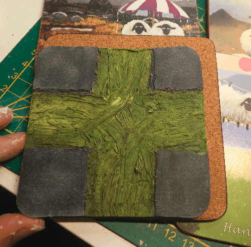

This are the 4 coasters for 50cts I bought. Full of witty jokes on the front and cork on the back.

I already had some Sewer tiles I made in the past from cork coasters, but they were unfortunately not the same scale. So instead of making more sewer tiles I decided to simply make regular tiles.

I divided them 3x3 3.5cm squares. I could have made them 4x4 2.5cm squares but I like my minis to have some breathing room. 2.5cm is the very minimum, and because I will be chopping some cork off to delimit the squares, it would have ended up too small.

Cutting the fork along the lines.

Adding some irregularities to the patterns.

Priming them black. The good thing about cork (as opposed to foam) is that you can prime it without the spray melting it.

A little drybrush and they look much better already.

A second one with some brown and green. I tried to do some irregular patterns. The last thing I tried is on the top right, brushing on the corners of the tiles, I find it gives a nice finish, I should do more of that.