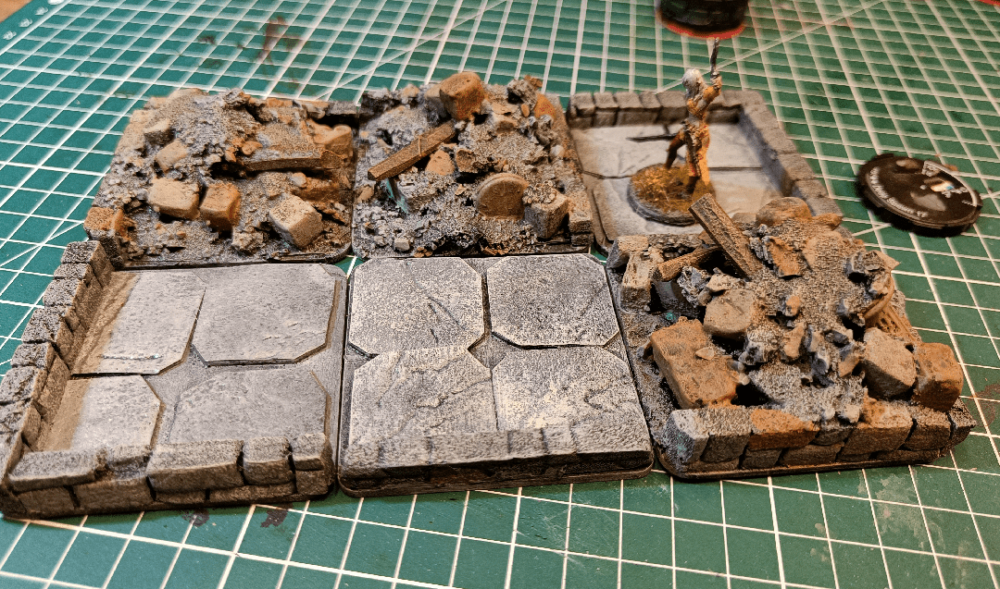
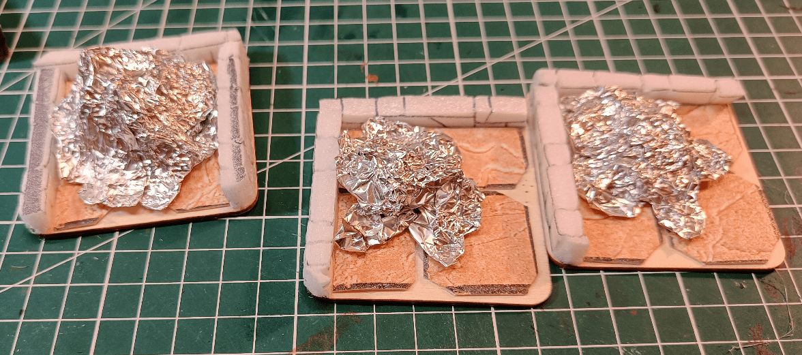
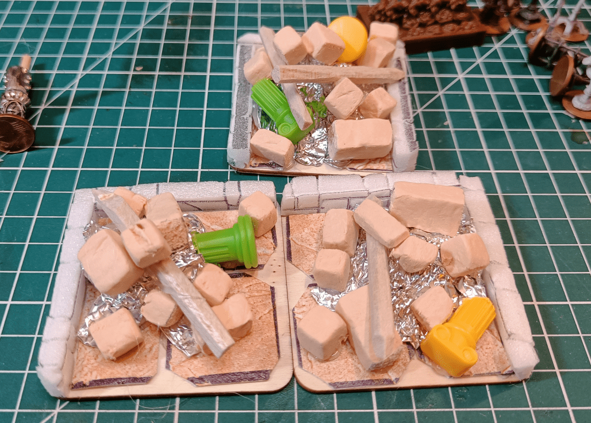
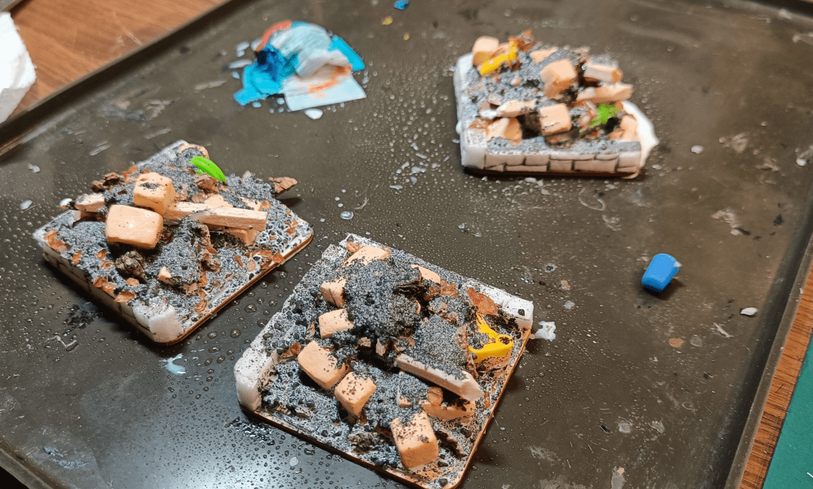
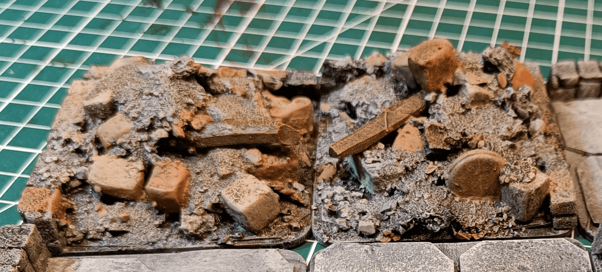

I sometimes need to mark some areas of a room as collapsed. Even for no specific reason, adding collapsed markers help create some difficult terrain and some challenge in encounters.

For the scenario I intend to run, the dungeon map indicates some areas as collapsed. Instead of crafting collapsed marker and making sure they would fit in my dungeon tiles, I decided to directly make collapsed dungeon tile.

I started with regular dungeon tiles, and added some shape with tinfoil.

More foam bricks, balsa beams and some plastic columns.

Then glue, sand, more glue.

And we paint that in a few different shades.

