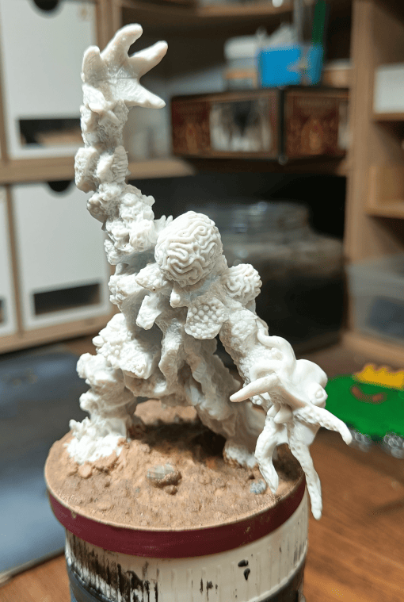
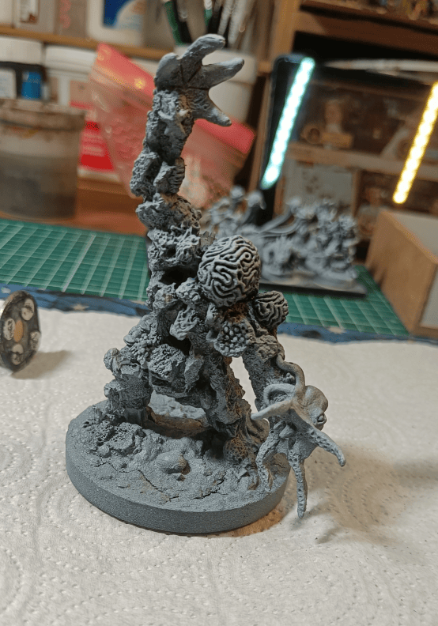
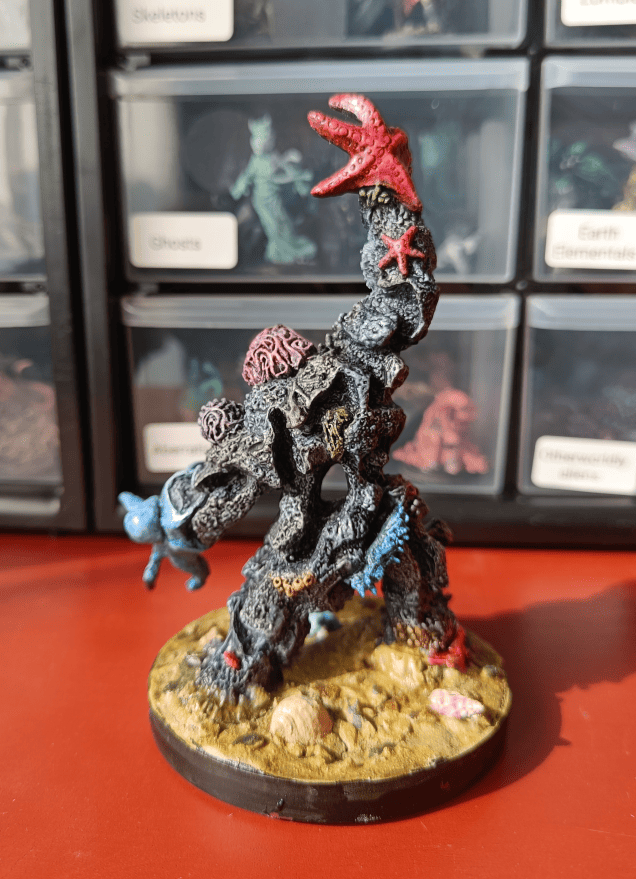

I really enjoy painting Reaper Bones miniatures like this Coral Golem. These highly original sculpts offer a refreshing change from the usual miniatures, and they make perfect unique monsters to throw at players during game sessions. This particular creature is a fascinating monster made of stones, starfish, and shells.

<!-- 1 -->

_The Coral Golem is a monster composed of stones, starfish, and shells._

<!-- 2 -->

_For the base, I used an Häagen-Dazs lid since this is quite an imposing creature. At that time, I wasn't paying much attention to base uniformity. Nowadays I try to make sure my bases follow logical patterns - either one square, two-by-two, or the equivalent of three-by-three. Back then I was still in "use whatever I could find" mode. I filled it with a mix of spackle and pebbles, and even added real small shells inside to match the theme._

<!-- 3 -->

_After priming in black then grey, you can see the spackle started to crack at the bottom, which doesn't make much sense - sand isn't supposed to crack. I didn't really know how to fix it, so I just left it as is._

<!-- 4 -->

_The fully painted golem seen from behind. For the stone parts of his body, I had just gotten some speedpaints, so I used different grey speedpaints that I mixed. Some sections I painted with one grey, then adjacent areas with another, trying to blend them together for some uniformity. The result is decent but nothing extraordinary. The special elements like the anemones, octopus, and starfish I painted with more vibrant colors. In photos it looks good, but up close it's not that impressive - I could have put in more effort. But again, speedpaints really allow you to get a passable result without much effort._

Overall, this Coral Golem was a fun project that let me experiment with speedpaints and create a unique monster for the table. While not my finest work up close, it serves its purpose well as an interesting adversary that stands out from the typical fantasy creatures.
