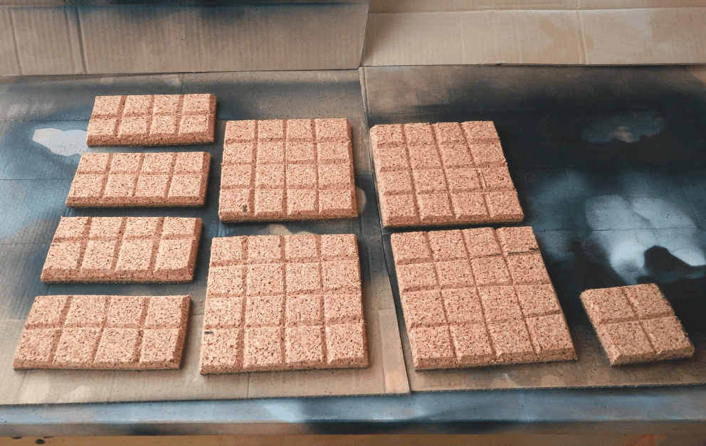

I tried to make some dungeon tiles out of cork. I had bought some isolation cork boards and thought I could turn them into dungeon tiles.

I had seen the Wyloch tiles video and other video about making tiles from isolation foam, but I thought it would take too much time. I thought that using cork would be easier, as I won't have to carve any stone detail into it as the cork already has some texture to it that could look like stone once painted.

## Cutting

So I went into cutting my board into various sizes. I did a few 2x2, some larger and a few angled pieces as well.

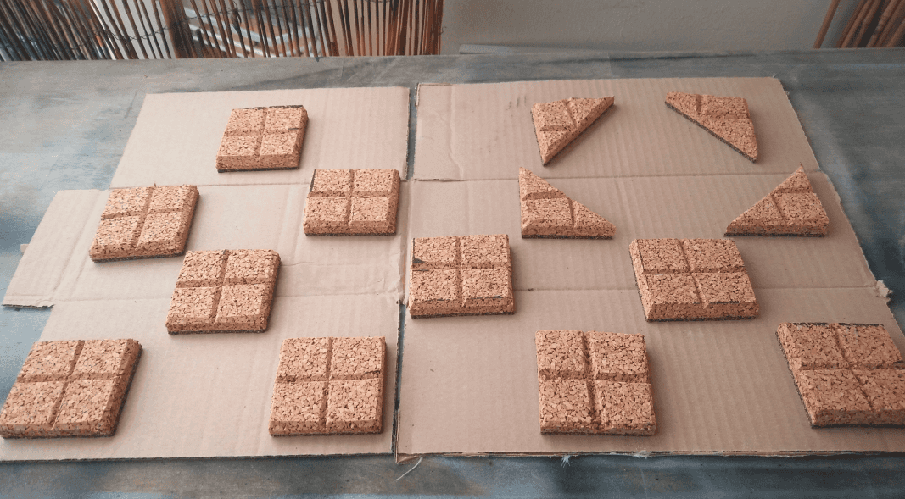

## Priming

Cutting the fork was actually quite easy. I cut some recess to delimit the various squares and went on base coating them black.

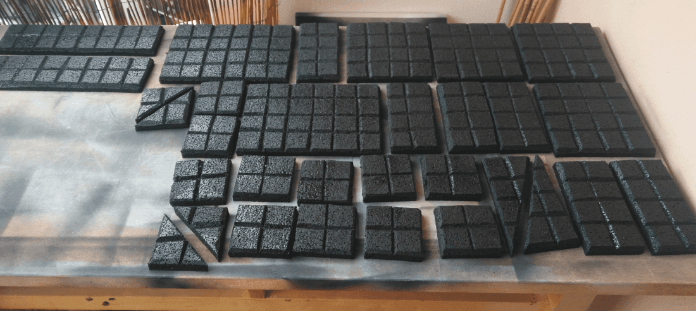

## Painting

Unfortunately the paint in my can slightly warp the tiles. It's not much visible on the smaller ones, but on the big one you can see that they don't fit square on the table, one end is more elevated than the other.

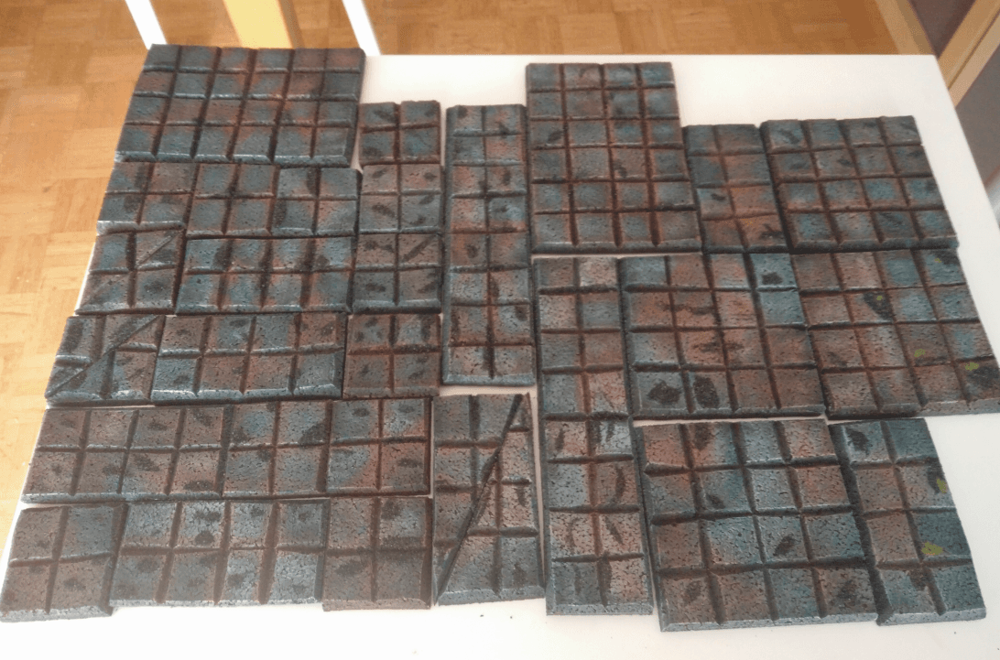

I then went onto painting them. I first added some black paint into recesses where the can couldn't get. Then I applied two dry brushes, of dark gray and lighter gray.

At that point it looked too gray and not very interesting. So I went into adding some more variations. I took some white, brown and green and added some dry brushing and sponge blob here and there. I didn't really have a plan when I started and the overall look now is more interesting, but still quite bland.

What I discovered is that doing a dry brushing along the lines is what looks the best, like here:

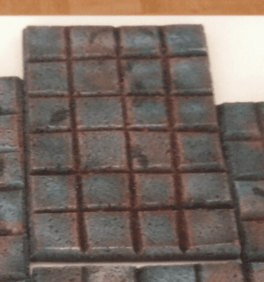

## Playing

And here is how they look like in-game when my group of adventurers went exploring an underground barrow with ominous statues. One statue was trapped, and 3 skeletons arrived to block the entrance. Only Melkor, the level one necromancer managed to get out.

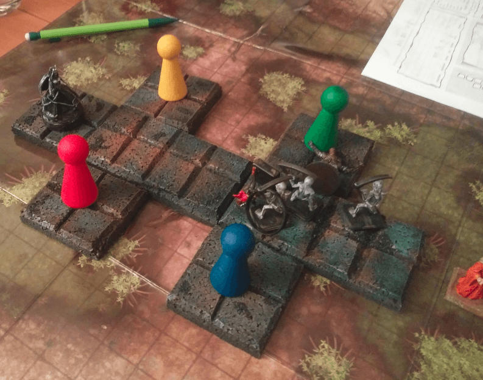

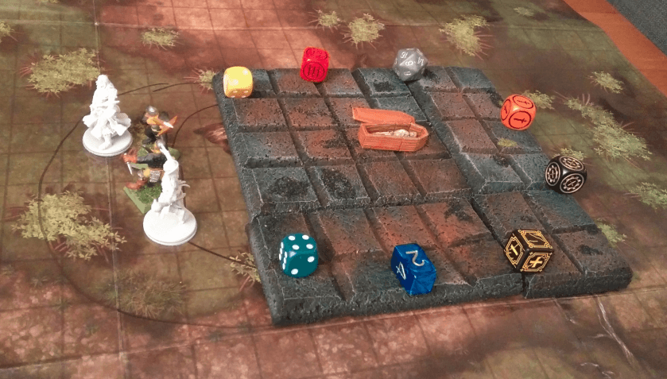

Above, another group went into exploring a nearby barrow. To be honest, I don't even remember what they where encountering there.

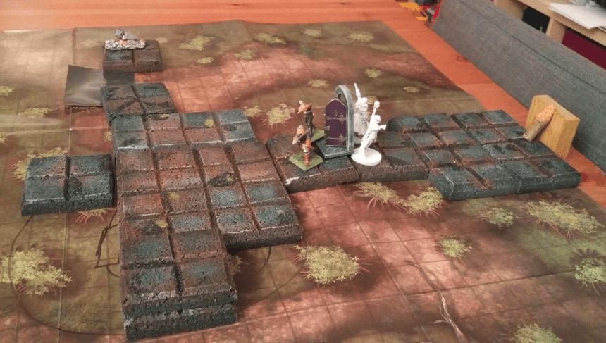

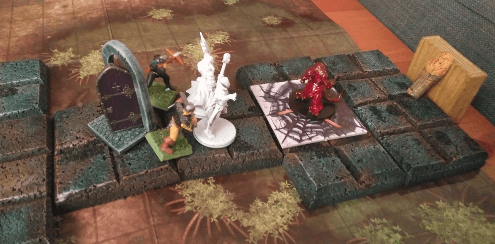

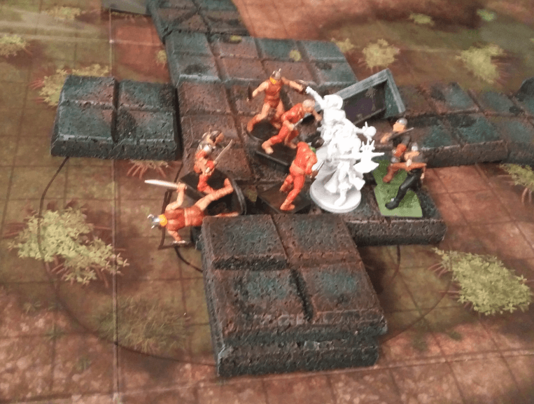

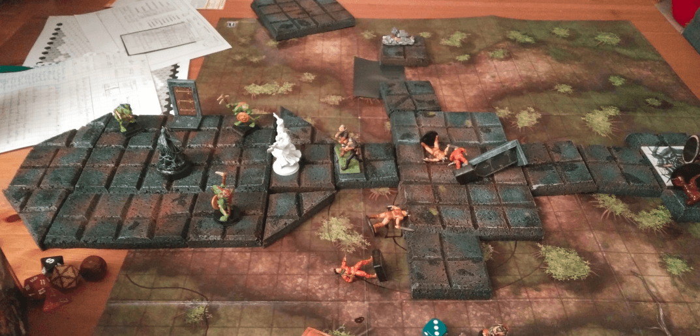

I have been using the tiles a lot in our mega dungeon campaign and it worked pretty well. They're a bit fiddly sometimes, and not all cut to the exact same dimensions so it can create some slight alignment problems, but nothing major.

What I don't have it walls, though. As long as the layouts are simple it's OK, but when you have long corridors with many side doors, it can be more difficult to tell which room is which. In the future I might redo more tiles but paint them in a different color scheme so we can differentiate them.

## More playing

Below are more pictures of the various games we play with them:

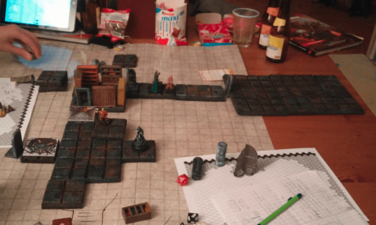

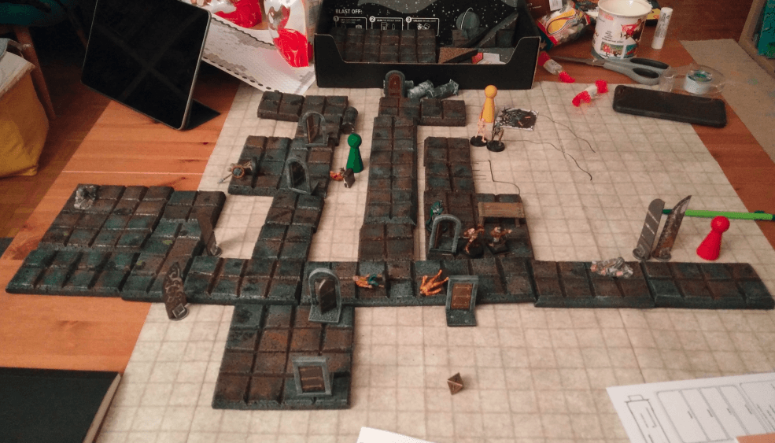

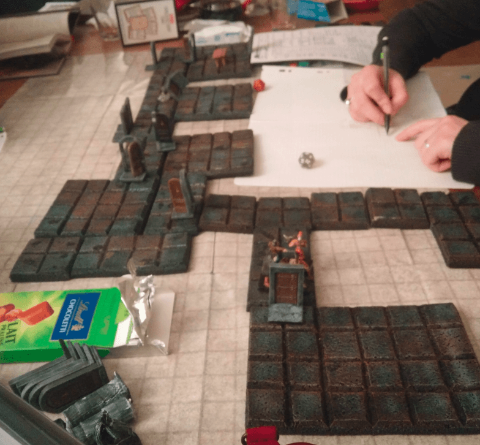

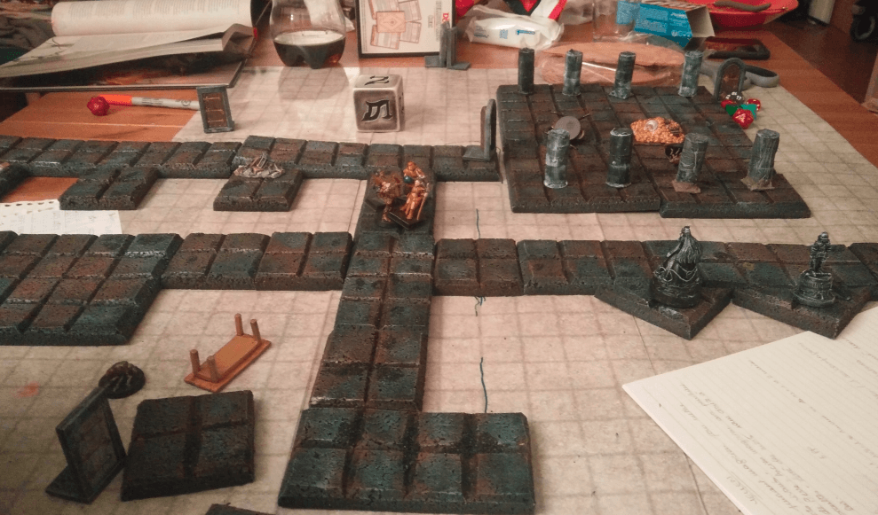

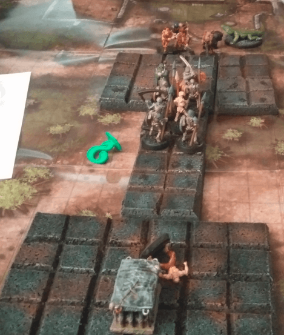

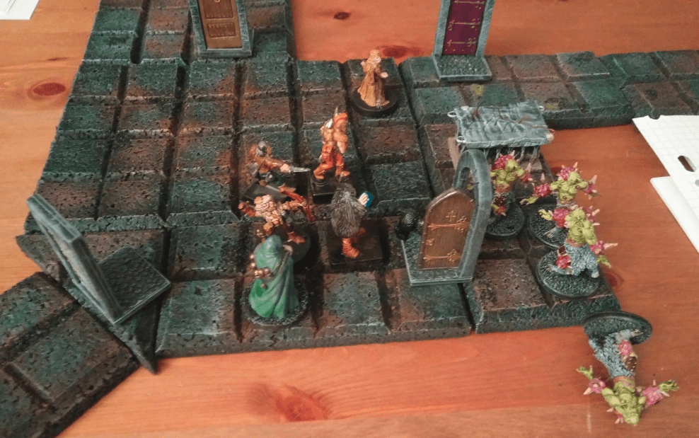
