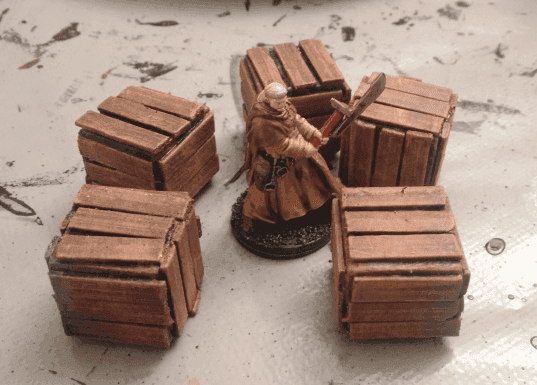
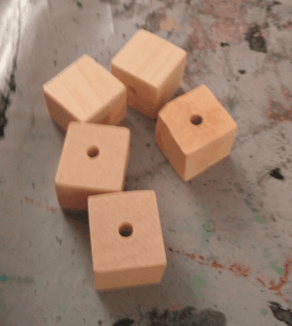
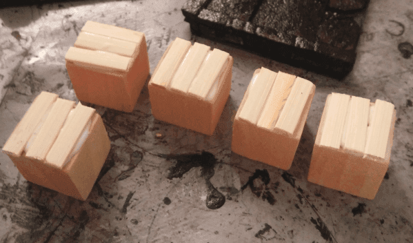
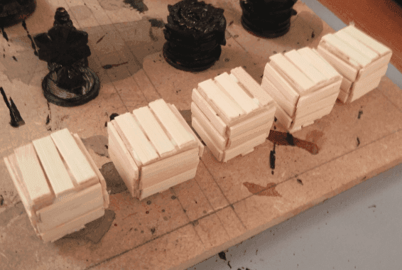
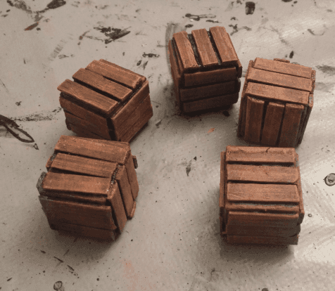

This is a quick post on how I made some crates for scatter terrain. They don't look perfect, but just good enough to add some cover to an encounter.

I started with some squared beads I found in a craft shop.

I glued short bamboo sticks on the sides.

Covering all the sides took a while, as I had to wait for the glue to dry on one side before doing the next one, so I span it on several evenings while working on other projects.

It's then a first layer of black paint, overbrush of dark brown and two dry brushes of lighter browns.

