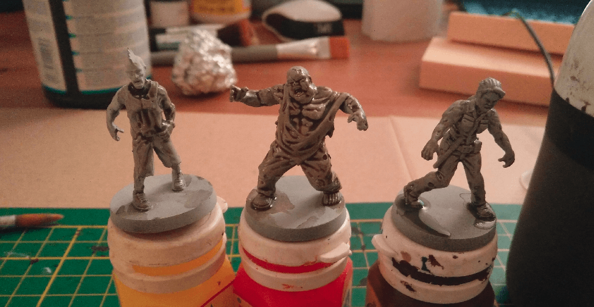
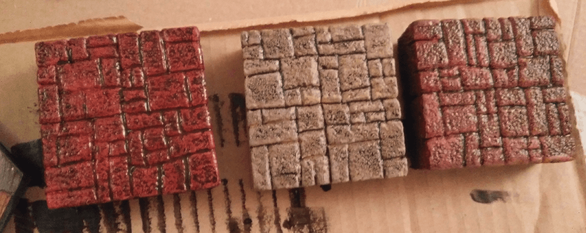

I followed instruction of Black Magic Craft to make my own black wash and was incredibly happy with the results. One layer on primed miniatures already showed the details more sharply.

Also worked well on some tiles I was crafting to test some colors chemes. It really tones down the color so I really shouldn't be afraid of using bright colors.