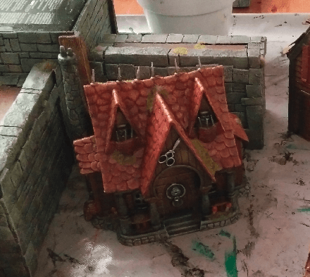
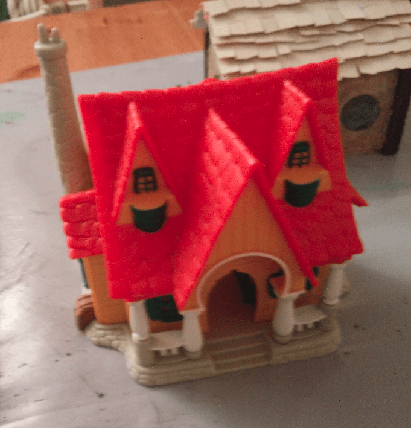
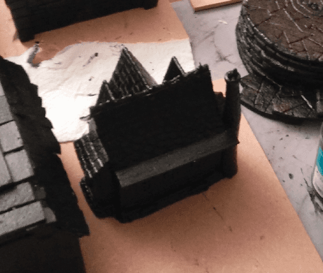
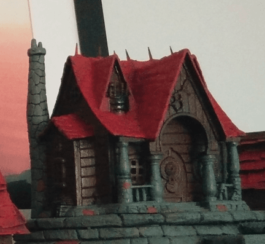
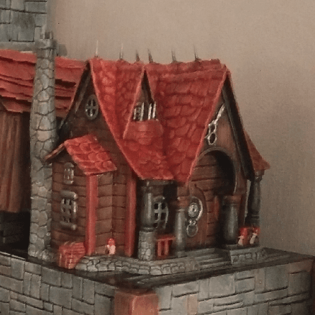

I repainted a Disney toy into a house suitable for the Old World.

This is the toy, as I original found it in a second hand shop. It is not the right scale for miniatures (a bit too short), but it definitely has this weird fantasy crooked look I like.

I coated it black with the usual black mod podge mixture.

And I blocked the main colors. Grey for the stone (with some brown variation), brown for the wood, and red for the roof.

I added some pikes on the roof (made from toothpicks) to better fit the Warhammer Old World feel, as well as some earing decoration on the main door.

More drybrush and details added later.

And a final shot after all the flocking was added.

I'm sorry I don't have better pictures; I had some picture sync issue between my
phone and computer and looks like I lost some data here...
