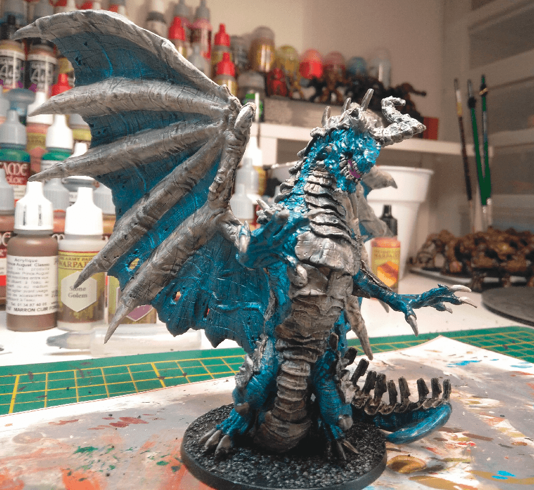
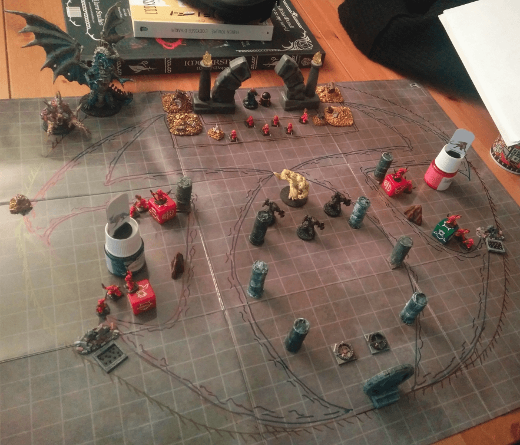

This is the Draco-zombie from Zombicide Green Horde extensions. I **tried** to paint it as Void Dragon from the Tome of Beasts but kinda failed:

If I had to redo it, I wouldn't use such a strong wash on the bones (I think it's the Dark Wash from The Army Painter. I think the Strong Wash would have been enough.).

## During Battle

Here is the final battle 