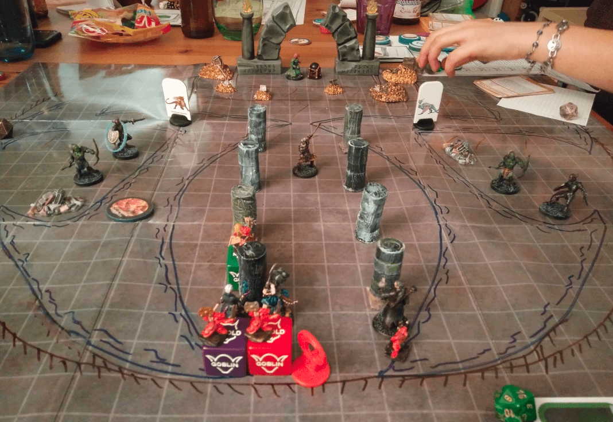

This is the Draco-zombie from Zombicide Green Horde extensions. I **tried** to paint it as Void Dragon from the Tome of Beasts but kinda failed:

If I had to redo it, I wouldn't use such a strong wash on the bones (I think it's the Dark Wash from The Army Painter. I think the Strong Wash would have been enough.).

## During Battle

Here is the final battle, when the PCs entered the room, floating in space in a giant globe. The Dragonkin at the end is trying to invoke the Dragon.

Their way is blocked by an Orc warrior.

Spells are fired, Kobolds are helping, Orcs are falling in the goo and attacked by oozes.

Finally the orcs are defeated, but now the globe is breaking and the platforms starts to drift in space while the Dragon appears.

Separated by a broken bridge, our heroes try to win a mind contest with the Dragon while its hoard is slowly dripping into space.