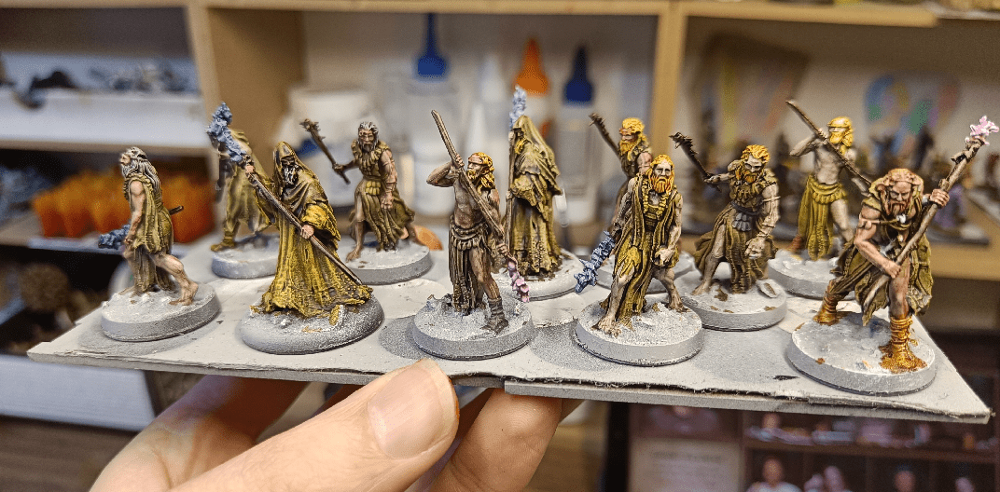
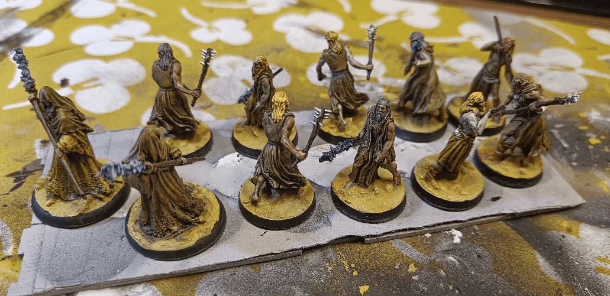

Those were a very quick paint job with my new Army Painter big box. I couldn't believe how quickly I could paint this whole group. One evening and it was done, and I was very happy with the result. 

All skin and clothe, where the Speed Paints shine the most because of all the recesses and raised areas.

In my game, I made them followers of Krakoa. Krakoa is a Kraken God that lives at the bottom of the oceans. He catches all the people that drown in the high seas, offering them a bargain: they can either drown and fall to the end of the bottomless seas, or be saved and raised to the surface, but become spawns of Krakoa.

I wanted him to represent the dual aspects of the Second Chance. When you're supposed to be dead, but are miraculously saved, and what you do with your new found life, and if you actually have any impact on it, or if it's all part of a deal with a devil-like entity.