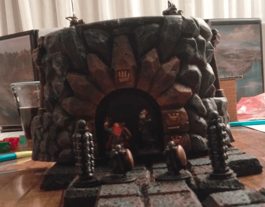
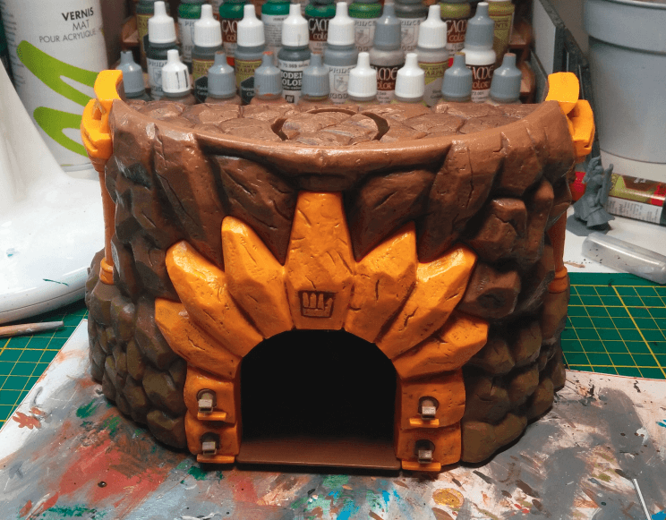
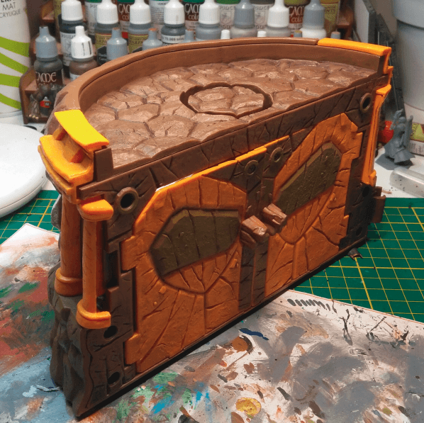
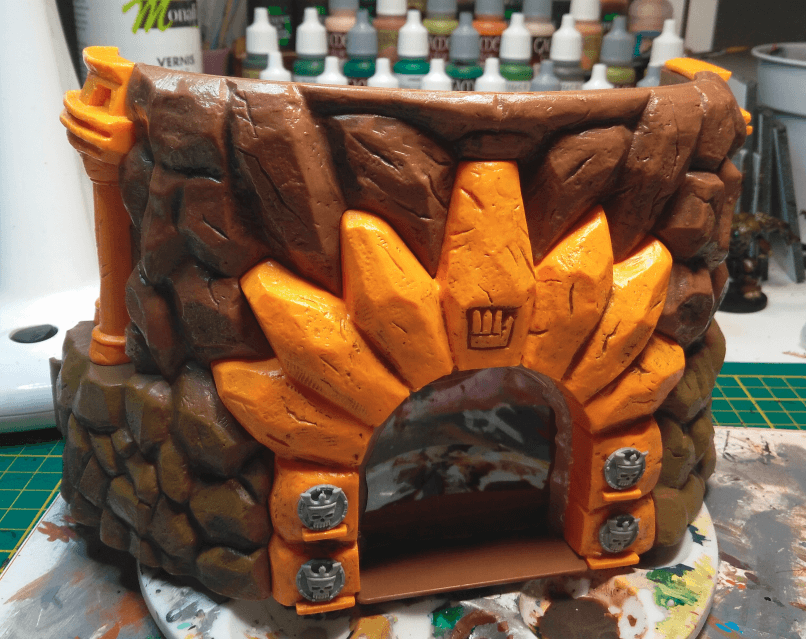
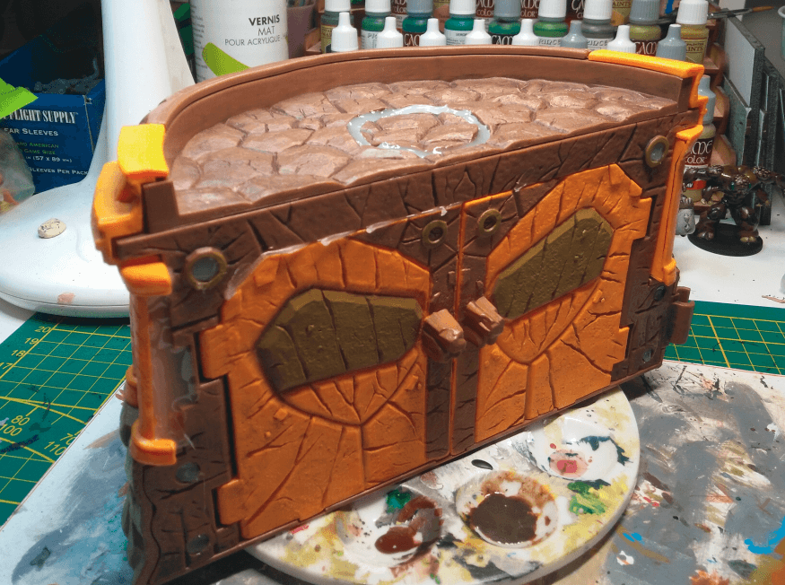
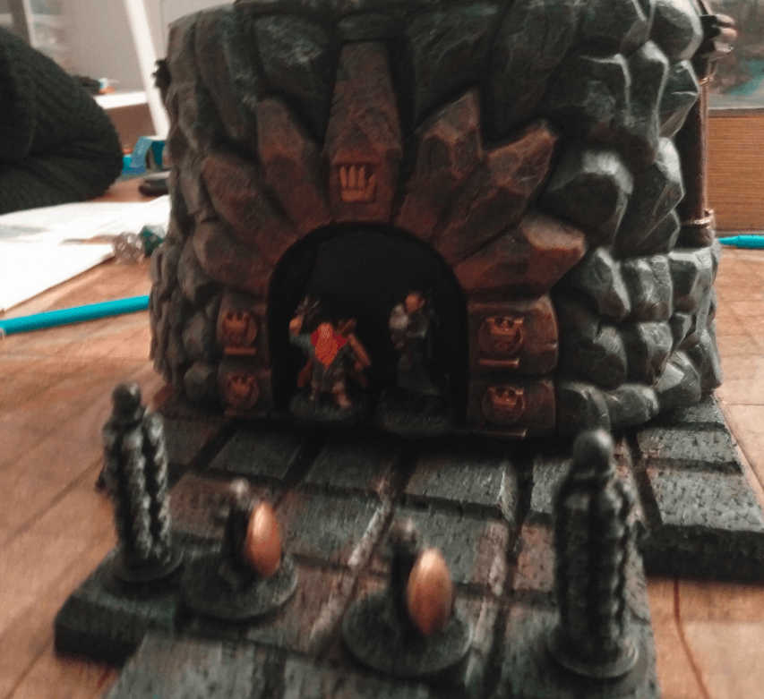

This is Gormiti toy found in a second-hand shop for 1€. I had to check online to know what it was, but I could directly see it had repaint potential.

Even with the orange colors, I could see that it had some great texture already. I needed to fill glue the doors and fill the recesses, though.

I added some shields on the front to keep it in line with the underground Duergar fortress I had in mind.

Most of the holes are filled. I even filled the round hole on the top with my glue gun. I think I need to buy and learn how to use some green stuff, it would make this kind of filling much more adequate.

Here you can see two PCs that teleported right at the bottom of the tower, behind the two guards.